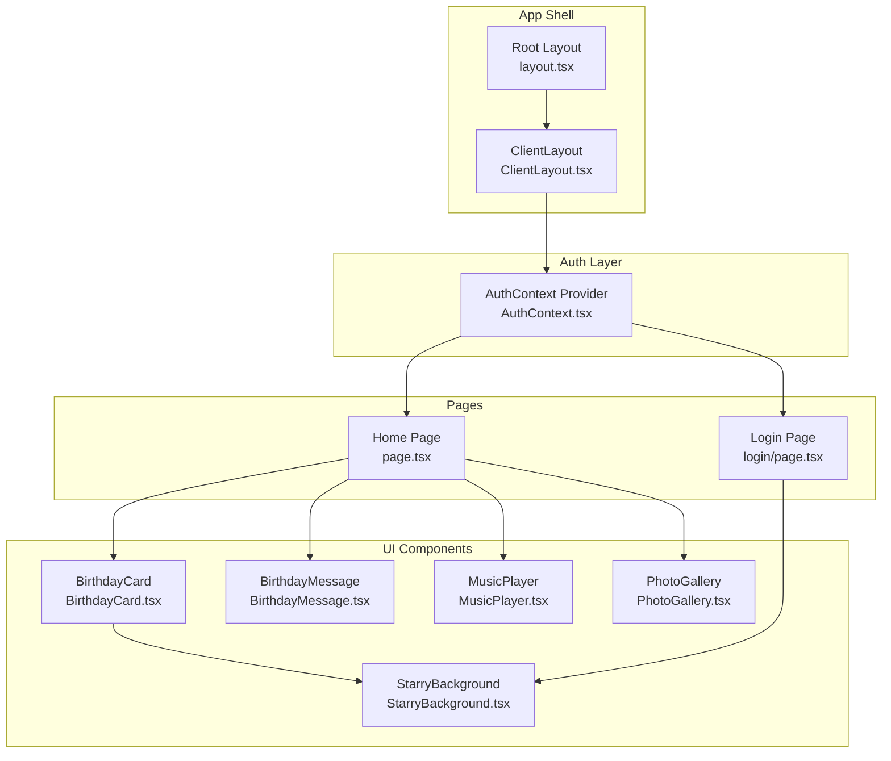
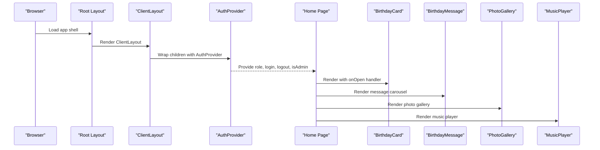
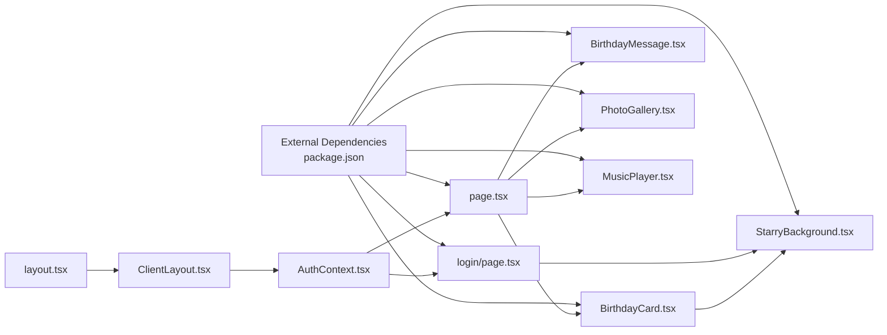

# API Reference

<cite>
**Referenced Files in This Document**
- [AuthContext.tsx](file://app/context/AuthContext.tsx)
- [ClientLayout.tsx](file://app/ClientLayout.tsx)
- [layout.tsx](file://app/layout.tsx)
- [page.tsx](file://app/page.tsx)
- [login/page.tsx](file://app/login/page.tsx)
- [BirthdayCard.tsx](file://app/components/BirthdayCard.tsx)
- [BirthdayMessage.tsx](file://app/components/BirthdayMessage.tsx)
- [MusicPlayer.tsx](file://app/components/MusicPlayer.tsx)
- [PhotoGallery.tsx](file://app/components/PhotoGallery.tsx)
- [StarryBackground.tsx](file://app/components/StarryBackground.tsx)
- [package.json](file://package.json)
</cite>

## Table of Contents
1. [Introduction](#introduction)
2. [Project Structure](#project-structure)
3. [Core Components](#core-components)
4. [Architecture Overview](#architecture-overview)
5. [Detailed Component Analysis](#detailed-component-analysis)
6. [Dependency Analysis](#dependency-analysis)
7. [Performance Considerations](#performance-considerations)
8. [Troubleshooting Guide](#troubleshooting-guide)
9. [Conclusion](#conclusion)

## Introduction
This API reference documents the Ulang Tahun Gebetan application’s authentication and UI components. It covers:
- AuthContext API: authentication methods, state properties, and the useAuth hook
- Component APIs: props, interfaces, events, and lifecycle behavior for BirthdayCard, BirthdayMessage, MusicPlayer, PhotoGallery, and StarryBackground
- Authentication state model, role types, and state management patterns
- TypeScript interfaces, prop validation rules, and usage examples
- Integration patterns and event propagation across components

## Project Structure
The application is a Next.js app using client-side React with Framer Motion animations and Tailwind CSS styling. Authentication is provided via a React Context provider, and UI components are organized under app/components.

**Diagram sources**
- [layout.tsx:21-36](file://app/layout.tsx#L21-L36)
- [ClientLayout.tsx:5-7](file://app/ClientLayout.tsx#L5-L7)
- [AuthContext.tsx:18-49](file://app/context/AuthContext.tsx#L18-L49)
- [page.tsx:13-239](file://app/page.tsx#L13-L239)
- [login/page.tsx:9-192](file://app/login/page.tsx#L9-L192)
- [BirthdayCard.tsx:11-148](file://app/components/BirthdayCard.tsx#L11-L148)
- [BirthdayMessage.tsx:16-138](file://app/components/BirthdayMessage.tsx#L16-L138)
- [MusicPlayer.tsx:6-102](file://app/components/MusicPlayer.tsx#L6-L102)
- [PhotoGallery.tsx:30-123](file://app/components/PhotoGallery.tsx#L30-L123)
- [StarryBackground.tsx:36-195](file://app/components/StarryBackground.tsx#L36-L195)

**Section sources**
- [layout.tsx:16-36](file://app/layout.tsx#L16-L36)
- [ClientLayout.tsx:3-7](file://app/ClientLayout.tsx#L3-L7)
- [AuthContext.tsx:18-49](file://app/context/AuthContext.tsx#L18-L49)

## Core Components

### AuthContext API
AuthContext provides role-based authentication state and actions to the application. It persists the role in local storage and exposes a custom hook for consumption.

- Role Types
  - Type alias: Role = 'admin' | 'user' | null
  - Used to represent current authenticated role

- Context Type
  - role: Role
  - login(role: Role, password?: string): boolean
    - Validates admin password when role is 'admin'
    - Persists role to local storage
    - Returns true on successful login, false otherwise
  - logout(): void
    - Clears role from state and local storage
  - isAdmin: boolean
    - Derived property indicating admin role

- Provider
  - AuthProvider({ children: ReactNode })
    - Initializes role from local storage on mount
    - Exposes context value with role, login, logout, and isAdmin

- Hook
  - useAuth(): AuthContextType
    - Throws if used outside AuthProvider
    - Returns current context value

- Usage Notes
  - Admin login requires password 'admin123'
  - Role persistence uses localStorage keys: 'birthday-role'

**Section sources**
- [AuthContext.tsx:5-12](file://app/context/AuthContext.tsx#L5-L12)
- [AuthContext.tsx:18-49](file://app/context/AuthContext.tsx#L18-L49)
- [AuthContext.tsx:51-57](file://app/context/AuthContext.tsx#L51-L57)

### Authentication State Model
- State Properties
  - role: 'admin' | 'user' | null
  - isAdmin: boolean derived from role
- Persistence
  - Local storage key: 'birthday-role'
- Lifecycle
  - On mount, provider reads persisted role
  - On login/logout, state updates and local storage syncs

**Section sources**
- [AuthContext.tsx:19-26](file://app/context/AuthContext.tsx#L19-L26)
- [AuthContext.tsx:28-42](file://app/context/AuthContext.tsx#L28-L42)

### State Management Patterns
- Client-side context with local storage synchronization
- Strict provider requirement enforced by custom hook
- Minimal state updates with derived properties

**Section sources**
- [AuthContext.tsx:18-49](file://app/context/AuthContext.tsx#L18-L49)
- [AuthContext.tsx:51-57](file://app/context/AuthContext.tsx#L51-L57)

## Architecture Overview
The application follows a layered architecture:
- Shell: Root layout and client wrapper
- Auth: Context provider and custom hook
- Pages: Home and Login pages consuming auth state
- Components: Reusable UI elements with animations and persistence

**Diagram sources**
- [layout.tsx:21-36](file://app/layout.tsx#L21-L36)
- [ClientLayout.tsx:5-7](file://app/ClientLayout.tsx#L5-L7)
- [AuthContext.tsx:18-49](file://app/context/AuthContext.tsx#L18-L49)
- [page.tsx:13-239](file://app/page.tsx#L13-L239)
- [BirthdayCard.tsx:11-148](file://app/components/BirthdayCard.tsx#L11-L148)
- [BirthdayMessage.tsx:16-138](file://app/components/BirthdayMessage.tsx#L16-L138)
- [PhotoGallery.tsx:30-123](file://app/components/PhotoGallery.tsx#L30-L123)
- [MusicPlayer.tsx:6-102](file://app/components/MusicPlayer.tsx#L6-L102)

## Detailed Component Analysis

### BirthdayCard
- Purpose
  - Interactive envelope animation that reveals a birthday message
- Props
  - onOpen: () => void
    - Callback invoked after opening animation completes
- Internal State
  - phase: 'idle' | 'opening' | 'opened'
- Behavior
  - Click triggers opening animation
  - After animation delay, invokes onOpen
  - Uses Framer Motion for entrance, envelope flip, and letter reveal
- Lifecycle
  - Mounts with initial opacity and gradient background
  - Handles click transitions and timing
- Integration
  - Renders StarryBackground variant 'warm'
  - Called by Home page with handleCardOpen

**Section sources**
- [BirthdayCard.tsx:7-9](file://app/components/BirthdayCard.tsx#L7-L9)
- [BirthdayCard.tsx:11-19](file://app/components/BirthdayCard.tsx#L11-L19)
- [BirthdayCard.tsx:31-148](file://app/components/BirthdayCard.tsx#L31-L148)

### BirthdayMessage
- Purpose
  - Animated message carousel with typewriter effect
- Props
  - None (no props interface defined)
- Internal State
  - currentIndex: number
  - messages: string[]
  - displayedText: string
  - isTyping: boolean
- Persistence
  - Loads messages from localStorage key 'admin-messages' if present
- Behavior
  - Typewriter effect advances character by character
  - After completion, waits and cycles to next message
  - Supports manual selection of messages via progress dots
- Lifecycle
  - Reads persisted messages on mount
  - Manages intervals for typing and cycling
- Integration
  - Consumed by Home page inside the main content area

**Section sources**
- [BirthdayMessage.tsx:16-30](file://app/components/BirthdayMessage.tsx#L16-L30)
- [BirthdayMessage.tsx:32-54](file://app/components/BirthdayMessage.tsx#L32-L54)
- [BirthdayMessage.tsx:56-138](file://app/components/BirthdayMessage.tsx#L56-L138)

### MusicPlayer
- Purpose
  - Audio player with mini-player and expanded controls
- Props
  - None (no props interface defined)
- Internal State
  - isPlaying: boolean
  - isExpanded: boolean
  - audioRef: HTMLAudioElement | null
- Behavior
  - Toggle play/pause on button press
  - Double-tap toggles expanded panel
  - Visual waveform animation during playback
- Lifecycle
  - Mounts with spring animations
  - Fixed position at bottom-right corner
- Integration
  - Rendered by Home page at the bottom of the screen

**Section sources**
- [MusicPlayer.tsx:6-20](file://app/components/MusicPlayer.tsx#L6-L20)
- [MusicPlayer.tsx:22-102](file://app/components/MusicPlayer.tsx#L22-L102)

### PhotoGallery
- Purpose
  - Responsive grid of animated photo cards with captions
- Props
  - None (no props interface defined)
- Internal State
  - photos: Photo[] (default set loaded from defaults)
- Persistence
  - Loads photos from localStorage key 'admin-photos' if present
- Behavior
  - Spring-loaded animations per item
  - Hover effects with scaling and elevation
  - Randomized gradients and rotations for visual variety
- Lifecycle
  - Reads persisted photos on mount
  - Animates items with staggered delays
- Integration
  - Rendered by Home page under the message section

**Section sources**
- [PhotoGallery.tsx:30-39](file://app/components/PhotoGallery.tsx#L30-L39)
- [PhotoGallery.tsx:41-123](file://app/components/PhotoGallery.tsx#L41-L123)

### StarryBackground
- Purpose
  - Canvas-based animated starfield with optional shooting stars and floating particles
- Props
  - variant?: 'night' | 'warm'
    - Controls star color palette and particle hue
- Internal State
  - Canvas rendering state managed via refs and effects
- Behavior
  - Resizes with window
  - Twinkling stars with dynamic opacity
  - Random shooting stars with fade trails
  - Floating particles with boundary wrapping
- Lifecycle
  - Initializes on mount, cleans up on unmount
  - Listens to window resize events
- Integration
  - Used by BirthdayCard and LoginPage backgrounds

**Section sources**
- [StarryBackground.tsx:36-195](file://app/components/StarryBackground.tsx#L36-L195)

### AuthContext Integration Points
- Home page
  - Redirects to login if role is null
  - Uses role to conditionally render content
  - Passes onOpen to BirthdayCard
- Login page
  - Uses login to authenticate and navigate
  - Conditionally renders password input for admin
- ClientLayout
  - Wraps app with AuthProvider

**Section sources**
- [page.tsx:13-44](file://app/page.tsx#L13-L44)
- [login/page.tsx:9-26](file://app/login/page.tsx#L9-L26)
- [ClientLayout.tsx:5-7](file://app/ClientLayout.tsx#L5-L7)

## Dependency Analysis

**Diagram sources**
- [AuthContext.tsx:18-49](file://app/context/AuthContext.tsx#L18-L49)
- [ClientLayout.tsx:5-7](file://app/ClientLayout.tsx#L5-L7)
- [layout.tsx:21-36](file://app/layout.tsx#L21-L36)
- [page.tsx:13-239](file://app/page.tsx#L13-L239)
- [login/page.tsx:9-192](file://app/login/page.tsx#L9-L192)
- [BirthdayCard.tsx:11-148](file://app/components/BirthdayCard.tsx#L11-L148)
- [BirthdayMessage.tsx:16-138](file://app/components/BirthdayMessage.tsx#L16-L138)
- [MusicPlayer.tsx:6-102](file://app/components/MusicPlayer.tsx#L6-L102)
- [PhotoGallery.tsx:30-123](file://app/components/PhotoGallery.tsx#L30-L123)
- [StarryBackground.tsx:36-195](file://app/components/StarryBackground.tsx#L36-L195)
- [package.json:11-27](file://package.json#L11-L27)

**Section sources**
- [package.json:11-27](file://package.json#L11-L27)

## Performance Considerations
- Animation libraries
  - Framer Motion and react-confetti are used; ensure animations are disabled or throttled on low-power devices
- Canvas rendering
  - StarryBackground uses requestAnimationFrame; consider pausing offscreen or reducing particle count for performance
- Local storage
  - Frequent reads/writes occur in BirthdayMessage and PhotoGallery; keep payload sizes reasonable
- Audio
  - MusicPlayer uses HTMLAudioElement; ensure lazy initialization and cleanup on unmount

[No sources needed since this section provides general guidance]

## Troubleshooting Guide
- useAuth used outside provider
  - Symptom: Error thrown when calling useAuth
  - Fix: Ensure ClientLayout wraps the application and AuthProvider is rendered
  - Related source: [AuthContext.tsx:51-57](file://app/context/AuthContext.tsx#L51-L57), [ClientLayout.tsx:5-7](file://app/ClientLayout.tsx#L5-L7)
- Admin login fails
  - Symptom: Incorrect password error
  - Cause: Admin password must match 'admin123'
  - Related source: [login/page.tsx:18-22](file://app/login/page.tsx#L18-L22), [AuthContext.tsx:28-37](file://app/context/AuthContext.tsx#L28-L37)
- Content not visible after login
  - Symptom: Blank screen or redirect to login
  - Cause: role is null; ensure AuthProvider initializes from localStorage
  - Related source: [AuthContext.tsx:19-26](file://app/context/AuthContext.tsx#L19-L26), [page.tsx:22-26](file://app/page.tsx#L22-L26)
- Messages not loading
  - Symptom: Default messages shown instead of persisted ones
  - Cause: 'admin-messages' not found or invalid JSON
  - Related source: [BirthdayMessage.tsx:23-29](file://app/components/BirthdayMessage.tsx#L23-L29)
- Photos not loading
  - Symptom: Default photos shown instead of persisted ones
  - Cause: 'admin-photos' not found or invalid JSON
  - Related source: [PhotoGallery.tsx:33-39](file://app/components/PhotoGallery.tsx#L33-L39)

**Section sources**
- [AuthContext.tsx:51-57](file://app/context/AuthContext.tsx#L51-L57)
- [ClientLayout.tsx:5-7](file://app/ClientLayout.tsx#L5-L7)
- [login/page.tsx:18-22](file://app/login/page.tsx#L18-L22)
- [AuthContext.tsx:19-26](file://app/context/AuthContext.tsx#L19-L26)
- [page.tsx:22-26](file://app/page.tsx#L22-L26)
- [BirthdayMessage.tsx:23-29](file://app/components/BirthdayMessage.tsx#L23-L29)
- [PhotoGallery.tsx:33-39](file://app/components/PhotoGallery.tsx#L33-L39)

## Conclusion
The Ulang Tahun Gebetan application provides a cohesive authentication and UI framework:
- AuthContext offers a minimal, robust authentication layer with role-based access and persistence
- Components are modular, animated, and integrate seamlessly with shared state and navigation
- TypeScript interfaces and props are clearly defined, enabling predictable usage and maintenance
- Event-driven interactions (clicks, double-clicks, keyboard) and lifecycle hooks ensure responsive experiences