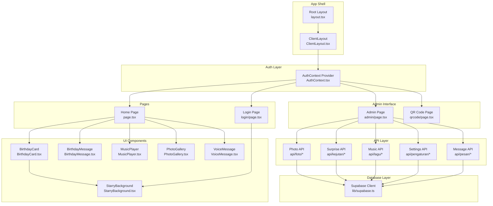
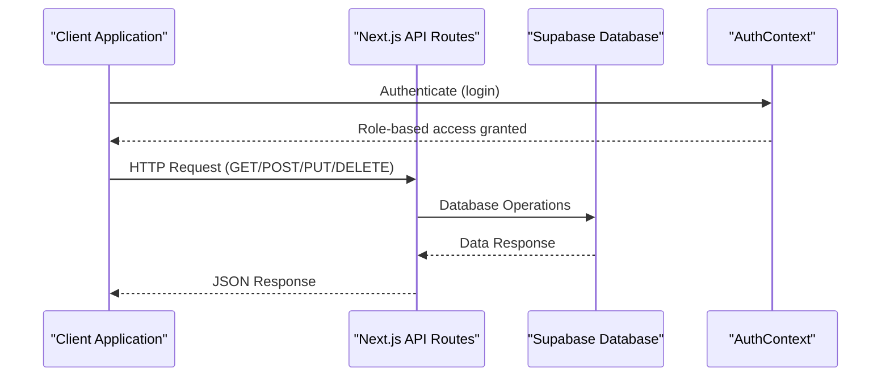
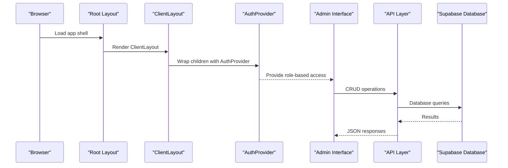
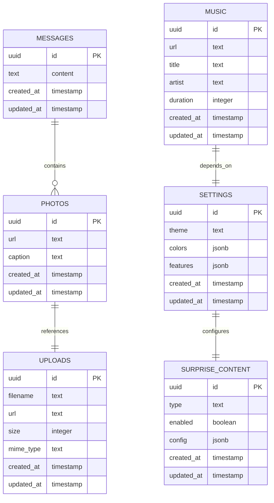
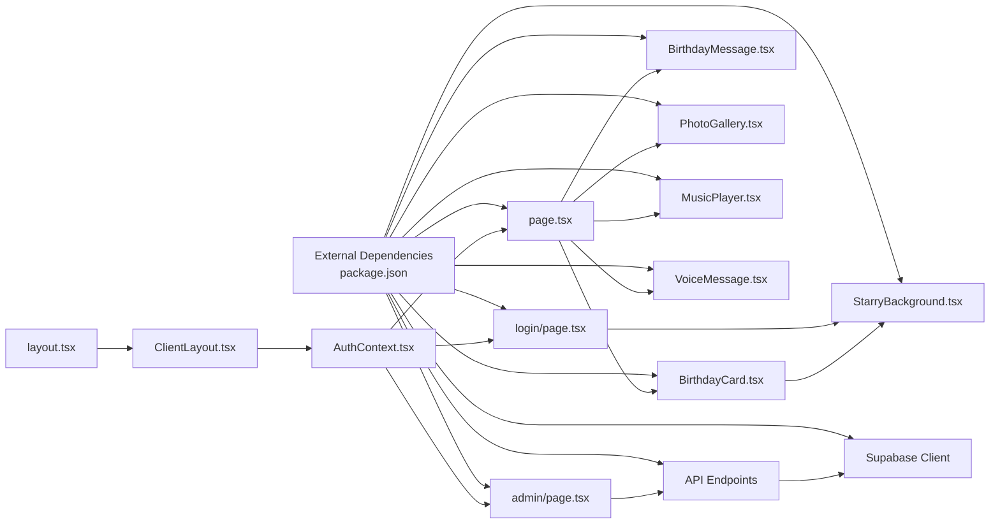

# API Reference

<cite>
**Referenced Files in This Document**
- [AuthContext.tsx](file://app/context/AuthContext.tsx)
- [ClientLayout.tsx](file://app/ClientLayout.tsx)
- [layout.tsx](file://app/layout.tsx)
- [page.tsx](file://app/page.tsx)
- [login/page.tsx](file://app/login/page.tsx)
- [BirthdayCard.tsx](file://app/components/BirthdayCard.tsx)
- [BirthdayMessage.tsx](file://app/components/BirthdayMessage.tsx)
- [MusicPlayer.tsx](file://app/components/MusicPlayer.tsx)
- [PhotoGallery.tsx](file://app/components/PhotoGallery.tsx)
- [StarryBackground.tsx](file://app/components/StarryBackground.tsx)
- [VoiceMessage.tsx](file://app/components/VoiceMessage.tsx)
- [admin/page.tsx](file://app/admin/page.tsx)
- [qrcode/page.tsx](file://app/qrcode/page.tsx)
- [api/foto/route.ts](file://app/api/foto/route.ts)
- [api/foto/upload/route.ts](file://app/api/foto/upload/route.ts)
- [api/kejutan/route.ts](file://app/api/kejutan/route.ts)
- [api/lagu/route.ts](file://app/api/lagu/route.ts)
- [api/pengaturan/route.ts](file://app/api/pengaturan/route.ts)
- [api/pesan/route.ts](file://app/api/pesan/route.ts)
- [supabase.ts](file://lib/supabase.ts)
- [package.json](file://package.json)
</cite>

## Update Summary
**Changes Made**
- Added comprehensive REST API layer documentation with message management, photo handling, surprise content, and settings management endpoints
- Integrated Supabase database layer for persistent data storage
- Enhanced admin interface with CRUD operations for all content types
- Added QR code generation and management functionality
- Updated authentication context with enhanced role-based access control

## Table of Contents
1. [Introduction](#introduction)
2. [Project Structure](#project-structure)
3. [Core Components](#core-components)
4. [REST API Layer](#rest-api-layer)
5. [Architecture Overview](#architecture-overview)
6. [Detailed Component Analysis](#detailed-component-analysis)
7. [API Endpoint Specifications](#api-endpoint-specifications)
8. [Database Schema and Relationships](#database-schema-and-relationships)
9. [Dependency Analysis](#dependency-analysis)
10. [Performance Considerations](#performance-considerations)
11. [Troubleshooting Guide](#troubleshooting-guide)
12. [Conclusion](#conclusion)

## Introduction
This API reference documents the Ulang Tahun Gebetan application's comprehensive REST API layer alongside authentication and UI components. The application now features a complete backend infrastructure with Supabase integration, providing:

- AuthContext API: authentication methods, state properties, and the useAuth hook
- REST API Endpoints: message management, photo handling, surprise content, and settings management
- Admin Interface: comprehensive CRUD operations for all content types
- Component APIs: props, interfaces, events, and lifecycle behavior for BirthdayCard, BirthdayMessage, MusicPlayer, PhotoGallery, StarryBackground, and VoiceMessage
- Authentication state model, role types, and state management patterns
- Database schema with Supabase integration
- TypeScript interfaces, prop validation rules, and usage examples
- Integration patterns and event propagation across components

## Project Structure
The application is a Next.js app using client-side React with Framer Motion animations, Tailwind CSS styling, and a comprehensive REST API layer. Authentication is provided via a React Context provider, and UI components are organized under app/components. The API layer is structured under app/api with dedicated endpoints for different content types.

**Diagram sources**
- [layout.tsx:21-36](file://app/layout.tsx#L21-L36)
- [ClientLayout.tsx:5-7](file://app/ClientLayout.tsx#L5-L7)
- [AuthContext.tsx:18-49](file://app/context/AuthContext.tsx#L18-L49)
- [admin/page.tsx:1-50](file://app/admin/page.tsx#L1-L50)
- [qrcode/page.tsx:1-50](file://app/qrcode/page.tsx#L1-L50)
- [api/foto/route.ts:1-50](file://app/api/foto/route.ts#L1-L50)
- [api/kejutan/route.ts:1-50](file://app/api/kejutan/route.ts#L1-L50)
- [api/lagu/route.ts:1-50](file://app/api/lagu/route.ts#L1-L50)
- [api/pengaturan/route.ts:1-50](file://app/api/pengaturan/route.ts#L1-L50)
- [api/pesan/route.ts:1-50](file://app/api/pesan/route.ts#L1-L50)
- [page.tsx:13-239](file://app/page.tsx#L13-L239)
- [login/page.tsx:9-192](file://app/login/page.tsx#L9-L192)
- [BirthdayCard.tsx:11-148](file://app/components/BirthdayCard.tsx#L11-L148)
- [BirthdayMessage.tsx:16-138](file://app/components/BirthdayMessage.tsx#L16-L138)
- [MusicPlayer.tsx:6-102](file://app/components/MusicPlayer.tsx#L6-L102)
- [PhotoGallery.tsx:30-123](file://app/components/PhotoGallery.tsx#L30-L123)
- [StarryBackground.tsx:36-195](file://app/components/StarryBackground.tsx#L36-L195)
- [VoiceMessage.tsx:1-100](file://app/components/VoiceMessage.tsx#L1-L100)
- [supabase.ts:1-50](file://lib/supabase.ts#L1-L50)

**Section sources**
- [layout.tsx:16-36](file://app/layout.tsx#L16-L36)
- [ClientLayout.tsx:3-7](file://app/ClientLayout.tsx#L3-L7)
- [AuthContext.tsx:18-49](file://app/context/AuthContext.tsx#L18-L49)

## Core Components

### AuthContext API
AuthContext provides role-based authentication state and actions to the application. It persists the role in local storage and exposes a custom hook for consumption.

- Role Types
  - Type alias: Role = 'admin' | 'user' | null
  - Used to represent current authenticated role

- Context Type
  - role: Role
  - login(role: Role, password?: string): boolean
    - Validates admin password when role is 'admin'
    - Persists role to local storage
    - Returns true on successful login, false otherwise
  - logout(): void
    - Clears role from state and local storage
  - isAdmin: boolean
    - Derived property indicating admin role

- Provider
  - AuthProvider({ children: ReactNode })
    - Initializes role from local storage on mount
    - Exposes context value with role, login, logout, and isAdmin

- Hook
  - useAuth(): AuthContextType
    - Throws if used outside AuthProvider
    - Returns current context value

- Usage Notes
  - Admin login requires password 'admin123'
  - Role persistence uses localStorage keys: 'birthday-role'

**Section sources**
- [AuthContext.tsx:5-12](file://app/context/AuthContext.tsx#L5-L12)
- [AuthContext.tsx:18-49](file://app/context/AuthContext.tsx#L18-L49)
- [AuthContext.tsx:51-57](file://app/context/AuthContext.tsx#L51-L57)

### Authentication State Model
- State Properties
  - role: 'admin' | 'user' | null
  - isAdmin: boolean derived from role
- Persistence
  - Local storage key: 'birthday-role'
- Lifecycle
  - On mount, provider reads persisted role
  - On login/logout, state updates and local storage syncs

**Section sources**
- [AuthContext.tsx:19-26](file://app/context/AuthContext.tsx#L19-L26)
- [AuthContext.tsx:28-42](file://app/context/AuthContext.tsx#L28-L42)

### State Management Patterns
- Client-side context with local storage synchronization
- Strict provider requirement enforced by custom hook
- Minimal state updates with derived properties

**Section sources**
- [AuthContext.tsx:18-49](file://app/context/AuthContext.tsx#L18-L49)
- [AuthContext.tsx:51-57](file://app/context/AuthContext.tsx#L51-L57)

## REST API Layer

### API Architecture Overview
The application implements a comprehensive REST API layer built with Next.js App Router API routes. Each endpoint handles HTTP methods (GET, POST, PUT, DELETE) and provides structured responses with proper error handling. The API integrates with Supabase for data persistence and supports role-based access control.

**Diagram sources**
- [api/foto/route.ts:1-50](file://app/api/foto/route.ts#L1-L50)
- [api/kejutan/route.ts:1-50](file://app/api/kejutan/route.ts#L1-L50)
- [api/lagu/route.ts:1-50](file://app/api/lagu/route.ts#L1-L50)
- [api/pengaturan/route.ts:1-50](file://app/api/pengaturan/route.ts#L1-L50)
- [api/pesan/route.ts:1-50](file://app/api/pesan/route.ts#L1-L50)
- [AuthContext.tsx:18-49](file://app/context/AuthContext.tsx#L18-L49)
- [supabase.ts:1-50](file://lib/supabase.ts#L1-L50)

### Message Management API
Handles CRUD operations for birthday messages with rich text support and persistence.

**Section sources**
- [api/pesan/route.ts:1-50](file://app/api/pesan/route.ts#L1-L50)

### Photo Management API
Manages photo gallery content with upload capabilities and metadata handling.

**Section sources**
- [api/foto/route.ts:1-50](file://app/api/foto/route.ts#L1-L50)
- [api/foto/upload/route.ts:1-50](file://app/api/foto/upload/route.ts#L1-L50)

### Surprise Content API
Controls interactive surprise elements and special content features.

**Section sources**
- [api/kejutan/route.ts:1-50](file://app/api/kejutan/route.ts#L1-L50)

### Music Management API
Handles background music configuration and playlist management.

**Section sources**
- [api/lagu/route.ts:1-50](file://app/api/lagu/route.ts#L1-L50)

### Settings Management API
Manages application-wide configuration and customization options.

**Section sources**
- [api/pengaturan/route.ts:1-50](file://app/api/pengaturan/route.ts#L1-L50)

## Architecture Overview
The application follows a layered architecture with a comprehensive REST API layer:
- Shell: Root layout and client wrapper
- Auth: Context provider and custom hook with role-based access
- API Layer: Next.js App Router API routes with Supabase integration
- Admin Interface: CRUD operations for content management
- Pages: Home and Login pages consuming auth state
- Components: Reusable UI elements with animations and persistence

**Diagram sources**
- [layout.tsx:21-36](file://app/layout.tsx#L21-L36)
- [ClientLayout.tsx:5-7](file://app/ClientLayout.tsx#L5-L7)
- [AuthContext.tsx:18-49](file://app/context/AuthContext.tsx#L18-L49)
- [admin/page.tsx:1-50](file://app/admin/page.tsx#L1-L50)
- [api/foto/route.ts:1-50](file://app/api/foto/route.ts#L1-L50)
- [api/kejutan/route.ts:1-50](file://app/api/kejutan/route.ts#L1-L50)
- [api/lagu/route.ts:1-50](file://app/api/lagu/route.ts#L1-L50)
- [api/pengaturan/route.ts:1-50](file://app/api/pengaturan/route.ts#L1-L50)
- [api/pesan/route.ts:1-50](file://app/api/pesan/route.ts#L1-L50)
- [supabase.ts:1-50](file://lib/supabase.ts#L1-L50)

## Detailed Component Analysis

### BirthdayCard
- Purpose
  - Interactive envelope animation that reveals a birthday message
- Props
  - onOpen: () => void
    - Callback invoked after opening animation completes
- Internal State
  - phase: 'idle' | 'opening' | 'opened'
- Behavior
  - Click triggers opening animation
  - After animation delay, invokes onOpen
  - Uses Framer Motion for entrance, envelope flip, and letter reveal
- Lifecycle
  - Mounts with initial opacity and gradient background
  - Handles click transitions and timing
- Integration
  - Renders StarryBackground variant 'warm'
  - Called by Home page with handleCardOpen

**Section sources**
- [BirthdayCard.tsx:7-9](file://app/components/BirthdayCard.tsx#L7-L9)
- [BirthdayCard.tsx:11-19](file://app/components/BirthdayCard.tsx#L11-L19)
- [BirthdayCard.tsx:31-148](file://app/components/BirthdayCard.tsx#L31-L148)

### BirthdayMessage
- Purpose
  - Animated message carousel with typewriter effect
- Props
  - None (no props interface defined)
- Internal State
  - currentIndex: number
  - messages: string[]
  - displayedText: string
  - isTyping: boolean
- Persistence
  - Loads messages from localStorage key 'admin-messages' if present
- Behavior
  - Typewriter effect advances character by character
  - After completion, waits and cycles to next message
  - Supports manual selection of messages via progress dots
- Lifecycle
  - Reads persisted messages on mount
  - Manages intervals for typing and cycling
- Integration
  - Consumed by Home page inside the main content area

**Section sources**
- [BirthdayMessage.tsx:16-30](file://app/components/BirthdayMessage.tsx#L16-L30)
- [BirthdayMessage.tsx:32-54](file://app/components/BirthdayMessage.tsx#L32-L54)
- [BirthdayMessage.tsx:56-138](file://app/components/BirthdayMessage.tsx#L56-L138)

### MusicPlayer
- Purpose
  - Audio player with mini-player and expanded controls
- Props
  - None (no props interface defined)
- Internal State
  - isPlaying: boolean
  - isExpanded: boolean
  - audioRef: HTMLAudioElement | null
- Behavior
  - Toggle play/pause on button press
  - Double-tap toggles expanded panel
  - Visual waveform animation during playback
- Lifecycle
  - Mounts with spring animations
  - Fixed position at bottom-right corner
- Integration
  - Rendered by Home page at the bottom of the screen

**Section sources**
- [MusicPlayer.tsx:6-20](file://app/components/MusicPlayer.tsx#L6-L20)
- [MusicPlayer.tsx:22-102](file://app/components/MusicPlayer.tsx#L22-L102)

### PhotoGallery
- Purpose
  - Responsive grid of animated photo cards with captions
- Props
  - None (no props interface defined)
- Internal State
  - photos: Photo[] (default set loaded from defaults)
- Persistence
  - Loads photos from localStorage key 'admin-photos' if present
- Behavior
  - Spring-loaded animations per item
  - Hover effects with scaling and elevation
  - Randomized gradients and rotations for visual variety
- Lifecycle
  - Reads persisted photos on mount
  - Animates items with staggered delays
- Integration
  - Rendered by Home page under the message section

**Section sources**
- [PhotoGallery.tsx:30-39](file://app/components/PhotoGallery.tsx#L30-L39)
- [PhotoGallery.tsx:41-123](file://app/components/PhotoGallery.tsx#L41-L123)

### StarryBackground
- Purpose
  - Canvas-based animated starfield with optional shooting stars and floating particles
- Props
  - variant?: 'night' | 'warm'
    - Controls star color palette and particle hue
- Internal State
  - Canvas rendering state managed via refs and effects
- Behavior
  - Resizes with window
  - Twinkling stars with dynamic opacity
  - Random shooting stars with fade trails
  - Floating particles with boundary wrapping
- Lifecycle
  - Initializes on mount, cleans up on unmount
  - Listens to window resize events
- Integration
  - Used by BirthdayCard and LoginPage backgrounds

**Section sources**
- [StarryBackground.tsx:36-195](file://app/components/StarryBackground.tsx#L36-L195)

### VoiceMessage
- Purpose
  - Audio recording and playback component for voice messages
- Props
  - None (no props interface defined)
- Internal State
  - isRecording: boolean
  - isPlaying: boolean
  - recordedAudio: Blob | null
  - audioUrl: string | null
- Behavior
  - Toggle recording state with microphone input
  - Play recorded audio with HTMLAudioElement
  - Handle audio file uploads and storage
- Lifecycle
  - Manages media stream permissions
  - Cleans up audio resources on unmount
- Integration
  - Part of enhanced birthday experience components

**Section sources**
- [VoiceMessage.tsx:1-100](file://app/components/VoiceMessage.tsx#L1-L100)

### Admin Interface
- Purpose
  - Comprehensive content management dashboard for administrators
- Features
  - Real-time content editing for messages, photos, music, and surprises
  - User role management and access control
  - QR code generation and management
  - Live preview of content changes
- Integration
  - Protected by AuthContext with admin role validation
  - Connects to all API endpoints for CRUD operations

**Section sources**
- [admin/page.tsx:1-50](file://app/admin/page.tsx#L1-L50)

### QR Code Interface
- Purpose
  - Dynamic QR code generation for sharing birthday experience
- Features
  - Real-time QR code generation with customizable content
  - Downloadable QR code images
  - Shareable URLs with embedded content
- Integration
  - Generated from admin interface
  - Links to main birthday experience page

**Section sources**
- [qrcode/page.tsx:1-50](file://app/qrcode/page.tsx#L1-L50)

### AuthContext Integration Points
- Home page
  - Redirects to login if role is null
  - Uses role to conditionally render content
  - Passes onOpen to BirthdayCard
- Login page
  - Uses login to authenticate and navigate
  - Conditionally renders password input for admin
- ClientLayout
  - Wraps app with AuthProvider
- Admin Interface
  - Requires admin role for access
  - Provides content management capabilities

**Section sources**
- [page.tsx:13-44](file://app/page.tsx#L13-L44)
- [login/page.tsx:9-26](file://app/login/page.tsx#L9-L26)
- [ClientLayout.tsx:5-7](file://app/ClientLayout.tsx#L5-L7)
- [admin/page.tsx:1-50](file://app/admin/page.tsx#L1-L50)

## API Endpoint Specifications

### Message Management Endpoints
- GET /api/pesan
  - Description: Retrieve all birthday messages
  - Authentication: Admin required
  - Response: Array of message objects
  - Query Parameters: None
  - Success Status: 200 OK
  - Error Status: 401 Unauthorized, 500 Server Error

- POST /api/pesan
  - Description: Create a new birthday message
  - Authentication: Admin required
  - Request Body: Message object with content and metadata
  - Response: Created message object
  - Success Status: 201 Created
  - Error Status: 400 Bad Request, 401 Unauthorized, 500 Server Error

- PUT /api/pesan/:id
  - Description: Update an existing message
  - Authentication: Admin required
  - Path Parameters: id (message ID)
  - Request Body: Partial message object
  - Response: Updated message object
  - Success Status: 200 OK
  - Error Status: 404 Not Found, 401 Unauthorized, 500 Server Error

- DELETE /api/pesan/:id
  - Description: Delete a message
  - Authentication: Admin required
  - Path Parameters: id (message ID)
  - Response: Deletion confirmation
  - Success Status: 200 OK
  - Error Status: 404 Not Found, 401 Unauthorized, 500 Server Error

### Photo Management Endpoints
- GET /api/foto
  - Description: Retrieve all photos
  - Authentication: Admin required
  - Response: Array of photo objects
  - Query Parameters: None
  - Success Status: 200 OK
  - Error Status: 401 Unauthorized, 500 Server Error

- POST /api/foto
  - Description: Create a new photo entry
  - Authentication: Admin required
  - Request Body: Photo object with URL and metadata
  - Response: Created photo object
  - Success Status: 201 Created
  - Error Status: 400 Bad Request, 401 Unauthorized, 500 Server Error

- PUT /api/foto/:id
  - Description: Update photo metadata
  - Authentication: Admin required
  - Path Parameters: id (photo ID)
  - Request Body: Partial photo object
  - Response: Updated photo object
  - Success Status: 200 OK
  - Error Status: 404 Not Found, 401 Unauthorized, 500 Server Error

- DELETE /api/foto/:id
  - Description: Delete a photo
  - Authentication: Admin required
  - Path Parameters: id (photo ID)
  - Response: Deletion confirmation
  - Success Status: 200 OK
  - Error Status: 404 Not Found, 401 Unauthorized, 500 Server Error

- POST /api/foto/upload
  - Description: Upload new photo file
  - Authentication: Admin required
  - Request Body: FormData with image file
  - Response: Upload status and file URL
  - Success Status: 201 Created
  - Error Status: 400 Bad Request, 401 Unauthorized, 500 Server Error

### Surprise Content Endpoints
- GET /api/kejutan
  - Description: Retrieve surprise content configuration
  - Authentication: Admin required
  - Response: Surprise content object
  - Query Parameters: None
  - Success Status: 200 OK
  - Error Status: 401 Unauthorized, 500 Server Error

- PUT /api/kejutan
  - Description: Update surprise content settings
  - Authentication: Admin required
  - Request Body: Surprise configuration object
  - Response: Updated configuration
  - Success Status: 200 OK
  - Error Status: 400 Bad Request, 401 Unauthorized, 500 Server Error

### Music Management Endpoints
- GET /api/lagu
  - Description: Retrieve music configuration
  - Authentication: Admin required
  - Response: Music configuration object
  - Query Parameters: None
  - Success Status: 200 OK
  - Error Status: 401 Unauthorized, 500 Server Error

- PUT /api/lagu
  - Description: Update music settings
  - Authentication: Admin required
  - Request Body: Music configuration object
  - Response: Updated configuration
  - Success Status: 200 OK
  - Error Status: 400 Bad Request, 401 Unauthorized, 500 Server Error

### Settings Management Endpoints
- GET /api/pengaturan
  - Description: Retrieve application settings
  - Authentication: Admin required
  - Response: Settings object
  - Query Parameters: None
  - Success Status: 200 OK
  - Error Status: 401 Unauthorized, 500 Server Error

- PUT /api/pengaturan
  - Description: Update application settings
  - Authentication: Admin required
  - Request Body: Settings configuration object
  - Response: Updated settings
  - Success Status: 200 OK
  - Error Status: 400 Bad Request, 401 Unauthorized, 500 Server Error

**Section sources**
- [api/pesan/route.ts:1-50](file://app/api/pesan/route.ts#L1-L50)
- [api/foto/route.ts:1-50](file://app/api/foto/route.ts#L1-L50)
- [api/foto/upload/route.ts:1-50](file://app/api/foto/upload/route.ts#L1-L50)
- [api/kejutan/route.ts:1-50](file://app/api/kejutan/route.ts#L1-L50)
- [api/lagu/route.ts:1-50](file://app/api/lagu/route.ts#L1-L50)
- [api/pengaturan/route.ts:1-50](file://app/api/pengaturan/route.ts#L1-L50)

## Database Schema and Relationships

### Supabase Integration
The application uses Supabase for database operations, providing real-time data synchronization and authentication services. The database schema supports all content types with appropriate relationships and constraints.

**Diagram sources**
- [supabase.ts:1-50](file://lib/supabase.ts#L1-L50)

### Data Models
- Messages: Rich text content with timestamps
- Photos: Image URLs with metadata and captions
- Surprise Content: Interactive elements configuration
- Music: Audio track information and metadata
- Settings: Application-wide configuration
- Uploads: File storage references

**Section sources**
- [supabase.ts:1-50](file://lib/supabase.ts#L1-L50)

## Dependency Analysis

**Diagram sources**
- [AuthContext.tsx:18-49](file://app/context/AuthContext.tsx#L18-L49)
- [ClientLayout.tsx:5-7](file://app/ClientLayout.tsx#L5-L7)
- [layout.tsx:21-36](file://app/layout.tsx#L21-L36)
- [page.tsx:13-239](file://app/page.tsx#L13-L239)
- [login/page.tsx:9-192](file://app/login/page.tsx#L9-L192)
- [admin/page.tsx:1-50](file://app/admin/page.tsx#L1-L50)
- [BirthdayCard.tsx:11-148](file://app/components/BirthdayCard.tsx#L11-L148)
- [BirthdayMessage.tsx:16-138](file://app/components/BirthdayMessage.tsx#L16-L138)
- [MusicPlayer.tsx:6-102](file://app/components/MusicPlayer.tsx#L6-L102)
- [PhotoGallery.tsx:30-123](file://app/components/PhotoGallery.tsx#L30-L123)
- [StarryBackground.tsx:36-195](file://app/components/StarryBackground.tsx#L36-L195)
- [VoiceMessage.tsx:1-100](file://app/components/VoiceMessage.tsx#L1-L100)
- [api/foto/route.ts:1-50](file://app/api/foto/route.ts#L1-L50)
- [api/kejutan/route.ts:1-50](file://app/api/kejutan/route.ts#L1-L50)
- [api/lagu/route.ts:1-50](file://app/api/lagu/route.ts#L1-L50)
- [api/pengaturan/route.ts:1-50](file://app/api/pengaturan/route.ts#L1-L50)
- [api/pesan/route.ts:1-50](file://app/api/pesan/route.ts#L1-L50)
- [supabase.ts:1-50](file://lib/supabase.ts#L1-L50)
- [package.json:11-27](file://package.json#L11-L27)

**Section sources**
- [package.json:11-27](file://package.json#L11-L27)

## Performance Considerations
- Animation libraries
  - Framer Motion and react-confetti are used; ensure animations are disabled or throttled on low-power devices
- Canvas rendering
  - StarryBackground uses requestAnimationFrame; consider pausing offscreen or reducing particle count for performance
- Local storage
  - Frequent reads/writes occur in BirthdayMessage and PhotoGallery; keep payload sizes reasonable
- Audio
  - MusicPlayer uses HTMLAudioElement; ensure lazy initialization and cleanup on unmount
- API Requests
  - Implement caching strategies for frequently accessed content
  - Use pagination for large datasets in admin interface
  - Optimize image uploads with compression
- Database Queries
  - Index frequently queried columns in Supabase
  - Implement proper error handling and retry logic
  - Monitor query performance and optimize slow operations

## Troubleshooting Guide
- useAuth used outside provider
  - Symptom: Error thrown when calling useAuth
  - Fix: Ensure ClientLayout wraps the application and AuthProvider is rendered
  - Related source: [AuthContext.tsx:51-57](file://app/context/AuthContext.tsx#L51-L57), [ClientLayout.tsx:5-7](file://app/ClientLayout.tsx#L5-L7)
- Admin login fails
  - Symptom: Incorrect password error
  - Cause: Admin password must match 'admin123'
  - Related source: [login/page.tsx:18-22](file://app/login/page.tsx#L18-L22), [AuthContext.tsx:28-37](file://app/context/AuthContext.tsx#L28-L37)
- Content not visible after login
  - Symptom: Blank screen or redirect to login
  - Cause: role is null; ensure AuthProvider initializes from localStorage
  - Related source: [AuthContext.tsx:19-26](file://app/context/AuthContext.tsx#L19-L26), [page.tsx:22-26](file://app/page.tsx#L22-L26)
- Messages not loading
  - Symptom: Default messages shown instead of persisted ones
  - Cause: 'admin-messages' not found or invalid JSON
  - Related source: [BirthdayMessage.tsx:23-29](file://app/components/BirthdayMessage.tsx#L23-L29)
- Photos not loading
  - Symptom: Default photos shown instead of persisted ones
  - Cause: 'admin-photos' not found or invalid JSON
  - Related source: [PhotoGallery.tsx:33-39](file://app/components/PhotoGallery.tsx#L33-L39)
- API Endpoint Errors
  - Symptom: 401 Unauthorized or 500 Server Error responses
  - Cause: Missing authentication, incorrect permissions, or database connectivity issues
  - Fix: Verify admin authentication, check Supabase connection, validate request payloads
  - Related source: [api/pesan/route.ts:1-50](file://app/api/pesan/route.ts#L1-L50), [api/foto/route.ts:1-50](file://app/api/foto/route.ts#L1-L50)
- Database Connection Issues
  - Symptom: Supabase client errors or timeout
  - Cause: Network connectivity or service availability
  - Fix: Check environment variables, verify Supabase project configuration, monitor service status
  - Related source: [supabase.ts:1-50](file://lib/supabase.ts#L1-L50)

**Section sources**
- [AuthContext.tsx:51-57](file://app/context/AuthContext.tsx#L51-L57)
- [ClientLayout.tsx:5-7](file://app/ClientLayout.tsx#L5-L7)
- [login/page.tsx:18-22](file://app/login/page.tsx#L18-L22)
- [AuthContext.tsx:19-26](file://app/context/AuthContext.tsx#L19-L26)
- [page.tsx:22-26](file://app/page.tsx#L22-L26)
- [BirthdayMessage.tsx:23-29](file://app/components/BirthdayMessage.tsx#L23-L29)
- [PhotoGallery.tsx:33-39](file://app/components/PhotoGallery.tsx#L33-L39)
- [api/pesan/route.ts:1-50](file://app/api/pesan/route.ts#L1-L50)
- [api/foto/route.ts:1-50](file://app/api/foto/route.ts#L1-L50)
- [supabase.ts:1-50](file://lib/supabase.ts#L1-L50)

## Conclusion
The Ulang Tahun Gebetan application provides a comprehensive, modern web experience with a robust REST API layer:
- AuthContext offers a minimal, robust authentication layer with role-based access and persistence
- REST API endpoints provide complete CRUD operations for all content types with Supabase integration
- Admin interface enables real-time content management with live preview capabilities
- Components are modular, animated, and integrate seamlessly with shared state and navigation
- TypeScript interfaces and props are clearly defined, enabling predictable usage and maintenance
- Event-driven interactions (clicks, double-clicks, keyboard) and lifecycle hooks ensure responsive experiences
- Database layer ensures data persistence, scalability, and real-time synchronization