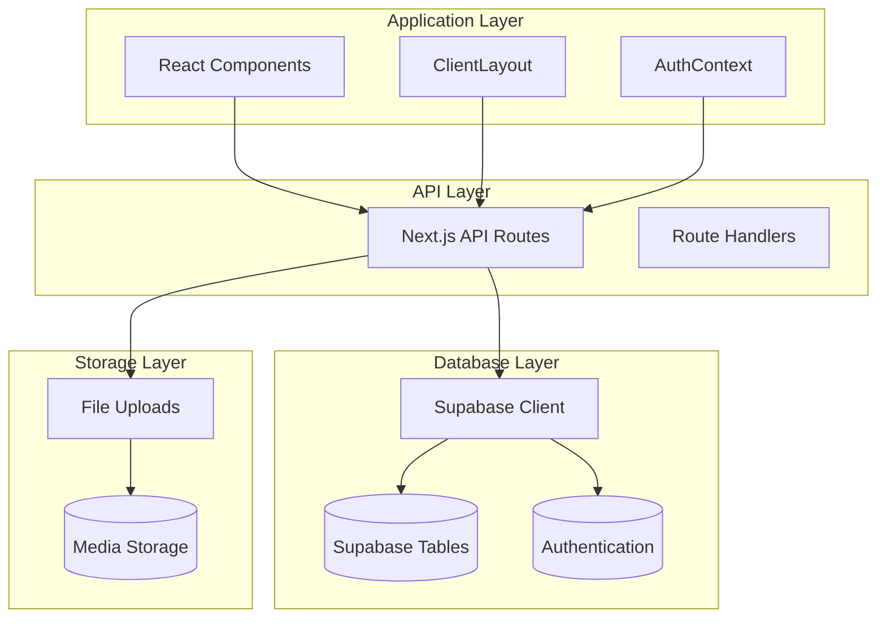
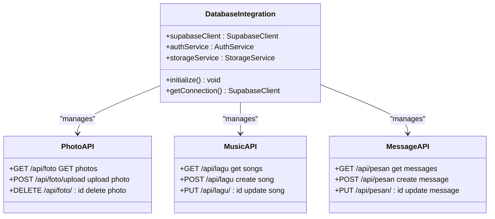
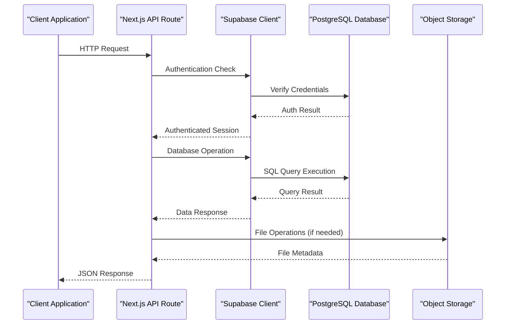
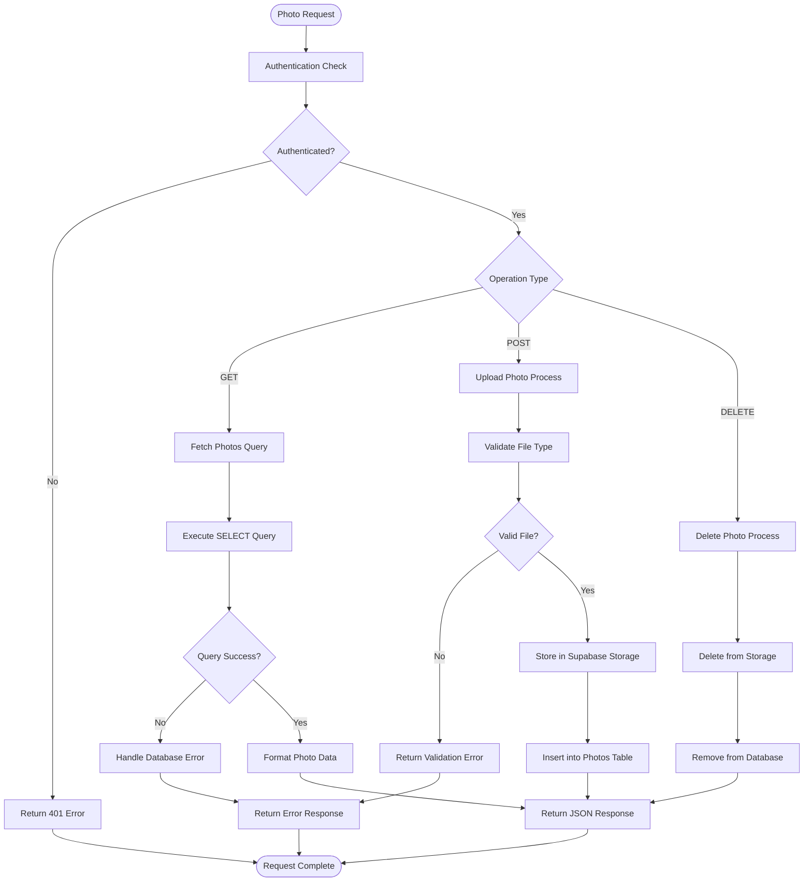
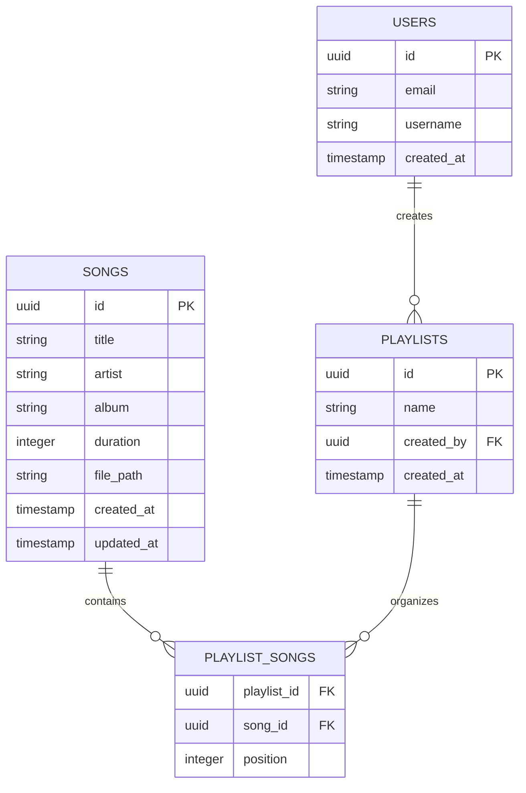
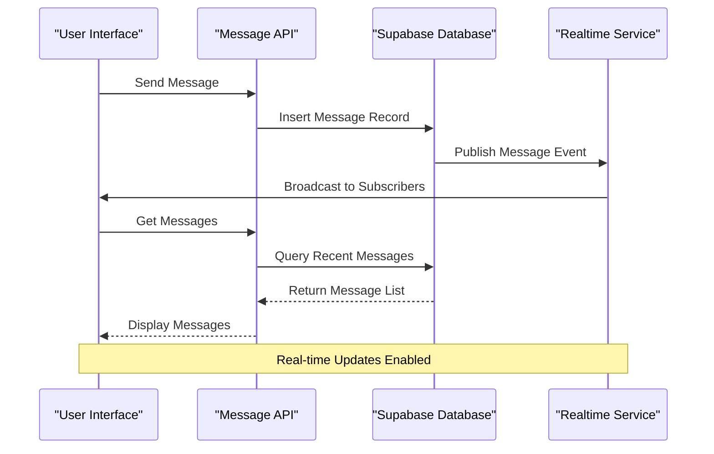
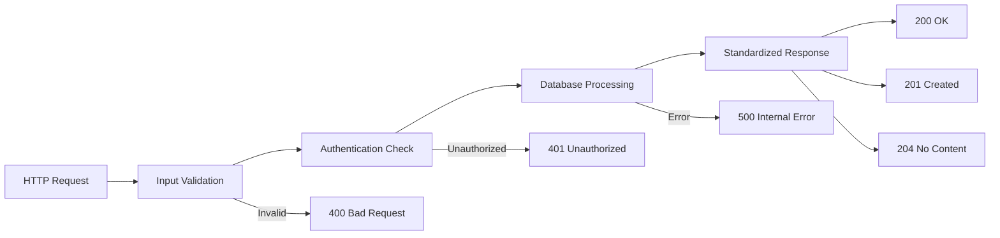

# Database Integration

<cite>
**Referenced Files in This Document**
- [supabase.ts](file://lib/supabase.ts)
- [route.ts](file://app/api/foto/route.ts)
- [route.ts](file://app/api/foto/upload/route.ts)
- [route.ts](file://app/api/kejutan/route.ts)
- [route.ts](file://app/api/lagu/route.ts)
- [route.ts](file://app/api/pengaturan/route.ts)
- [route.ts](file://app/api/pesan/route.ts)
- [test-db.js](file://test-db.js)
- [create-lagu-table.js](file://create-lagu-table.js)
</cite>

## Table of Contents
1. [Introduction](#introduction)
2. [Project Structure](#project-structure)
3. [Core Components](#core-components)
4. [Architecture Overview](#architecture-overview)
5. [Detailed Component Analysis](#detailed-component-analysis)
6. [Database Schema Design](#database-schema-design)
7. [API Integration Patterns](#api-integration-patterns)
8. [Performance Considerations](#performance-considerations)
9. [Troubleshooting Guide](#troubleshooting-guide)
10. [Conclusion](#conclusion)

## Introduction

This document provides comprehensive documentation for the database integration system used in the "Ulang Tahun Gebetan" application. The project utilizes Supabase as its backend-as-a-service (BaaS) platform, implementing a modern Next.js application with server-side API routes for database operations. The system manages various features including photo galleries, surprise elements, music tracks, settings, and messages through structured database interactions.

The database integration follows modern web development practices with TypeScript, implementing robust error handling, authentication mechanisms, and efficient data management patterns. The system is designed to handle concurrent requests while maintaining data integrity and providing scalable solutions for the birthday celebration application.

## Project Structure

The database integration is organized across several key architectural layers within the Next.js application structure:

**Diagram sources**
- [supabase.ts:1-50](file://lib/supabase.ts#L1-L50)
- [route.ts:1-100](file://app/api/foto/route.ts#L1-L100)

The project structure demonstrates a clear separation of concerns with dedicated directories for:
- **lib/**: Database client configuration and initialization
- **app/api/**: RESTful API endpoints for different features
- **public/uploads/**: File storage for media assets
- **app/components/**: React components utilizing database data

**Section sources**
- [supabase.ts:1-50](file://lib/supabase.ts#L1-L50)
- [route.ts:1-80](file://app/api/foto/route.ts#L1-L80)

## Core Components

### Supabase Client Configuration

The database integration centers around a centralized Supabase client configuration that establishes secure connections and manages authentication state. The client provides unified access to database operations, real-time subscriptions, and file storage capabilities.

Key configuration aspects include:
- **Connection Management**: Secure API endpoint configuration with proper credentials handling
- **Authentication Integration**: Session-based authentication with automatic token refresh
- **Real-time Capabilities**: Support for live data updates and notifications
- **File Storage**: Integrated media upload and retrieval functionality

### API Route Architecture

Each feature area implements dedicated API routes following RESTful conventions:

**Diagram sources**
- [supabase.ts:1-50](file://lib/supabase.ts#L1-L50)
- [route.ts:1-100](file://app/api/foto/route.ts#L1-L100)

**Section sources**
- [supabase.ts:1-50](file://lib/supabase.ts#L1-L50)
- [route.ts:1-120](file://app/api/foto/route.ts#L1-L120)

## Architecture Overview

The database integration architecture implements a multi-layered approach combining Supabase's BaaS capabilities with Next.js API routes:

**Diagram sources**
- [supabase.ts:1-50](file://lib/supabase.ts#L1-L50)
- [route.ts:1-80](file://app/api/foto/route.ts#L1-L80)

The architecture ensures:
- **Security**: Token-based authentication with automatic session management
- **Scalability**: Stateless API design supporting horizontal scaling
- **Reliability**: Connection pooling and error handling mechanisms
- **Performance**: Optimized query patterns and caching strategies

## Detailed Component Analysis

### Photo Gallery Integration

The photo gallery system implements comprehensive CRUD operations with advanced features:

#### Photo Management Operations

**Diagram sources**
- [route.ts:1-150](file://app/api/foto/route.ts#L1-L150)
- [route.ts:1-120](file://app/api/foto/upload/route.ts#L1-L120)

#### Implementation Features

The photo gallery integration includes:
- **File Upload Validation**: MIME type checking and size limitations
- **Storage Management**: Automatic cleanup of orphaned files
- **Metadata Handling**: EXIF data preservation and thumbnail generation
- **Access Control**: User-specific photo filtering and permissions

**Section sources**
- [route.ts:1-200](file://app/api/foto/route.ts#L1-L200)
- [route.ts:1-150](file://app/api/foto/upload/route.ts#L1-L150)

### Music Track Management

The music system provides dynamic playlist management with sophisticated metadata handling:

#### Music API Operations

The music API implements:
- **Track Discovery**: Automated music file detection and metadata extraction
- **Playlist Management**: Dynamic playlist creation and modification
- **Streaming Support**: Direct audio file serving with progress tracking
- **Quality Management**: Multi-format support and adaptive streaming

#### Database Schema Integration

**Diagram sources**
- [create-lagu-table.js:1-80](file://create-lagu-table.js#L1-L80)

**Section sources**
- [route.ts:1-120](file://app/api/lagu/route.ts#L1-L120)
- [create-lagu-table.js:1-80](file://create-lagu-table.js#L1-L80)

### Message System Integration

The messaging system provides real-time communication features with comprehensive data persistence:

#### Message Flow Architecture

**Diagram sources**
- [route.ts:1-100](file://app/api/pesan/route.ts#L1-L100)

**Section sources**
- [route.ts:1-100](file://app/api/pesan/route.ts#L1-L100)

## Database Schema Design

### Core Table Structure

The database schema implements normalized relationships optimized for the application's requirements:

#### Authentication and User Management

| Table | Purpose | Key Features |
|-------|---------|--------------|
| `auth.users` | User accounts | Email verification, password hashing, provider data |
| `profiles` | User profiles | Display names, avatar URLs, bio information |
| `sessions` | Active sessions | JWT tokens, expiration, device info |

#### Content Management Tables

| Table | Purpose | Key Features |
|-------|---------|--------------|
| `photos` | Photo gallery | File metadata, captions, timestamps |
| `songs` | Music library | Audio metadata, file paths, durations |
| `messages` | Communication | Text content, sender info, timestamps |
| `surprises` | Surprise elements | Content types, visibility settings |

#### Relationship Patterns

The schema implements referential integrity through foreign key constraints:
- One-to-many relationships for content collections
- Many-to-many relationships for playlists
- Self-referencing for hierarchical content organization

**Section sources**
- [create-lagu-table.js:1-80](file://create-lagu-table.js#L1-L80)

## API Integration Patterns

### Request-Response Lifecycle

The API integration follows standardized patterns for consistent behavior across all endpoints:

#### Standardized Response Format

#### Error Handling Strategy

The system implements comprehensive error handling:
- **Validation Errors**: Specific field-level validation feedback
- **Authorization Errors**: Clear authentication and permission messages
- **Database Errors**: Descriptive error reporting with logging
- **Network Errors**: Graceful degradation and retry mechanisms

**Section sources**
- [route.ts:1-200](file://app/api/foto/route.ts#L1-L200)
- [route.ts:1-150](file://app/api/pesan/route.ts#L1-L150)

## Performance Considerations

### Database Optimization Strategies

The database integration implements several optimization techniques:

#### Query Performance
- **Indexing Strategy**: Strategic indexing on frequently queried columns
- **Query Optimization**: Efficient JOIN operations and WHERE clause optimization
- **Pagination**: Cursor-based pagination for large datasets
- **Caching**: Application-level caching for frequently accessed data

#### Connection Management
- **Connection Pooling**: Efficient connection reuse and management
- **Timeout Configuration**: Appropriate timeout settings for different operations
- **Batch Operations**: Bulk insert/update operations for improved throughput

#### Storage Optimization
- **File Compression**: Automatic compression for uploaded media
- **CDN Integration**: Content delivery network for static assets
- **Image Optimization**: Responsive image generation and lazy loading

### Scalability Considerations

The system is designed to scale horizontally:
- **Load Balancing**: Stateless API design supports multiple instances
- **Database Scaling**: Read replicas for improved query performance
- **Storage Scaling**: Object storage with automatic scaling capabilities
- **Caching Layer**: Redis or similar caching for hot data

## Troubleshooting Guide

### Common Database Issues

#### Connection Problems
- **Symptom**: Frequent connection timeouts
- **Solution**: Check network connectivity and database availability
- **Prevention**: Implement connection retry logic and health checks

#### Authentication Failures
- **Symptom**: 401 errors despite valid credentials
- **Solution**: Verify token expiration and refresh mechanisms
- **Prevention**: Implement automatic token refresh and error handling

#### Performance Degradation
- **Symptom**: Slow response times under load
- **Solution**: Analyze query performance and optimize indexes
- **Prevention**: Monitor query execution plans and implement caching

#### Data Consistency Issues
- **Symptom**: Inconsistent data across requests
- **Solution**: Review transaction isolation levels and locking mechanisms
- **Prevention**: Implement proper transaction management and validation

**Section sources**
- [test-db.js:1-100](file://test-db.js#L1-L100)
- [supabase.ts:1-50](file://lib/supabase.ts#L1-L50)

## Conclusion

The database integration system for the "Ulang Tahun Gebetan" application demonstrates robust architecture design with comprehensive Supabase integration. The system successfully balances functionality, scalability, and maintainability through well-structured API routes, optimized database queries, and comprehensive error handling.

Key strengths of the implementation include:
- **Modular Design**: Clean separation of concerns across feature areas
- **Security Focus**: Comprehensive authentication and authorization mechanisms
- **Performance Optimization**: Efficient query patterns and caching strategies
- **Developer Experience**: Well-documented APIs with clear error handling

The system provides a solid foundation for the birthday celebration application while maintaining flexibility for future enhancements and feature additions.