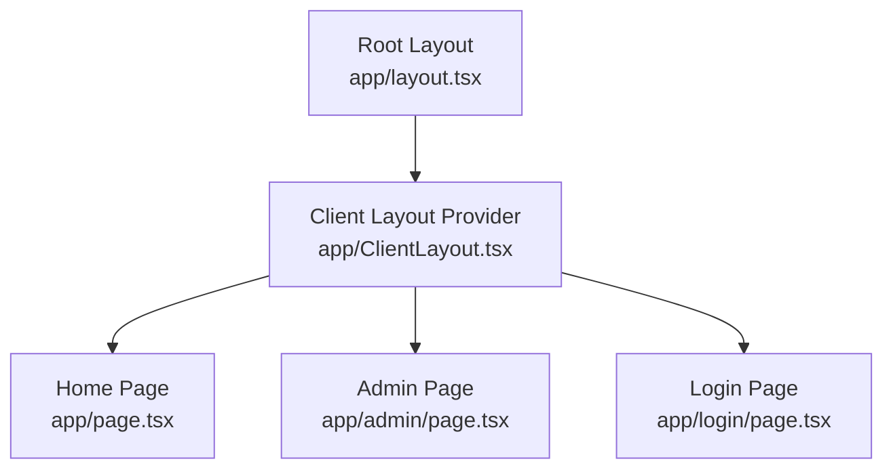
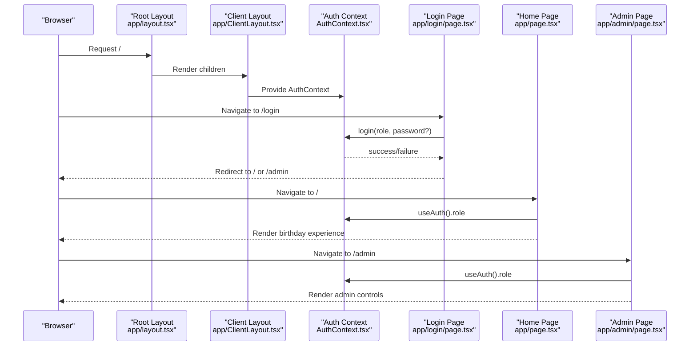
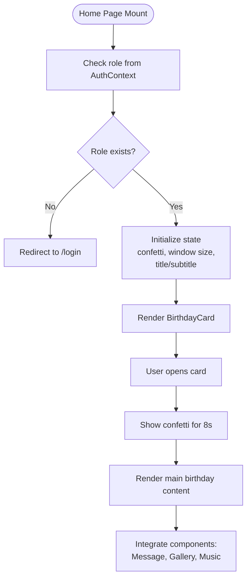
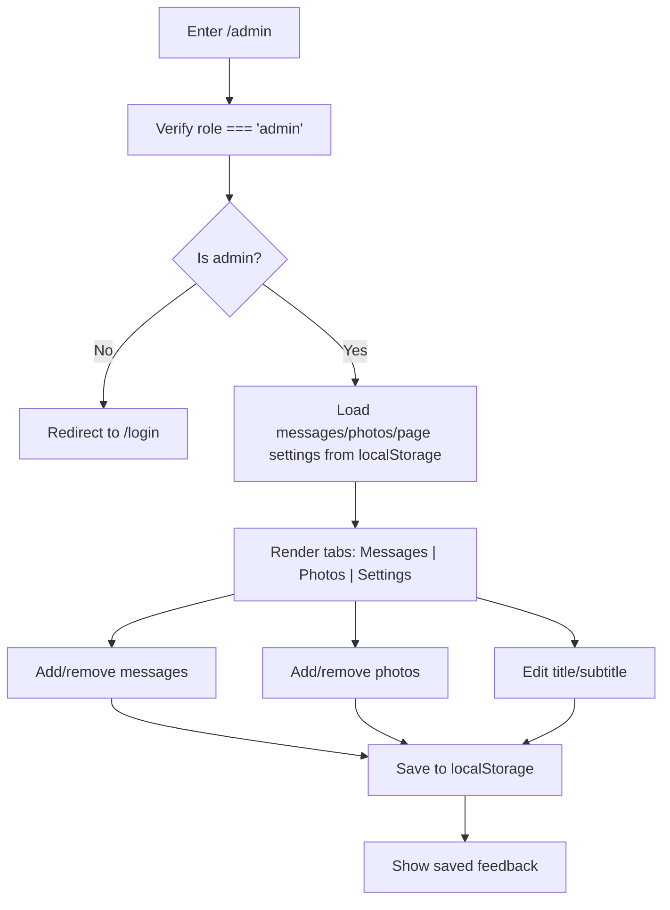
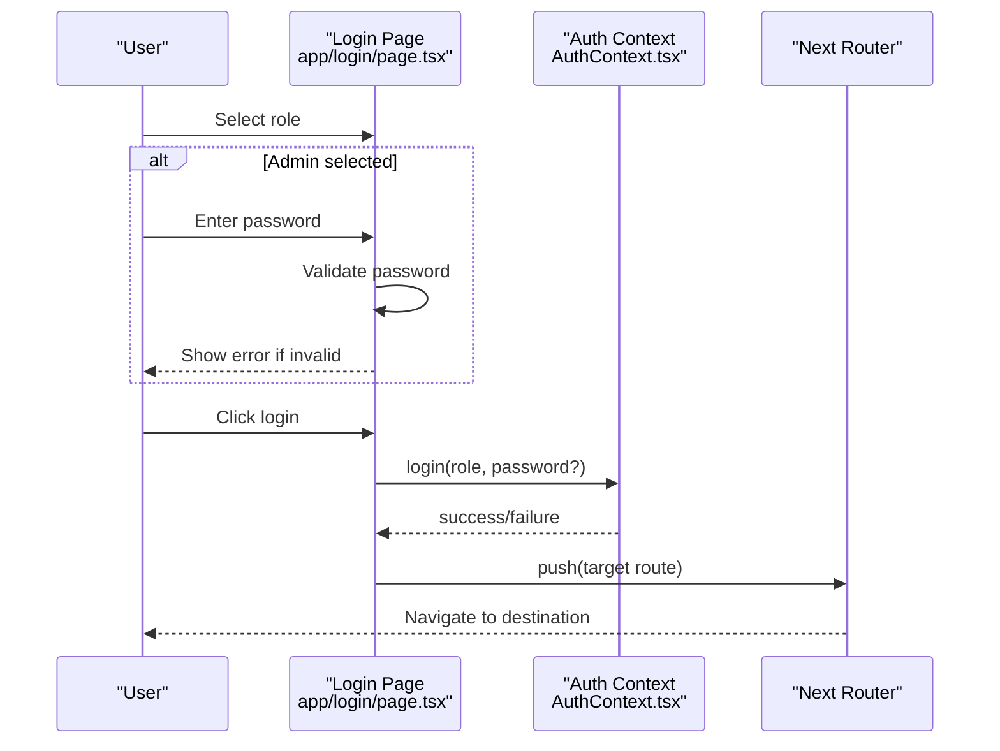
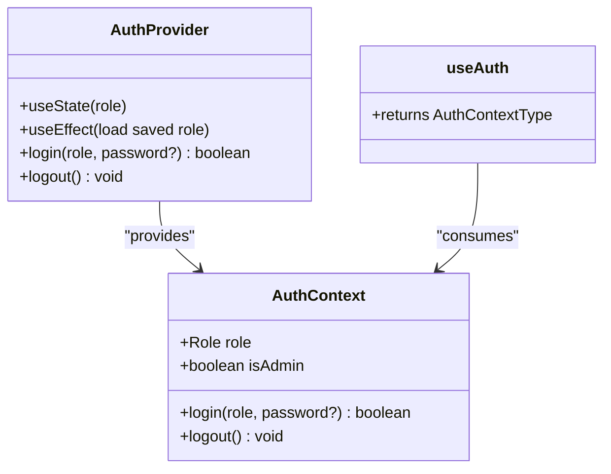
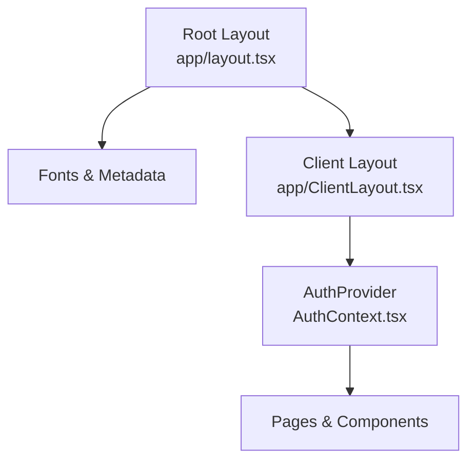
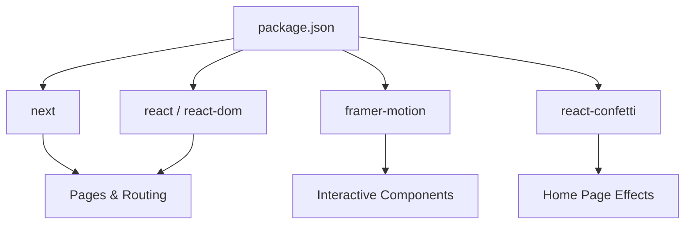

# Application Pages & Routing

<cite>
**Referenced Files in This Document**
- [app/layout.tsx](file://app/layout.tsx)
- [app/ClientLayout.tsx](file://app/ClientLayout.tsx)
- [app/page.tsx](file://app/page.tsx)
- [app/admin/page.tsx](file://app/admin/page.tsx)
- [app/login/page.tsx](file://app/login/page.tsx)
- [app/context/AuthContext.tsx](file://app/context/AuthContext.tsx)
- [app/components/BirthdayCard.tsx](file://app/components/BirthdayCard.tsx)
- [app/components/BirthdayMessage.tsx](file://app/components/BirthdayMessage.tsx)
- [app/components/PhotoGallery.tsx](file://app/components/PhotoGallery.tsx)
- [app/components/MusicPlayer.tsx](file://app/components/MusicPlayer.tsx)
- [app/globals.css](file://app/globals.css)
- [package.json](file://package.json)
- [next.config.ts](file://next.config.ts)
</cite>

## Table of Contents
1. [Introduction](#introduction)
2. [Project Structure](#project-structure)
3. [Core Components](#core-components)
4. [Architecture Overview](#architecture-overview)
5. [Detailed Component Analysis](#detailed-component-analysis)
6. [Dependency Analysis](#dependency-analysis)
7. [Performance Considerations](#performance-considerations)
8. [Troubleshooting Guide](#troubleshooting-guide)
9. [Conclusion](#conclusion)

## Introduction
This document explains the Next.js application pages and routing structure for a birthday celebration website. It covers the file-based routing model, layout hierarchy, client-side rendering requirements, route protection, navigation patterns, and the integration between pages and the authentication system. It also documents page-specific styling, component integration, data persistence, and SEO considerations tailored for a joyful, interactive experience.

## Project Structure
The application follows Next.js file-based routing under the app directory. Key routes include:
- Home page: app/page.tsx (root route /)
- Admin page: app/admin/page.tsx (/admin)
- Login page: app/login/page.tsx (/login)

Layout hierarchy:
- Root layout wraps all pages with fonts, metadata, and the client-side provider.
- ClientLayout.tsx provides the authentication context to child components.

**Diagram sources**
- [app/layout.tsx:16-36](file://app/layout.tsx#L16-L36)
- [app/ClientLayout.tsx:5-7](file://app/ClientLayout.tsx#L5-L7)
- [app/page.tsx:13-238](file://app/page.tsx#L13-L238)
- [app/admin/page.tsx:19-312](file://app/admin/page.tsx#L19-L312)
- [app/login/page.tsx:9-191](file://app/login/page.tsx#L9-L191)

**Section sources**
- [app/layout.tsx:16-36](file://app/layout.tsx#L16-L36)
- [app/ClientLayout.tsx:5-7](file://app/ClientLayout.tsx#L5-L7)
- [app/page.tsx:13-238](file://app/page.tsx#L13-L238)
- [app/admin/page.tsx:19-312](file://app/admin/page.tsx#L19-L312)
- [app/login/page.tsx:9-191](file://app/login/page.tsx#L9-L191)

## Core Components
- Authentication Context: Provides role-based access, login/logout, and admin checks. Used across pages to enforce route protection and enable admin features.
- Home Page: Orchestrates the birthday experience with animated confetti, a flip-card reveal, message carousel, photo gallery, and music player.
- Admin Page: Allows administrators to manage messages, photos, and page settings persisted in local storage.
- Login Page: Role selection screen with optional admin password verification and navigation to target routes.
- Shared Components: BirthdayCard, BirthdayMessage, PhotoGallery, MusicPlayer encapsulate reusable UI and interactions.

Key client-side rendering markers:
- Pages and components use 'use client' to enable client-side hooks and interactivity.

**Section sources**
- [app/context/AuthContext.tsx:18-48](file://app/context/AuthContext.tsx#L18-L48)
- [app/page.tsx:13-238](file://app/page.tsx#L13-L238)
- [app/admin/page.tsx:19-312](file://app/admin/page.tsx#L19-L312)
- [app/login/page.tsx:9-191](file://app/login/page.tsx#L9-L191)
- [app/components/BirthdayCard.tsx:10-158](file://app/components/BirthdayCard.tsx#L10-L158)
- [app/components/BirthdayMessage.tsx:14-97](file://app/components/BirthdayMessage.tsx#L14-L97)
- [app/components/PhotoGallery.tsx:28-99](file://app/components/PhotoGallery.tsx#L28-L99)
- [app/components/MusicPlayer.tsx:6-101](file://app/components/MusicPlayer.tsx#L6-L101)

## Architecture Overview
The routing and layout architecture enforces client-side rendering for interactive components and centralizes authentication state. The flow below illustrates how users move from login to protected areas and how admin-only routes are gated.

**Diagram sources**
- [app/layout.tsx:21-35](file://app/layout.tsx#L21-L35)
- [app/ClientLayout.tsx:5-7](file://app/ClientLayout.tsx#L5-L7)
- [app/context/AuthContext.tsx:28-42](file://app/context/AuthContext.tsx#L28-L42)
- [app/login/page.tsx:16-26](file://app/login/page.tsx#L16-L26)
- [app/page.tsx:14-36](file://app/page.tsx#L14-L36)
- [app/admin/page.tsx:20-61](file://app/admin/page.tsx#L20-L61)

## Detailed Component Analysis

### Home Page (/)
Responsibilities:
- Route protection: Redirects unauthenticated users to /login.
- Interactive birthday reveal: BirthdayCard triggers confetti and reveals the main content.
- Dynamic content: Loads customizable title/subtitle from local storage.
- Integrated experiences: BirthdayMessage carousel, PhotoGallery, and MusicPlayer.

Client-side rendering requirements:
- Uses 'use client', Framer Motion animations, React Confetti, and Next.js router for navigation.

Protected route behavior:
- On mount, checks role; if null, navigates to /login.

**Diagram sources**
- [app/page.tsx:14-44](file://app/page.tsx#L14-L44)
- [app/page.tsx:77-85](file://app/page.tsx#L77-L85)
- [app/page.tsx:91-235](file://app/page.tsx#L91-L235)

**Section sources**
- [app/page.tsx:13-238](file://app/page.tsx#L13-L238)
- [app/components/BirthdayCard.tsx:10-158](file://app/components/BirthdayCard.tsx#L10-L158)
- [app/components/BirthdayMessage.tsx:14-97](file://app/components/BirthdayMessage.tsx#L14-L97)
- [app/components/PhotoGallery.tsx:28-99](file://app/components/PhotoGallery.tsx#L28-L99)
- [app/components/MusicPlayer.tsx:6-101](file://app/components/MusicPlayer.tsx#L6-L101)

### Admin Page (/admin)
Responsibilities:
- Admin-only access: Enforces role check and redirects to /login if not admin.
- Content management: CRUD for birthday messages and photo entries.
- Settings: Customize page title and subtitle.
- Persistence: Uses local storage to persist messages, photos, and page settings.

Navigation and UX:
- Tabbed interface for messages, photos, and settings.
- Save action persists all changes to local storage.

**Diagram sources**
- [app/admin/page.tsx:20-61](file://app/admin/page.tsx#L20-L61)
- [app/admin/page.tsx:63-96](file://app/admin/page.tsx#L63-L96)
- [app/admin/page.tsx:151-202](file://app/admin/page.tsx#L151-L202)
- [app/admin/page.tsx:206-264](file://app/admin/page.tsx#L206-L264)
- [app/admin/page.tsx:268-307](file://app/admin/page.tsx#L268-L307)

**Section sources**
- [app/admin/page.tsx:19-312](file://app/admin/page.tsx#L19-L312)

### Login Page (/login)
Responsibilities:
- Role selection: Choose 'user' or 'admin'.
- Admin authentication: Validates admin password against a hardcoded secret.
- Navigation: Redirects to '/' for user or '/admin' for admin upon successful login.

UX highlights:
- Animated role cards with selection feedback.
- Conditional password field visibility for admin.
- Error messaging for invalid admin credentials.

**Diagram sources**
- [app/login/page.tsx:16-26](file://app/login/page.tsx#L16-L26)
- [app/context/AuthContext.tsx:28-42](file://app/context/AuthContext.tsx#L28-L42)

**Section sources**
- [app/login/page.tsx:9-191](file://app/login/page.tsx#L9-L191)

### Authentication System
The AuthContext manages role state, login/logout, and admin detection. It persists the role in local storage for session continuity across browser sessions.

**Diagram sources**
- [app/context/AuthContext.tsx:18-48](file://app/context/AuthContext.tsx#L18-L48)
- [app/context/AuthContext.tsx:51-57](file://app/context/AuthContext.tsx#L51-L57)

**Section sources**
- [app/context/AuthContext.tsx:18-48](file://app/context/AuthContext.tsx#L18-L48)

### Layout Hierarchy and Client Rendering
Root layout defines metadata, fonts, and wraps children in ClientLayout. ClientLayout provides the AuthProvider so that pages and components can use client-side hooks and consume authentication state.

**Diagram sources**
- [app/layout.tsx:16-36](file://app/layout.tsx#L16-L36)
- [app/ClientLayout.tsx:5-7](file://app/ClientLayout.tsx#L5-L7)
- [app/context/AuthContext.tsx:18-48](file://app/context/AuthContext.tsx#L18-L48)

**Section sources**
- [app/layout.tsx:16-36](file://app/layout.tsx#L16-L36)
- [app/ClientLayout.tsx:5-7](file://app/ClientLayout.tsx#L5-L7)

### Page-Specific Styling and Component Integration
- Global styles: Tailwind-based design with custom animations, glass morphism, gradients, and noise overlays.
- Home page: Floating decorations, confetti, and staggered animations for content sections.
- Admin page: Dark theme with backdrop blur, tab transitions, and form controls.
- Login page: Glass card with animated role selection and aurora glow effects.
- Components: BirthdayCard (flip animation), BirthdayMessage (carousel with progress), PhotoGallery (hover effects and gradients), MusicPlayer (floating controller with audio element).

**Section sources**
- [app/globals.css:11-175](file://app/globals.css#L11-L175)
- [app/page.tsx:46-235](file://app/page.tsx#L46-L235)
- [app/admin/page.tsx:99-311](file://app/admin/page.tsx#L99-L311)
- [app/login/page.tsx:28-191](file://app/login/page.tsx#L28-L191)
- [app/components/BirthdayCard.tsx:19-158](file://app/components/BirthdayCard.tsx#L19-L158)
- [app/components/BirthdayMessage.tsx:35-97](file://app/components/BirthdayMessage.tsx#L35-L97)
- [app/components/PhotoGallery.tsx:39-99](file://app/components/PhotoGallery.tsx#L39-L99)
- [app/components/MusicPlayer.tsx:22-101](file://app/components/MusicPlayer.tsx#L22-L101)

### Data Flow Between Pages
- Authentication state: Loaded from local storage on startup; login updates role and persists it.
- Content persistence: Messages, photos, and page settings are stored in local storage and loaded on demand by respective pages and components.
- Navigation: Next.js router handles programmatic navigation after login and role checks.

**Section sources**
- [app/context/AuthContext.tsx:21-26](file://app/context/AuthContext.tsx#L21-L26)
- [app/context/AuthContext.tsx:34-42](file://app/context/AuthContext.tsx#L34-L42)
- [app/admin/page.tsx:37-61](file://app/admin/page.tsx#L37-L61)
- [app/components/BirthdayMessage.tsx:18-26](file://app/components/BirthdayMessage.tsx#L18-L26)
- [app/components/PhotoGallery.tsx:31-37](file://app/components/PhotoGallery.tsx#L31-L37)
- [app/page.tsx:32-36](file://app/page.tsx#L32-L36)

### SEO Considerations and Meta Tags
- Metadata: Title and description are defined at the root layout level for consistent SEO signals across pages.
- Language: Root layout sets the HTML language attribute to Indonesian for locale relevance.
- Recommendations:
  - Add structured data for events or person schema if sharing widely.
  - Include canonical URLs and social media meta tags if embedding externally.
  - Ensure images and videos are optimized and served efficiently.

**Section sources**
- [app/layout.tsx:16-19](file://app/layout.tsx#L16-L19)
- [app/layout.tsx:27-29](file://app/layout.tsx#L27-L29)

## Dependency Analysis
External dependencies relevant to pages and routing:
- next: Framework runtime and routing.
- react, react-dom: UI rendering.
- framer-motion: Animations for interactive components.
- react-confetti: Visual effects for celebrations.

Build and tooling:
- Tailwind CSS v4 for styling.
- TypeScript for type safety.
- ESLint for code quality.

**Diagram sources**
- [package.json:11-27](file://package.json#L11-L27)

**Section sources**
- [package.json:11-27](file://package.json#L11-L27)
- [next.config.ts:3-5](file://next.config.ts#L3-L5)

## Performance Considerations
- Client-side rendering: Pages and components use 'use client'; keep heavy animations and third-party libraries scoped to minimize SSR overhead.
- Local storage usage: Efficiently load and update only necessary data; avoid frequent writes during rapid edits.
- Animations: Use staggered animations judiciously; disable or throttle where possible on lower-powered devices.
- Assets: Serve audio files locally and optimize for fast loading; consider lazy-loading for large galleries.
- Fonts: Preload critical fonts; ensure fallbacks for accessibility.

## Troubleshooting Guide
Common issues and resolutions:
- Redirect loops on /admin: Ensure role is set to 'admin' before navigating; verify login flow and local storage persistence.
- Login failures for admin: Confirm password matches the expected value; check error messaging and re-attempt.
- Home page blank: Verify role is present; confirm AuthContext provider is wrapping pages via ClientLayout.
- Confetti not appearing: Check window size initialization and confetti trigger timing.
- Music not playing: Verify audio file path and autoplay policies; test with user gesture.

**Section sources**
- [app/admin/page.tsx:32-36](file://app/admin/page.tsx#L32-L36)
- [app/login/page.tsx:18-22](file://app/login/page.tsx#L18-L22)
- [app/page.tsx:22-36](file://app/page.tsx#L22-L36)
- [app/page.tsx:77-85](file://app/page.tsx#L77-L85)
- [app/components/MusicPlayer.tsx:29-31](file://app/components/MusicPlayer.tsx#L29-L31)

## Conclusion
The application leverages Next.js file-based routing with a clear layout hierarchy and client-side authentication to deliver a delightful birthday experience. Route protection ensures secure access to admin features, while shared components and local storage enable a cohesive, customizable celebration. With thoughtful styling, animations, and performance practices, the platform supports an engaging and accessible user journey across roles and pages.