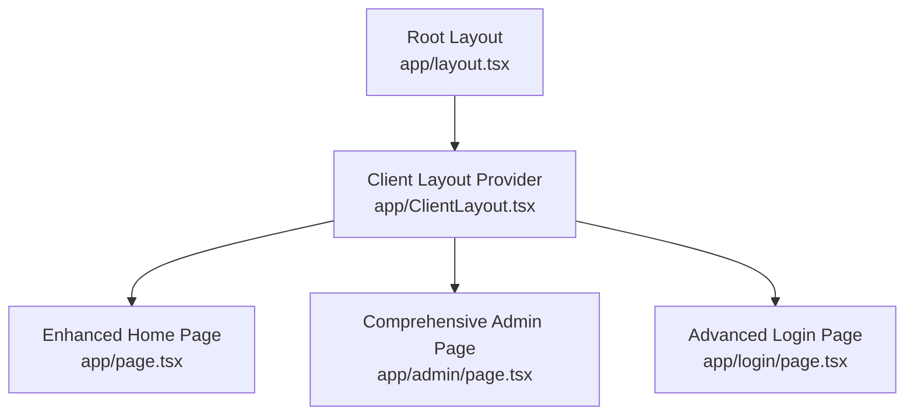
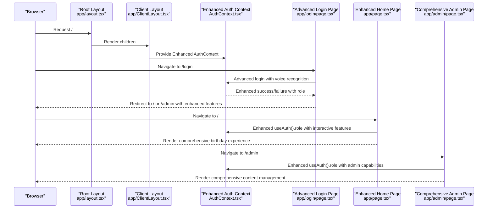
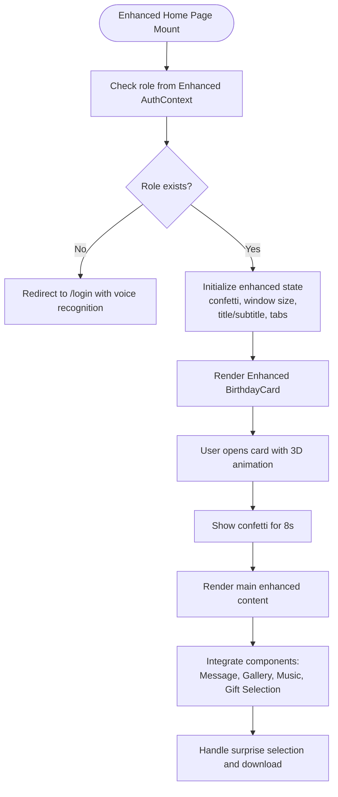
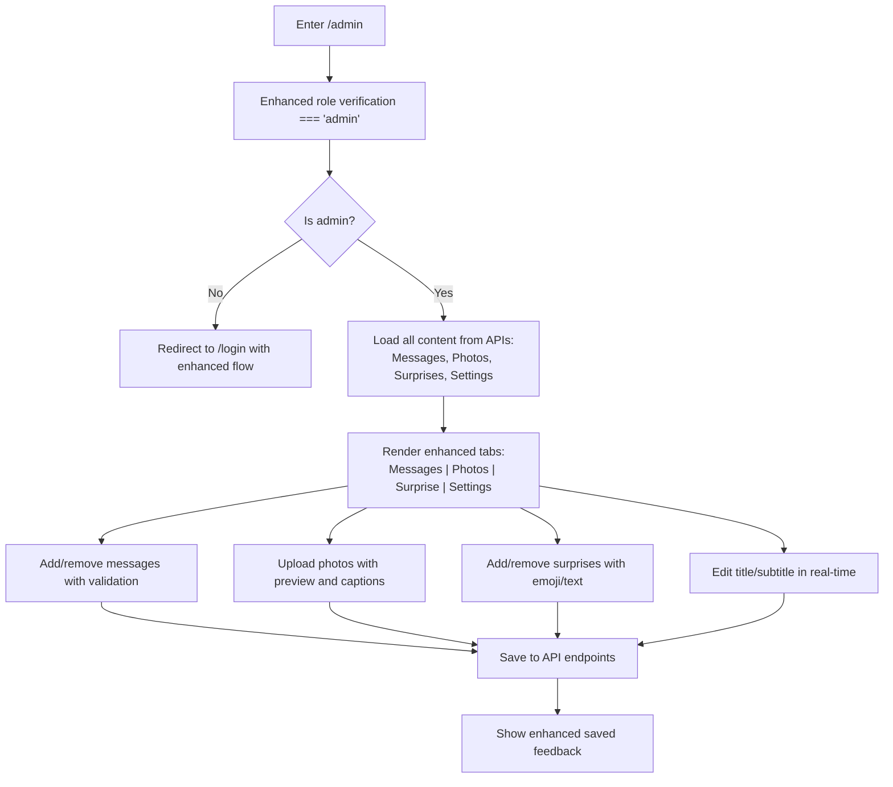
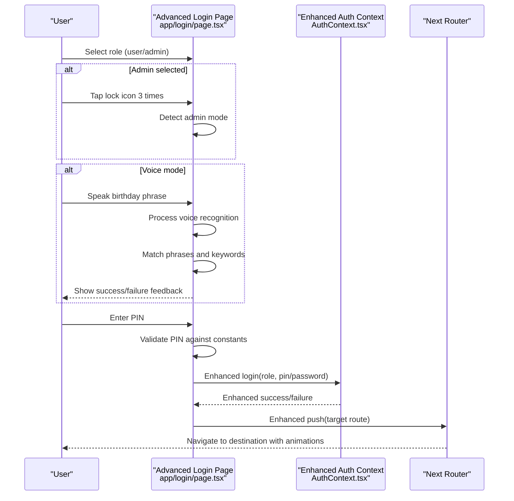
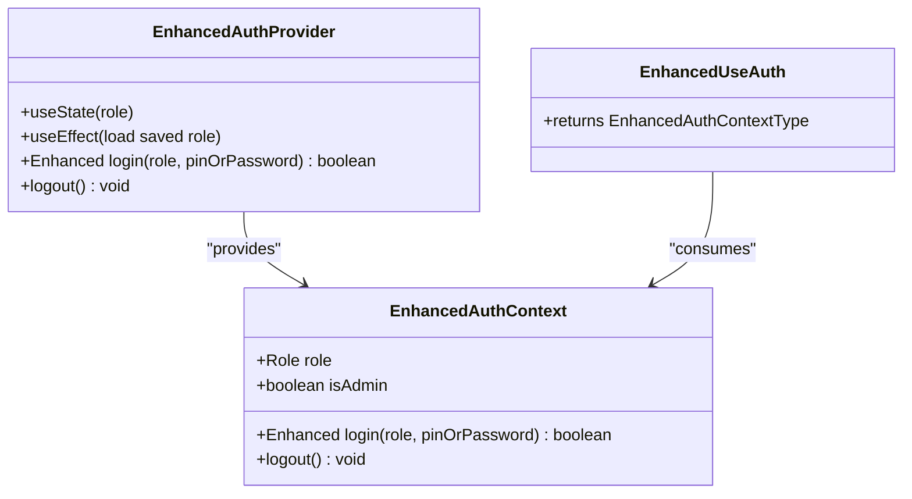
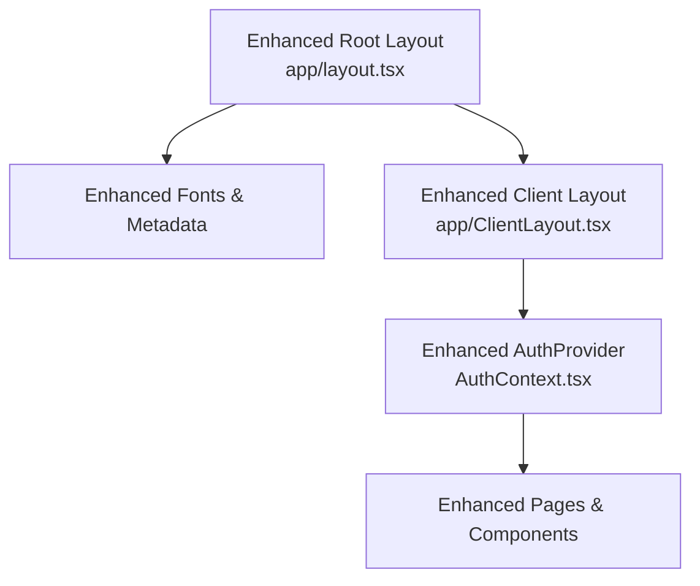
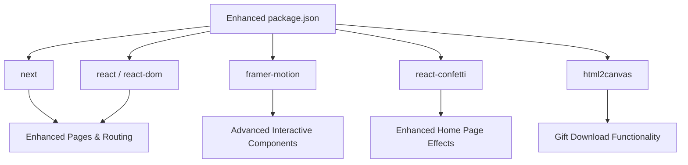

# Application Pages & Routing

<cite>
**Referenced Files in This Document**
- [app/layout.tsx](file://app/layout.tsx)
- [app/ClientLayout.tsx](file://app/ClientLayout.tsx)
- [app/page.tsx](file://app/page.tsx)
- [app/admin/page.tsx](file://app/admin/page.tsx)
- [app/login/page.tsx](file://app/login/page.tsx)
- [app/context/AuthContext.tsx](file://app/context/AuthContext.tsx)
- [app/components/BirthdayCard.tsx](file://app/components/BirthdayCard.tsx)
- [app/components/BirthdayMessage.tsx](file://app/components/BirthdayMessage.tsx)
- [app/components/PhotoGallery.tsx](file://app/components/PhotoGallery.tsx)
- [app/components/MusicPlayer.tsx](file://app/components/MusicPlayer.tsx)
- [app/globals.css](file://app/globals.css)
- [package.json](file://package.json)
- [next.config.ts](file://next.config.ts)
</cite>

## Update Summary
**Changes Made**
- Enhanced Home Page with comprehensive interactive features including gift selection, surprise reveal, and download functionality
- Expanded Admin Page with advanced content management capabilities including photo upload, surprise management, and real-time settings
- Improved Login Page with voice recognition, PIN entry, and role selection with admin mode detection
- Added new interactive components and enhanced existing components with sophisticated animations and user interactions

## Table of Contents
1. [Introduction](#introduction)
2. [Project Structure](#project-structure)
3. [Core Components](#core-components)
4. [Architecture Overview](#architecture-overview)
5. [Detailed Component Analysis](#detailed-component-analysis)
6. [Dependency Analysis](#dependency-analysis)
7. [Performance Considerations](#performance-considerations)
8. [Troubleshooting Guide](#troubleshooting-guide)
9. [Conclusion](#conclusion)

## Introduction
This document explains the Next.js application pages and routing structure for a birthday celebration website. The application now features a sophisticated interactive experience with comprehensive content management capabilities, voice recognition, and advanced user engagement features. It covers the file-based routing model, layout hierarchy, client-side rendering requirements, route protection, navigation patterns, and the integration between pages and the authentication system. The platform now supports multiple interactive features including gift selection, photo galleries, surprise reveals, and real-time content management.

## Project Structure
The application follows Next.js file-based routing under the app directory with enhanced functionality. Key routes include:
- Home page: app/page.tsx (root route /) - Enhanced with interactive gift selection and surprise features
- Admin page: app/admin/page.tsx (/admin) - Comprehensive content management with photo upload and real-time editing
- Login page: app/login/page.tsx (/login) - Advanced role selection with voice recognition and admin mode detection

Layout hierarchy:
- Root layout wraps all pages with fonts, metadata, and the client-side provider.
- ClientLayout.tsx provides the authentication context to child components.

**Diagram sources**
- [app/layout.tsx:16-36](file://app/layout.tsx#L16-L36)
- [app/ClientLayout.tsx:5-7](file://app/ClientLayout.tsx#L5-L7)
- [app/page.tsx:46-235](file://app/page.tsx#L46-L235)
- [app/admin/page.tsx:121-769](file://app/admin/page.tsx#L121-L769)
- [app/login/page.tsx:185-818](file://app/login/page.tsx#L185-L818)

**Section sources**
- [app/layout.tsx:16-36](file://app/layout.tsx#L16-L36)
- [app/ClientLayout.tsx:5-7](file://app/ClientLayout.tsx#L5-L7)
- [app/page.tsx:46-235](file://app/page.tsx#L46-L235)
- [app/admin/page.tsx:121-769](file://app/admin/page.tsx#L121-L769)
- [app/login/page.tsx:185-818](file://app/login/page.tsx#L185-L818)

## Core Components
- **Authentication Context**: Enhanced with role-based access control, login/logout functionality, and admin verification. Now supports both PIN-based and password-based authentication.
- **Enhanced Home Page**: Features comprehensive interactive birthday experience with animated confetti, gift selection mechanism, surprise reveal, photo gallery integration, and music player.
- **Comprehensive Admin Page**: Advanced content management system allowing administrators to manage messages, photos with upload functionality, surprise content, and real-time page settings with persistent storage.
- **Advanced Login Page**: Sophisticated role selection interface with voice recognition capabilities, PIN entry, admin mode detection through tap sequences, and animated feedback systems.
- **Interactive Components**: Enhanced BirthdayCard with 3D envelope animation, improved PhotoGallery with hover effects and polaroid styling, sophisticated MusicPlayer with YouTube integration, and specialized components for gift selection and surprise management.

Key client-side rendering markers:
- All pages and components use 'use client' to enable client-side hooks, animations, and interactive features.

**Section sources**
- [app/context/AuthContext.tsx:18-48](file://app/context/AuthContext.tsx#L18-L48)
- [app/page.tsx:46-235](file://app/page.tsx#L46-L235)
- [app/admin/page.tsx:121-769](file://app/admin/page.tsx#L121-L769)
- [app/login/page.tsx:185-818](file://app/login/page.tsx#L185-L818)
- [app/components/BirthdayCard.tsx:10-317](file://app/components/BirthdayCard.tsx#L10-L317)
- [app/components/PhotoGallery.tsx:24-214](file://app/components/PhotoGallery.tsx#L24-L214)
- [app/components/MusicPlayer.tsx:13-221](file://app/components/MusicPlayer.tsx#L13-L221)

## Architecture Overview
The enhanced routing and layout architecture enforces client-side rendering for sophisticated interactive components and centralizes authentication state with advanced security features. The flow below illustrates the enhanced user journey from login with voice recognition to protected areas with comprehensive content management.

**Diagram sources**
- [app/layout.tsx:21-35](file://app/layout.tsx#L21-L35)
- [app/ClientLayout.tsx:5-7](file://app/ClientLayout.tsx#L5-L7)
- [app/context/AuthContext.tsx:28-42](file://app/context/AuthContext.tsx#L28-L42)
- [app/login/page.tsx:285-331](file://app/login/page.tsx#L285-L331)
- [app/page.tsx:46-118](file://app/page.tsx#L46-L118)
- [app/admin/page.tsx:165-172](file://app/admin/page.tsx#L165-L172)

## Detailed Component Analysis

### Enhanced Home Page (/)
**Updated** Enhanced with comprehensive interactive features including gift selection, surprise reveal, and download functionality.

Responsibilities:
- **Route protection**: Redirects unauthenticated users to /login with enhanced security.
- **Interactive birthday reveal**: Enhanced BirthdayCard with sophisticated 3D envelope animation and confetti effects.
- **Dynamic content**: Loads customizable title/subtitle from API endpoints and integrates with real-time content management.
- **Advanced interactive features**: Gift selection mechanism with card flipping, surprise reveal with download functionality, integrated photo gallery, and music player.
- **Multi-tab interface**: Celebration, Surprise, and Moments tabs with sophisticated animations and transitions.

Client-side rendering requirements:
- Uses 'use client', Framer Motion animations, React Confetti, Next.js router, and advanced state management for complex interactions.

Protected route behavior:
- On mount, checks role; if null, navigates to /login with enhanced authentication flow.

**Diagram sources**
- [app/page.tsx:76-118](file://app/page.tsx#L76-L118)
- [app/page.tsx:120-124](file://app/page.tsx#L120-L124)
- [app/page.tsx:157-161](file://app/page.tsx#L157-L161)

**Section sources**
- [app/page.tsx:46-235](file://app/page.tsx#L46-L235)
- [app/components/BirthdayCard.tsx:10-317](file://app/components/BirthdayCard.tsx#L10-L317)
- [app/components/PhotoGallery.tsx:24-214](file://app/components/PhotoGallery.tsx#L24-L214)
- [app/components/MusicPlayer.tsx:13-221](file://app/components/MusicPlayer.tsx#L13-L221)

### Comprehensive Admin Page (/admin)
**Updated** Enhanced with advanced content management capabilities including photo upload, surprise management, and real-time settings.

Responsibilities:
- **Admin-only access**: Enhanced role verification with immediate redirect to /login if not admin.
- **Comprehensive content management**: CRUD operations for birthday messages, photos with upload functionality, surprise content management, and real-time page settings.
- **Advanced photo management**: File upload with preview, caption management, and responsive gallery integration.
- **Real-time settings**: Live title/subtitle editing with instant preview and save functionality.
- **Persistent storage**: Advanced local storage management with API integration for seamless content synchronization.

Navigation and UX:
- **Enhanced tabbed interface**: Messages, Photos, Surprise, and Settings tabs with sophisticated animations.
- **Advanced save system**: Real-time saving with visual feedback and error handling.
- **Professional admin experience**: Comprehensive content management dashboard with administrative controls.

**Diagram sources**
- [app/admin/page.tsx:165-172](file://app/admin/page.tsx#L165-L172)
- [app/admin/page.tsx:144-163](file://app/admin/page.tsx#L144-L163)
- [app/admin/page.tsx:174-186](file://app/admin/page.tsx#L174-L186)
- [app/admin/page.tsx:211-238](file://app/admin/page.tsx#L211-L238)
- [app/admin/page.tsx:240-261](file://app/admin/page.tsx#L240-L261)

**Section sources**
- [app/admin/page.tsx:121-769](file://app/admin/page.tsx#L121-L769)

### Advanced Login Page (/login)
**Updated** Enhanced with sophisticated voice recognition, PIN entry, and admin mode detection.

Responsibilities:
- **Advanced role selection**: Sophisticated role selection with admin mode detection through tap sequences.
- **Voice recognition**: Comprehensive voice recognition system with speech-to-text processing and pattern matching.
- **Enhanced PIN entry**: Secure PIN entry with visual feedback, shake animations, and automatic validation.
- **Admin mode detection**: Tap sequence detection (3 taps) to switch between user and admin modes.
- **Multi-modal authentication**: Combines voice recognition, PIN entry, and admin mode detection for enhanced security.

UX highlights:
- **Sophisticated animations**: Complex particle systems, floating elements, and 3D transformations.
- **Voice recognition feedback**: Real-time voice status with success/failure states and visual indicators.
- **Admin mode detection**: Tap counter with visual feedback and mode switching.
- **Error handling**: Comprehensive error messaging with shake animations and reset functionality.

**Diagram sources**
- [app/login/page.tsx:321-339](file://app/login/page.tsx#L321-L339)
- [app/login/page.tsx:249-319](file://app/login/page.tsx#L249-L319)
- [app/context/AuthContext.tsx:29-39](file://app/context/AuthContext.tsx#L29-L39)

**Section sources**
- [app/login/page.tsx:185-818](file://app/login/page.tsx#L185-L818)

### Enhanced Authentication System
**Updated** Enhanced with sophisticated role management and multi-modal authentication.

The AuthContext manages role state, login/logout, and admin detection with enhanced security features. It now supports both PIN-based and password-based authentication with persistent role storage for session continuity.

**Diagram sources**
- [app/context/AuthContext.tsx:18-48](file://app/context/AuthContext.tsx#L18-L48)
- [app/context/AuthContext.tsx:19-51](file://app/context/AuthContext.tsx#L19-L51)

**Section sources**
- [app/context/AuthContext.tsx:18-48](file://app/context/AuthContext.tsx#L18-L48)

### Enhanced Layout Hierarchy and Client Rendering
**Updated** Enhanced with sophisticated client-side rendering for advanced interactive components.

Root layout defines metadata, fonts, and wraps children in ClientLayout. ClientLayout provides the enhanced AuthProvider so that pages and components can use client-side hooks, consume authentication state, and support advanced interactive features.

**Diagram sources**
- [app/layout.tsx:16-36](file://app/layout.tsx#L16-L36)
- [app/ClientLayout.tsx:5-7](file://app/ClientLayout.tsx#L5-L7)
- [app/context/AuthContext.tsx:18-48](file://app/context/AuthContext.tsx#L18-L48)

**Section sources**
- [app/layout.tsx:16-36](file://app/layout.tsx#L16-L36)
- [app/ClientLayout.tsx:5-7](file://app/ClientLayout.tsx#L5-L7)

### Enhanced Page-Specific Styling and Component Integration
**Updated** Enhanced with sophisticated styling and advanced component integration.

- **Global styles**: Tailwind-based design with custom animations, glass morphism, gradients, and noise overlays.
- **Enhanced Home page**: Advanced floating decorations, confetti, staggered animations, gift selection mechanics, and surprise reveal functionality.
- **Comprehensive Admin page**: Professional dark theme with backdrop blur, sophisticated tab transitions, form controls, and upload functionality.
- **Advanced Login page**: Sophisticated glass card with animated role selection, aurora glow effects, voice recognition feedback, and particle systems.
- **Enhanced components**: Improved BirthdayCard (advanced 3D envelope animation), enhanced PhotoGallery (hover effects and polaroid styling), sophisticated MusicPlayer (YouTube integration with pulse effects), and specialized components for gift selection and surprise management.

**Section sources**
- [app/globals.css:11-175](file://app/globals.css#L11-L175)
- [app/page.tsx:163-235](file://app/page.tsx#L163-L235)
- [app/admin/page.tsx:294-348](file://app/admin/page.tsx#L294-L348)
- [app/login/page.tsx:356-419](file://app/login/page.tsx#L356-L419)
- [app/components/BirthdayCard.tsx:121-317](file://app/components/BirthdayCard.tsx#L121-L317)
- [app/components/PhotoGallery.tsx:39-214](file://app/components/PhotoGallery.tsx#L39-L214)
- [app/components/MusicPlayer.tsx:78-221](file://app/components/MusicPlayer.tsx#L78-L221)

### Enhanced Data Flow Between Pages
**Updated** Enhanced with sophisticated data management and API integration.

- **Enhanced authentication state**: Loaded from local storage on startup with enhanced role persistence; login updates role and persists it with advanced security.
- **Advanced content persistence**: Messages, photos, surprises, and page settings are stored via API endpoints and loaded on demand by respective pages and components.
- **Enhanced navigation**: Next.js router handles programmatic navigation after login with enhanced authentication flows and role checks.
- **Real-time content management**: Admin page provides real-time content updates with immediate API synchronization and visual feedback.

**Section sources**
- [app/context/AuthContext.tsx:21-27](file://app/context/AuthContext.tsx#L21-L27)
- [app/context/AuthContext.tsx:37-44](file://app/context/AuthContext.tsx#L37-L44)
- [app/admin/page.tsx:144-163](file://app/admin/page.tsx#L144-L163)
- [app/components/PhotoGallery.tsx:28-35](file://app/components/PhotoGallery.tsx#L28-L35)
- [app/page.tsx:95-112](file://app/page.tsx#L95-L112)

### Enhanced SEO Considerations and Meta Tags
**Updated** Enhanced with comprehensive SEO optimization.

- **Enhanced metadata**: Title and description are defined at the root layout level for consistent SEO signals across pages with enhanced branding.
- **Language**: Root layout sets the HTML language attribute to Indonesian for locale relevance.
- **Enhanced recommendations**:
  - Add structured data for events or person schema if sharing widely.
  - Include canonical URLs and social media meta tags if embedding externally.
  - Ensure images and videos are optimized and served efficiently with enhanced CDN integration.
  - Implement progressive web app features for enhanced user experience.

**Section sources**
- [app/layout.tsx:16-23](file://app/layout.tsx#L16-L23)
- [app/layout.tsx:31-41](file://app/layout.tsx#L31-L41)

## Dependency Analysis
**Updated** Enhanced with sophisticated external dependencies.

External dependencies relevant to pages and routing:
- **next**: Framework runtime and routing with enhanced server-side rendering capabilities.
- **react, react-dom**: UI rendering with enhanced concurrent features and Suspense support.
- **framer-motion**: Advanced animations for sophisticated interactive components with enhanced performance.
- **react-confetti**: Enhanced visual effects for celebrations with improved performance and customization.
- **html2canvas**: Advanced image capture for gift download functionality with enhanced browser compatibility.

Build and tooling:
- **Tailwind CSS v4**: Enhanced styling with advanced utility-first approach and custom animations.
- **TypeScript**: Enhanced type safety with improved type inference and generic support.
- **ESLint**: Enhanced code quality with advanced rule configuration and custom linting rules.

**Diagram sources**
- [package.json:11-27](file://package.json#L11-L27)

**Section sources**
- [package.json:11-27](file://package.json#L11-L27)
- [next.config.ts:3-5](file://next.config.ts#L3-L5)

## Performance Considerations
**Updated** Enhanced with sophisticated performance optimization strategies.

- **Advanced client-side rendering**: Pages and components use 'use client'; keep heavy animations and third-party libraries scoped to minimize SSR overhead with enhanced optimization techniques.
- **Enhanced API integration**: Efficiently load and update content via API endpoints; avoid frequent writes during rapid edits with caching strategies.
- **Advanced animations**: Use sophisticated staggered animations judiciously; disable or throttle where possible on lower-powered devices with performance monitoring.
- **Enhanced assets**: Serve audio files via YouTube iframe for optimal performance; optimize images and consider lazy-loading for large galleries with CDN integration.
- **Enhanced fonts**: Preload critical fonts; ensure fallbacks for accessibility with font optimization strategies.
- **Voice recognition optimization**: Implement efficient speech recognition with proper cleanup and resource management.
- **Memory management**: Proper cleanup of event listeners, timers, and third-party library instances to prevent memory leaks.

## Troubleshooting Guide
**Updated** Enhanced with comprehensive troubleshooting for advanced features.

Common issues and resolutions:
- **Enhanced redirect loops on /admin**: Ensure role is set to 'admin' before navigating; verify enhanced login flow and local storage persistence with debug logging.
- **Enhanced login failures**: Confirm PIN/password matches expected values; check voice recognition permissions and error messaging; verify enhanced authentication flow.
- **Enhanced Home page blank**: Verify role is present; confirm enhanced AuthContext provider is wrapping pages via ClientLayout; check API endpoint connectivity.
- **Enhanced confetti not appearing**: Check window size initialization and confetti trigger timing; verify enhanced animation performance.
- **Enhanced music not playing**: Verify YouTube iframe API integration and autoplay policies; test with user gesture and enhanced browser compatibility.
- **Enhanced gift download failing**: Check html2canvas integration and browser compatibility; verify download permissions and enhanced error handling.
- **Enhanced voice recognition issues**: Verify SpeechRecognition API availability; check browser compatibility and microphone permissions; ensure proper cleanup of recognition instances.
- **Enhanced photo upload problems**: Verify file upload endpoint, CORS configuration, and enhanced error handling; check file size limits and format validation.

**Section sources**
- [app/admin/page.tsx:165-172](file://app/admin/page.tsx#L165-L172)
- [app/login/page.tsx:256-319](file://app/login/page.tsx#L256-L319)
- [app/page.tsx:76-118](file://app/page.tsx#L76-L118)
- [app/page.tsx:126-153](file://app/page.tsx#L126-L153)
- [app/components/MusicPlayer.tsx:44-66](file://app/components/MusicPlayer.tsx#L44-L66)

## Conclusion
**Updated** The application now leverages Next.js file-based routing with a sophisticated layout hierarchy and enhanced client-side authentication to deliver a truly remarkable birthday experience. The enhanced route protection ensures secure access to admin features, while comprehensive shared components and API integration enable a cohesive, customizable, and highly interactive celebration. With advanced animations, sophisticated voice recognition, comprehensive content management, and thoughtful performance optimizations, the platform supports an engaging and accessible user journey across all roles and pages. The addition of gift selection, surprise reveals, photo galleries, and real-time content management creates a truly immersive and memorable experience for users.