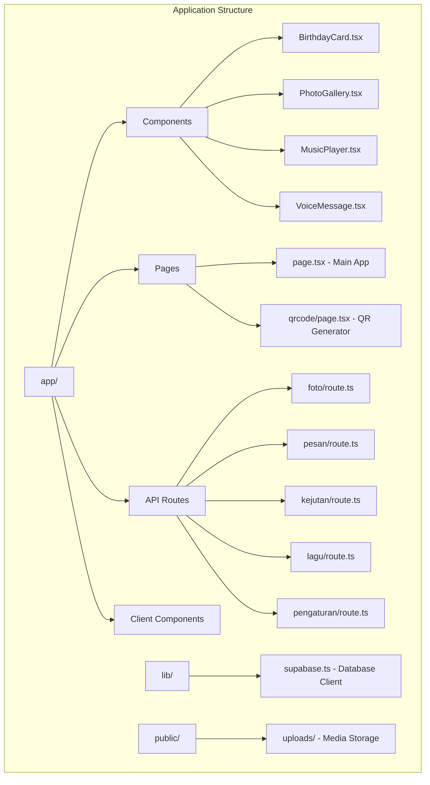
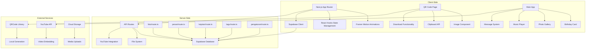
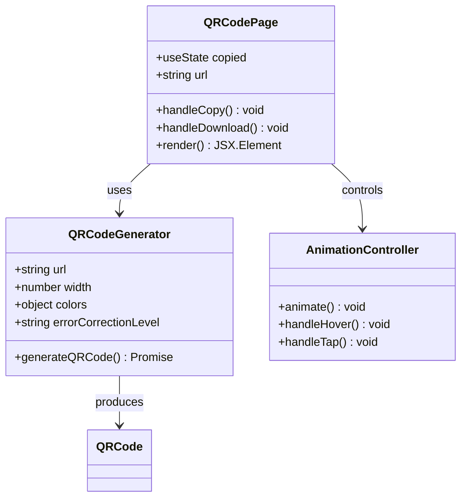
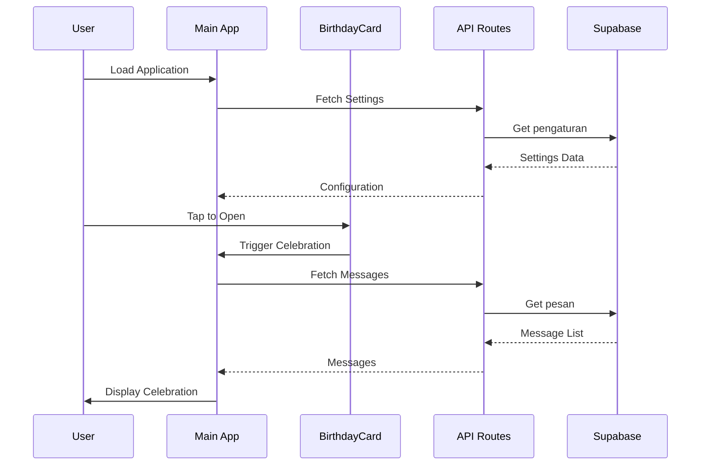
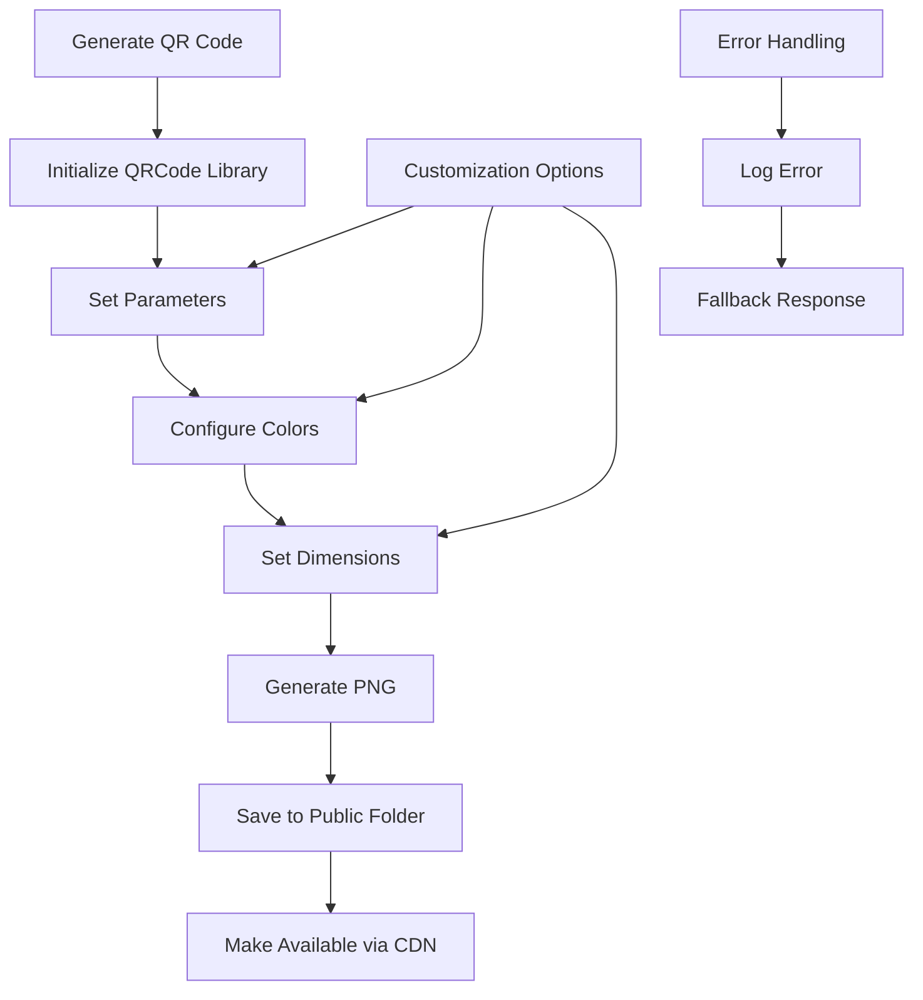
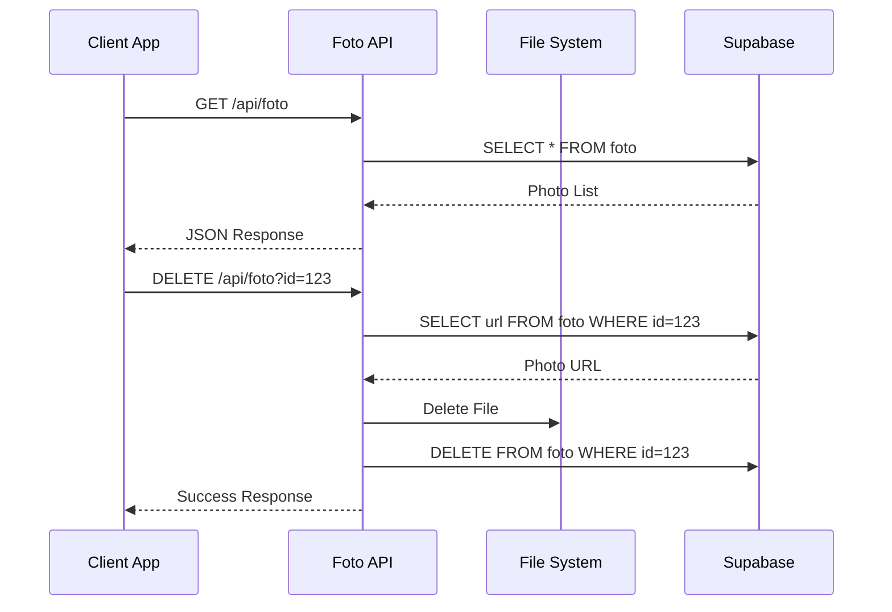
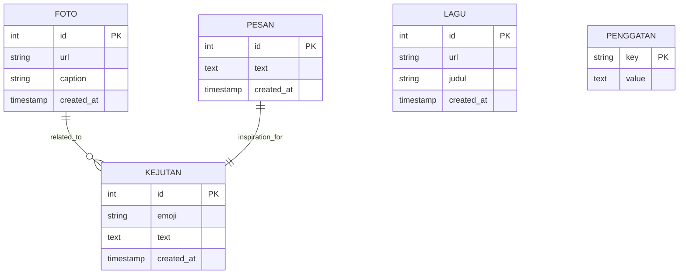

# QR Code System

<cite>
**Referenced Files in This Document**
- [README.md](file://README.md)
- [package.json](file://package.json)
- [app/layout.tsx](file://app/layout.tsx)
- [app/page.tsx](file://app/page.tsx)
- [app/qrcode/page.tsx](file://app/qrcode/page.tsx)
- [generate-qr.js](file://generate-qr.js)
- [generate_fast.py](file://generate_fast.py)
- [qrcode-love.html](file://qrcode-love.html)
- [lib/supabase.ts](file://lib/supabase.ts)
- [app/api/foto/route.ts](file://app/api/foto/route.ts)
- [app/api/pesan/route.ts](file://app/api/pesan/route.ts)
- [app/api/kejutan/route.ts](file://app/api/kejutan/route.ts)
- [app/api/lagu/route.ts](file://app/api/lagu/route.ts)
- [app/api/pengaturan/route.ts](file://app/api/pengaturan/route.ts)
</cite>

## Table of Contents
1. [Introduction](#introduction)
2. [Project Structure](#project-structure)
3. [Core Components](#core-components)
4. [Architecture Overview](#architecture-overview)
5. [Detailed Component Analysis](#detailed-component-analysis)
6. [QR Code Generation System](#qr-code-generation-system)
7. [API Integration](#api-integration)
8. [Database Schema](#database-schema)
9. [Performance Considerations](#performance-considerations)
10. [Deployment and Setup](#deployment-and-setup)
11. [Troubleshooting Guide](#troubleshooting-guide)
12. [Conclusion](#conclusion)

## Introduction

The QR Code System is a comprehensive web application designed to create, manage, and distribute QR codes for special occasions, particularly birthday celebrations. This system combines modern web technologies with interactive user experiences to deliver a seamless QR code generation and sharing platform.

The application serves as both a standalone QR code generator and an integrated birthday celebration platform, featuring animated interfaces, real-time data management, and social sharing capabilities. It demonstrates advanced concepts in React development, Next.js framework utilization, and backend API integration.

## Project Structure

The project follows a modern Next.js 13+ App Router architecture with a well-organized file structure that separates concerns effectively:



**Diagram sources**
- [app/layout.tsx:1-48](file://app/layout.tsx#L1-L48)
- [app/page.tsx:1-800](file://app/page.tsx#L1-L800)
- [app/qrcode/page.tsx:1-259](file://app/qrcode/page.tsx#L1-L259)

**Section sources**
- [README.md:1-37](file://README.md#L1-L37)
- [package.json:1-37](file://package.json#L1-L37)

## Core Components

The system consists of several interconnected components that work together to provide a complete QR code solution:

### Main Application Interface
The primary application (`app/page.tsx`) serves as the central hub, integrating multiple interactive components including birthday card animations, photo galleries, music players, and message systems.

### QR Code Generation Module
The dedicated QR code page (`app/qrcode/page.tsx`) provides a specialized interface for generating, downloading, and sharing QR codes with elegant animations and responsive design.

### Database Integration Layer
The Supabase client (`lib/supabase.ts`) manages all database connections and provides both public and administrative access patterns for secure data operations.

### API Management System
A comprehensive set of API routes handles CRUD operations for photos, messages, surprises, songs, and system settings, providing RESTful endpoints for frontend consumption.

**Section sources**
- [app/page.tsx:46-156](file://app/page.tsx#L46-L156)
- [app/qrcode/page.tsx:7-259](file://app/qrcode/page.tsx#L7-L259)
- [lib/supabase.ts:1-15](file://lib/supabase.ts#L1-L15)

## Architecture Overview

The system employs a modern client-server architecture with reactive frontend components and RESTful backend services:



**Diagram sources**
- [app/page.tsx:1-800](file://app/page.tsx#L1-L800)
- [app/qrcode/page.tsx:1-259](file://app/qrcode/page.tsx#L1-L259)
- [lib/supabase.ts:1-15](file://lib/supabase.ts#L1-L15)

## Detailed Component Analysis

### QR Code Generation Component

The QR code generation system provides a sophisticated interface for creating and managing QR codes with multiple customization options:



**Diagram sources**
- [app/qrcode/page.tsx:7-259](file://app/qrcode/page.tsx#L7-L259)
- [generate-qr.js:1-24](file://generate-qr.js#L1-L24)

The component features:
- **Responsive Design**: Adapts to mobile and desktop screen sizes
- **Interactive Elements**: Copy-to-clipboard functionality and download capabilities
- **Visual Enhancements**: Floating animations, gradient backgrounds, and decorative elements
- **Accessibility**: Proper ARIA labels and keyboard navigation support

### Main Application Component

The primary application orchestrates multiple interactive experiences:



**Diagram sources**
- [app/page.tsx:76-118](file://app/page.tsx#L76-L118)
- [app/components/BirthdayCard.tsx:10-26](file://app/components/BirthdayCard.tsx#L10-L26)

**Section sources**
- [app/qrcode/page.tsx:1-259](file://app/qrcode/page.tsx#L1-L259)
- [app/page.tsx:1-800](file://app/page.tsx#L1-L800)

## QR Code Generation System

The QR code generation system supports multiple approaches for creating customized QR codes:

### Local Generation Approach

The primary method uses the `qrcode` npm package for server-side generation:



**Diagram sources**
- [generate-qr.js:8-23](file://generate-qr.js#L8-L23)

### Alternative Generation Methods

The system includes additional generation approaches:

1. **Python-Based Generation**: Uses the `qrcode` Python library with PIL for advanced image manipulation
2. **HTML Canvas Generation**: Client-side generation using html2canvas for dynamic QR code creation
3. **External API Integration**: Utilizes QR server APIs for quick generation

**Section sources**
- [generate-qr.js:1-24](file://generate-qr.js#L1-L24)
- [generate_fast.py:1-55](file://generate_fast.py#L1-L55)
- [qrcode-love.html:189-235](file://qrcode-love.html#L189-L235)

## API Integration

The system provides comprehensive API endpoints for managing all application data:

### Photo Management API

Handles image uploads, retrieval, and deletion with proper file system management:



**Diagram sources**
- [app/api/foto/route.ts:16-37](file://app/api/foto/route.ts#L16-L37)

### Message Management API

Provides CRUD operations for user-generated messages with validation and error handling:

| Endpoint | Method | Description | Request Body | Response |
|----------|--------|-------------|--------------|----------|
| `/api/pesan` | GET | Retrieve all messages | None | Array of message objects |
| `/api/pesan` | POST | Create new message | `{ text: string }` | `{ success: boolean, id: number }` |
| `/api/pesan` | DELETE | Delete message | Query: `id` | `{ success: boolean }` |

### Surprise Management API

Manages interactive gift items with selection and animation states:

| Endpoint | Method | Description | Request Body | Response |
|----------|--------|-------------|--------------|----------|
| `/api/kejutan` | GET | Retrieve all surprises | None | Array of surprise objects |
| `/api/kejutan` | POST | Create new surprise | `{ emoji: string, text: string }` | `{ success: boolean, id: number }` |
| `/api/kejutan` | DELETE | Delete surprise | Query: `id` | `{ success: boolean }` |

### Song Management API

Integrates with YouTube for audio content management:

| Endpoint | Method | Description | Request Body | Response |
|----------|--------|-------------|--------------|----------|
| `/api/lagu` | GET | Retrieve all songs | None | Array of song objects |
| `/api/lagu` | POST | Add new song | `{ url: string, judul?: string }` | `{ success: boolean, id: number, url: string }` |
| `/api/lagu` | DELETE | Remove song | Query: `id` | `{ success: boolean }` |

**Section sources**
- [app/api/foto/route.ts:1-38](file://app/api/foto/route.ts#L1-L38)
- [app/api/pesan/route.ts:1-41](file://app/api/pesan/route.ts#L1-L41)
- [app/api/kejutan/route.ts:1-41](file://app/api/kejutan/route.ts#L1-L41)
- [app/api/lagu/route.ts:1-64](file://app/api/lagu/route.ts#L1-L64)

## Database Schema

The system utilizes a PostgreSQL database through Supabase with the following table structure:



**Diagram sources**
- [app/api/foto/route.ts:8](file://app/api/foto/route.ts#L8)
- [app/api/pesan/route.ts:6](file://app/api/pesan/route.ts#L6)
- [app/api/kejutan/route.ts:6](file://app/api/kejutan/route.ts#L6)
- [app/api/lagu/route.ts:19](file://app/api/lagu/route.ts#L19)
- [app/api/pengaturan/route.ts:6](file://app/api/pengaturan/route.ts#L6)

## Performance Considerations

The system implements several optimization strategies:

### Client-Side Optimizations
- **Lazy Loading**: Dynamic imports for heavy libraries like html2canvas
- **Animation Performance**: Hardware-accelerated CSS transforms
- **State Management**: Efficient React hooks for minimal re-renders
- **Image Optimization**: Next.js Image component with automatic optimization

### Server-Side Optimizations
- **Database Queries**: Optimized SELECT statements with proper indexing
- **File Management**: Efficient file system operations with proper cleanup
- **API Caching**: Response caching for frequently accessed data
- **Error Handling**: Comprehensive error boundaries and fallbacks

### Asset Management
- **Static Generation**: Pre-rendered pages for improved load times
- **CDN Integration**: Static assets served through content delivery networks
- **Compression**: Automatic gzip compression for API responses

## Deployment and Setup

### Prerequisites
- Node.js 16+
- npm or yarn package manager
- Supabase account with PostgreSQL database
- Environment variables configured

### Installation Steps

1. **Clone Repository**
   ```bash
   git clone https://github.com/yourusername/ulang-tahun-gebetan.git
   cd ulang-tahun-gebetan
   ```

2. **Install Dependencies**
   ```bash
   npm install
   ```

3. **Configure Environment Variables**
   ```
   NEXT_PUBLIC_SUPABASE_URL=your_supabase_url
   NEXT_PUBLIC_SUPABASE_ANON_KEY=your_anon_key
   SUPABASE_SERVICE_ROLE_KEY=your_service_key
   ```

4. **Run Development Server**
   ```bash
   npm run dev
   ```

5. **Build for Production**
   ```bash
   npm run build
   npm start
   ```

### Environment Configuration

The application requires the following environment variables:

| Variable | Description | Required |
|----------|-------------|----------|
| `NEXT_PUBLIC_SUPABASE_URL` | Supabase project URL | Yes |
| `NEXT_PUBLIC_SUPABASE_ANON_KEY` | Public Supabase key | Yes |
| `SUPABASE_SERVICE_ROLE_KEY` | Service role key for admin access | No |

**Section sources**
- [README.md:5-15](file://README.md#L5-L15)
- [lib/supabase.ts:3-14](file://lib/supabase.ts#L3-L14)

## Troubleshooting Guide

### Common Issues and Solutions

#### QR Code Generation Failures
**Problem**: QR code fails to generate or display
**Solution**: 
1. Verify URL format is correct
2. Check file permissions for public directory
3. Ensure qrcode library is properly installed
4. Validate error correction level settings

#### API Connection Issues
**Problem**: API endpoints return 500 errors
**Solution**:
1. Verify Supabase credentials are correct
2. Check database connectivity
3. Review CORS configuration
4. Validate request payload format

#### Animation Performance Problems
**Problem**: Smooth animations stutter on mobile devices
**Solution**:
1. Reduce animation complexity for mobile
2. Implement hardware acceleration
3. Optimize image sizes
4. Use requestAnimationFrame for smooth updates

#### File Upload Issues
**Problem**: Photo uploads fail or images don't appear
**Solution**:
1. Check file size limits
2. Verify MIME type validation
3. Ensure proper file permissions
4. Review cloud storage configuration

### Debugging Tools

The system includes built-in debugging capabilities:
- Console logging for API requests
- Error boundaries for React components
- Network monitoring for API calls
- Performance profiling for animations

**Section sources**
- [generate-qr.js:16-23](file://generate-qr.js#L16-L23)
- [app/api/foto/route.ts:34-36](file://app/api/foto/route.ts#L34-L36)

## Conclusion

The QR Code System represents a comprehensive solution for creating and managing QR codes in an interactive, visually appealing environment. The system successfully combines modern web technologies with practical functionality, providing users with an engaging experience for generating, customizing, and sharing QR codes.

Key achievements include:
- **Seamless User Experience**: Elegant animations and responsive design
- **Robust Architecture**: Clean separation of concerns with scalable API design
- **Flexible Integration**: Support for multiple QR generation methods and external services
- **Performance Optimization**: Carefully optimized for both desktop and mobile environments

The system serves as an excellent foundation for similar interactive applications, demonstrating best practices in React development, Next.js architecture, and database integration. Its modular design allows for easy extension and customization to meet specific project requirements.

Future enhancements could include additional QR customization options, social sharing integrations, analytics tracking, and expanded media support for richer user experiences.