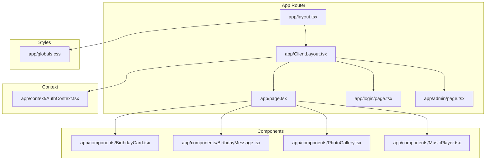
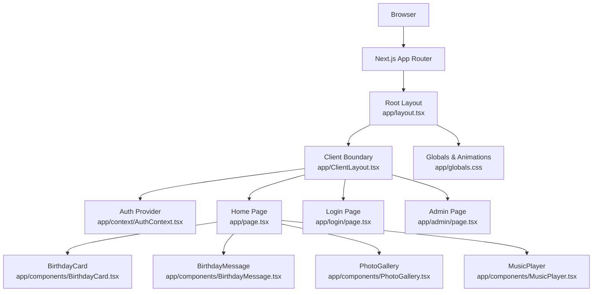
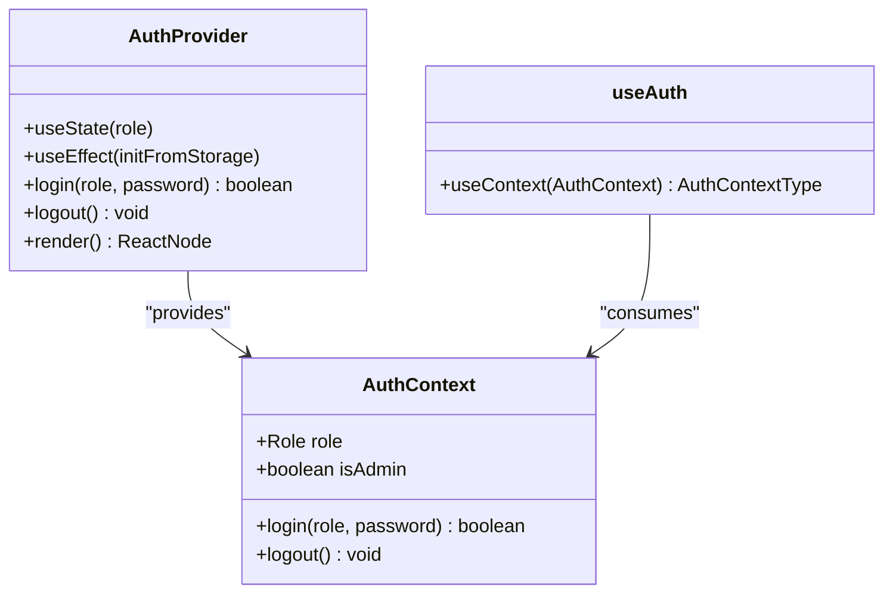
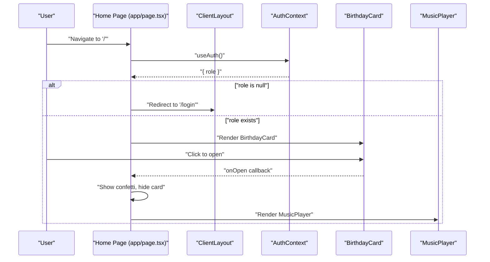
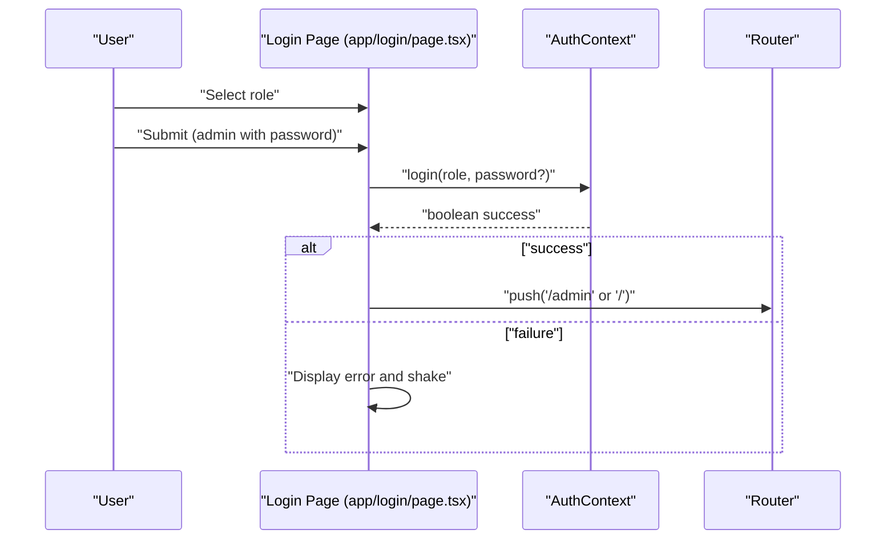
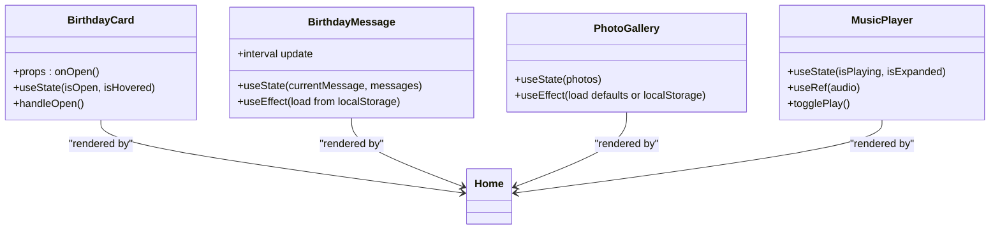
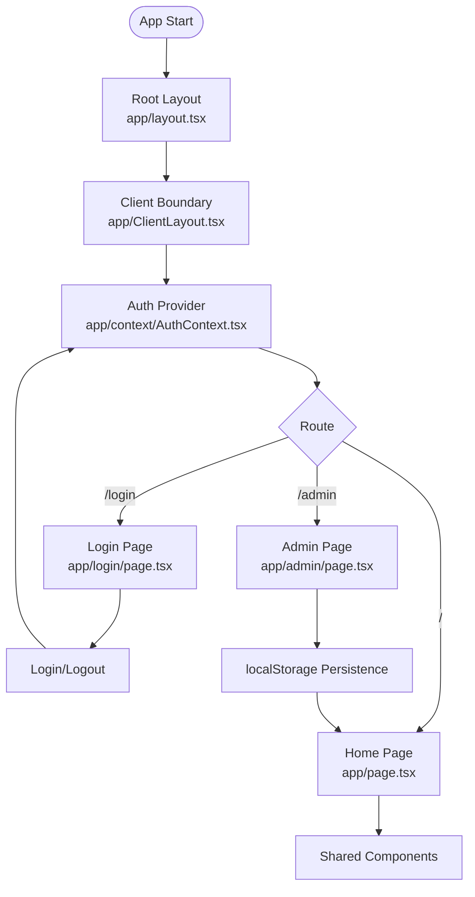
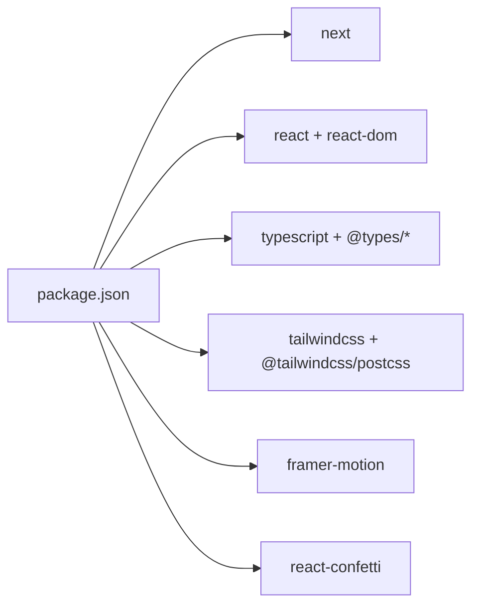

# Architecture & Technology Stack

<cite>
**Referenced Files in This Document**
- [README.md](file://README.md)
- [package.json](file://package.json)
- [next.config.ts](file://next.config.ts)
- [tsconfig.json](file://tsconfig.json)
- [postcss.config.mjs](file://postcss.config.mjs)
- [app/layout.tsx](file://app/layout.tsx)
- [app/ClientLayout.tsx](file://app/ClientLayout.tsx)
- [app/context/AuthContext.tsx](file://app/context/AuthContext.tsx)
- [app/page.tsx](file://app/page.tsx)
- [app/login/page.tsx](file://app/login/page.tsx)
- [app/admin/page.tsx](file://app/admin/page.tsx)
- [app/components/BirthdayCard.tsx](file://app/components/BirthdayCard.tsx)
- [app/components/BirthdayMessage.tsx](file://app/components/BirthdayMessage.tsx)
- [app/components/PhotoGallery.tsx](file://app/components/PhotoGallery.tsx)
- [app/components/MusicPlayer.tsx](file://app/components/MusicPlayer.tsx)
- [app/globals.css](file://app/globals.css)
</cite>

## Table of Contents
1. [Introduction](#introduction)
2. [Project Structure](#project-structure)
3. [Core Components](#core-components)
4. [Architecture Overview](#architecture-overview)
5. [Detailed Component Analysis](#detailed-component-analysis)
6. [Dependency Analysis](#dependency-analysis)
7. [Performance Considerations](#performance-considerations)
8. [Troubleshooting Guide](#troubleshooting-guide)
9. [Conclusion](#conclusion)
10. [Appendices](#appendices)

## Introduction
This document describes the architecture and technology stack of the Ulang Tahun Gebetan application. It focuses on the Next.js App Router architecture, file-based routing, component organization, and the integration of React with TypeScript, Tailwind CSS, and Framer Motion. It also covers client-server rendering approaches, local storage-based persistence, provider-based state management, and the system boundaries between authentication context, client layout, and individual pages.

## Project Structure
The application follows Next.js App Router conventions with a strict file-based routing model under the app directory. The structure emphasizes:
- Root layout and client-side provider boundary
- Page routes for home, login, and admin
- Shared UI components organized under app/components
- Global styles and animations via Tailwind and CSS keyframes
- Local configuration for Next.js, TypeScript, and PostCSS/Tailwind

**Diagram sources**
- [app/layout.tsx:1-37](file://app/layout.tsx#L1-L37)
- [app/ClientLayout.tsx:1-8](file://app/ClientLayout.tsx#L1-L8)
- [app/context/AuthContext.tsx:1-58](file://app/context/AuthContext.tsx#L1-L58)
- [app/page.tsx:1-239](file://app/page.tsx#L1-L239)
- [app/login/page.tsx:1-171](file://app/login/page.tsx#L1-L171)
- [app/admin/page.tsx:1-313](file://app/admin/page.tsx#L1-L313)
- [app/components/BirthdayCard.tsx:1-159](file://app/components/BirthdayCard.tsx#L1-L159)
- [app/components/BirthdayMessage.tsx:1-98](file://app/components/BirthdayMessage.tsx#L1-L98)
- [app/components/PhotoGallery.tsx:1-100](file://app/components/PhotoGallery.tsx#L1-L100)
- [app/components/MusicPlayer.tsx:1-102](file://app/components/MusicPlayer.tsx#L1-L102)
- [app/globals.css:1-175](file://app/globals.css#L1-L175)

**Section sources**
- [README.md:1-37](file://README.md#L1-L37)
- [package.json:1-29](file://package.json#L1-L29)
- [next.config.ts:1-8](file://next.config.ts#L1-L8)
- [tsconfig.json:1-35](file://tsconfig.json#L1-L35)
- [postcss.config.mjs:1-8](file://postcss.config.mjs#L1-L8)

## Core Components
- Root layout and client boundary:
  - Root layout defines global metadata, fonts, and wraps children in ClientLayout.
  - ClientLayout initializes the AuthProvider to enable client-side state sharing across pages.
- Authentication context:
  - Provides role-based access, login/logout, and admin guard checks using localStorage.
- Pages:
  - Home page orchestrates animations, confetti, and composes BirthdayCard, BirthdayMessage, PhotoGallery, and MusicPlayer.
  - Login page handles role selection and admin password verification.
  - Admin page manages dynamic content (messages, photos, page settings) persisted in localStorage.
- Shared components:
  - BirthdayCard implements a flip card with Framer Motion.
  - BirthdayMessage cycles messages with AnimatePresence transitions.
  - PhotoGallery renders a responsive grid with hover and spring animations.
  - MusicPlayer controls an audio element with expanded panel and animated indicators.

**Section sources**
- [app/layout.tsx:1-37](file://app/layout.tsx#L1-L37)
- [app/ClientLayout.tsx:1-8](file://app/ClientLayout.tsx#L1-L8)
- [app/context/AuthContext.tsx:1-58](file://app/context/AuthContext.tsx#L1-L58)
- [app/page.tsx:1-239](file://app/page.tsx#L1-L239)
- [app/login/page.tsx:1-171](file://app/login/page.tsx#L1-L171)
- [app/admin/page.tsx:1-313](file://app/admin/page.tsx#L1-L313)
- [app/components/BirthdayCard.tsx:1-159](file://app/components/BirthdayCard.tsx#L1-L159)
- [app/components/BirthdayMessage.tsx:1-98](file://app/components/BirthdayMessage.tsx#L1-L98)
- [app/components/PhotoGallery.tsx:1-100](file://app/components/PhotoGallery.tsx#L1-L100)
- [app/components/MusicPlayer.tsx:1-102](file://app/components/MusicPlayer.tsx#L1-L102)

## Architecture Overview
The system is a single-page application built with Next.js App Router. It uses:
- Server-rendered root layout with client-side hydration boundary
- File-based routing under app/
- Provider pattern for authentication state
- Component composition for page-specific layouts
- Local storage for persisted configuration and content
- Tailwind CSS for styling and CSS keyframes for animations
- Framer Motion for declarative animations

**Diagram sources**
- [app/layout.tsx:1-37](file://app/layout.tsx#L1-L37)
- [app/ClientLayout.tsx:1-8](file://app/ClientLayout.tsx#L1-L8)
- [app/context/AuthContext.tsx:1-58](file://app/context/AuthContext.tsx#L1-L58)
- [app/page.tsx:1-239](file://app/page.tsx#L1-L239)
- [app/login/page.tsx:1-171](file://app/login/page.tsx#L1-L171)
- [app/admin/page.tsx:1-313](file://app/admin/page.tsx#L1-L313)
- [app/components/BirthdayCard.tsx:1-159](file://app/components/BirthdayCard.tsx#L1-L159)
- [app/components/BirthdayMessage.tsx:1-98](file://app/components/BirthdayMessage.tsx#L1-L98)
- [app/components/PhotoGallery.tsx:1-100](file://app/components/PhotoGallery.tsx#L1-L100)
- [app/components/MusicPlayer.tsx:1-102](file://app/components/MusicPlayer.tsx#L1-L102)
- [app/globals.css:1-175](file://app/globals.css#L1-L175)

## Detailed Component Analysis

### Authentication Context and Provider Pattern
The AuthContext implements a classic Provider pattern:
- Context exposes role, login, logout, and isAdmin flag
- Uses localStorage to persist role across sessions
- Enforces admin password validation for admin login
- Guards protected routes by redirecting unauthenticated users

**Diagram sources**
- [app/context/AuthContext.tsx:1-58](file://app/context/AuthContext.tsx#L1-L58)

**Section sources**
- [app/context/AuthContext.tsx:1-58](file://app/context/AuthContext.tsx#L1-L58)

### Home Page Orchestration
The Home page composes multiple animated components and orchestrates:
- Redirect to login if not authenticated
- Window size detection for confetti sizing
- Local storage-backed customization of title/subtitle
- Birthday card opening triggers confetti and subsequent content reveal
- Rich animations using Framer Motion and React Confetti

**Diagram sources**
- [app/page.tsx:1-239](file://app/page.tsx#L1-L239)
- [app/ClientLayout.tsx:1-8](file://app/ClientLayout.tsx#L1-L8)
- [app/context/AuthContext.tsx:1-58](file://app/context/AuthContext.tsx#L1-L58)
- [app/components/BirthdayCard.tsx:1-159](file://app/components/BirthdayCard.tsx#L1-L159)
- [app/components/MusicPlayer.tsx:1-102](file://app/components/MusicPlayer.tsx#L1-L102)

**Section sources**
- [app/page.tsx:1-239](file://app/page.tsx#L1-L239)

### Login Page and Admin Guard
The Login page allows selecting role and optionally entering admin password. On successful login, it redirects to either the home page (user) or admin page (admin). The admin page enforces role-based guard and persists content to localStorage.

**Diagram sources**
- [app/login/page.tsx:1-171](file://app/login/page.tsx#L1-L171)
- [app/context/AuthContext.tsx:1-58](file://app/context/AuthContext.tsx#L1-L58)

**Section sources**
- [app/login/page.tsx:1-171](file://app/login/page.tsx#L1-L171)
- [app/admin/page.tsx:1-313](file://app/admin/page.tsx#L1-L313)

### Component Composition Patterns
- BirthdayCard: Flip animation with controlled open state and callback propagation
- BirthdayMessage: Auto-rotating messages with progress indicator and AnimatePresence transitions
- PhotoGallery: Responsive grid with hover effects and spring animations
- MusicPlayer: Toggle play/pause with expanded panel and animated progress bar

**Diagram sources**
- [app/components/BirthdayCard.tsx:1-159](file://app/components/BirthdayCard.tsx#L1-L159)
- [app/components/BirthdayMessage.tsx:1-98](file://app/components/BirthdayMessage.tsx#L1-L98)
- [app/components/PhotoGallery.tsx:1-100](file://app/components/PhotoGallery.tsx#L1-L100)
- [app/components/MusicPlayer.tsx:1-102](file://app/components/MusicPlayer.tsx#L1-L102)

**Section sources**
- [app/components/BirthdayCard.tsx:1-159](file://app/components/BirthdayCard.tsx#L1-L159)
- [app/components/BirthdayMessage.tsx:1-98](file://app/components/BirthdayMessage.tsx#L1-L98)
- [app/components/PhotoGallery.tsx:1-100](file://app/components/PhotoGallery.tsx#L1-L100)
- [app/components/MusicPlayer.tsx:1-102](file://app/components/MusicPlayer.tsx#L1-L102)

### Data Flow Between Authentication Context, Client Layout, and Pages
- ClientLayout wraps the app tree with AuthProvider
- AuthContext stores role in localStorage and exposes login/logout
- Pages consume useAuth to enforce guards and customize behavior
- Admin page persists content to localStorage for reuse by Home page components

**Diagram sources**
- [app/layout.tsx:1-37](file://app/layout.tsx#L1-L37)
- [app/ClientLayout.tsx:1-8](file://app/ClientLayout.tsx#L1-L8)
- [app/context/AuthContext.tsx:1-58](file://app/context/AuthContext.tsx#L1-L58)
- [app/page.tsx:1-239](file://app/page.tsx#L1-L239)
- [app/login/page.tsx:1-171](file://app/login/page.tsx#L1-L171)
- [app/admin/page.tsx:1-313](file://app/admin/page.tsx#L1-L313)

**Section sources**
- [app/layout.tsx:1-37](file://app/layout.tsx#L1-L37)
- [app/ClientLayout.tsx:1-8](file://app/ClientLayout.tsx#L1-L8)
- [app/context/AuthContext.tsx:1-58](file://app/context/AuthContext.tsx#L1-L58)
- [app/page.tsx:1-239](file://app/page.tsx#L1-L239)
- [app/login/page.tsx:1-171](file://app/login/page.tsx#L1-L171)
- [app/admin/page.tsx:1-313](file://app/admin/page.tsx#L1-L313)

## Dependency Analysis
- Framework and runtime:
  - Next.js 16.2.9, React 19.2.4, React DOM 19.2.4
- Styling and build:
  - Tailwind CSS v4 with @tailwindcss/postcss
  - PostCSS pipeline configured via postcss.config.mjs
  - TypeScript compiler options in tsconfig.json
- Animation and UX:
  - Framer Motion for gestures and page transitions
  - react-confetti for celebratory particle effects
- Routing and navigation:
  - Next.js App Router with file-based routes
  - next/navigation hooks for client-side navigation

**Diagram sources**
- [package.json:1-29](file://package.json#L1-L29)

**Section sources**
- [package.json:1-29](file://package.json#L1-L29)
- [tsconfig.json:1-35](file://tsconfig.json#L1-L35)
- [postcss.config.mjs:1-8](file://postcss.config.mjs#L1-L8)

## Performance Considerations
- Client boundary minimization:
  - Keep client directives scoped to components that require interactivity (pages and shared components)
- Animation performance:
  - Prefer transform and opacity for GPU-accelerated animations
  - Limit concurrent animations and use staggered delays thoughtfully
- Static assets:
  - Place audio files under public/ and reference via absolute paths for efficient caching
- Build and lint:
  - Use Next.js build pipeline; ensure TypeScript strictness and incremental builds
- Rendering strategy:
  - Current implementation relies on client-side hydration and localStorage; no SSR/SSG is used for page content
- Scalability:
  - Consider migrating to server-side rendering or static generation for SEO and performance
  - Introduce route handlers or API routes for dynamic content if needed

[No sources needed since this section provides general guidance]

## Troubleshooting Guide
- Authentication errors:
  - Admin login requires the hardcoded password; incorrect password triggers shake and error messaging
  - Verify localStorage availability and clearing on logout
- Navigation issues:
  - Ensure useAuth is used inside ClientLayout boundary
  - Confirm useRouter is used only on the client
- Animation glitches:
  - Validate Framer Motion versions and avoid conflicting transition configs
  - Reduce heavy nested animations on low-powered devices
- Styling problems:
  - Confirm Tailwind is initialized and PostCSS runs during build
  - Check globals.css for missing keyframe or gradient classes

**Section sources**
- [app/login/page.tsx:1-171](file://app/login/page.tsx#L1-L171)
- [app/context/AuthContext.tsx:1-58](file://app/context/AuthContext.tsx#L1-L58)
- [app/page.tsx:1-239](file://app/page.tsx#L1-L239)
- [postcss.config.mjs:1-8](file://postcss.config.mjs#L1-L8)
- [app/globals.css:1-175](file://app/globals.css#L1-L175)

## Conclusion
Ulang Tahun Gebetan demonstrates a clean Next.js App Router architecture with a clear separation between server-rendered root layout and client-side provider boundary. The Provider pattern centralizes authentication state, while component composition delivers a rich, animated user experience. Local storage enables dynamic content management for messages and photos. For production readiness, consider adopting server-side rendering or static generation, introducing API routes for scalable content management, and expanding the build pipeline with performance monitoring and automated testing.

[No sources needed since this section summarizes without analyzing specific files]

## Appendices
- Deployment:
  - Follow Next.js deployment guidance for Vercel or self-hosted environments
- Fonts:
  - Geist and Geist Mono are optimized via next/font; ensure network accessibility
- Accessibility:
  - Add ARIA roles and keyboard navigation for interactive components (e.g., MusicPlayer, PhotoGallery)

[No sources needed since this section provides general guidance]