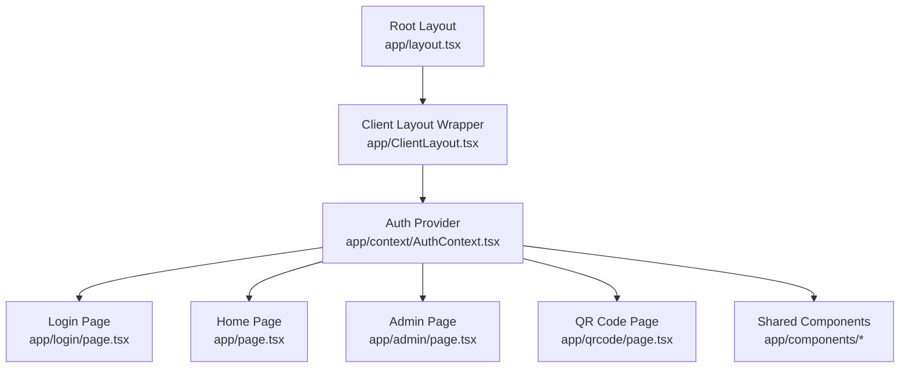
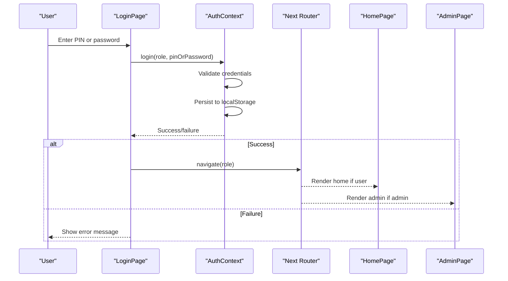
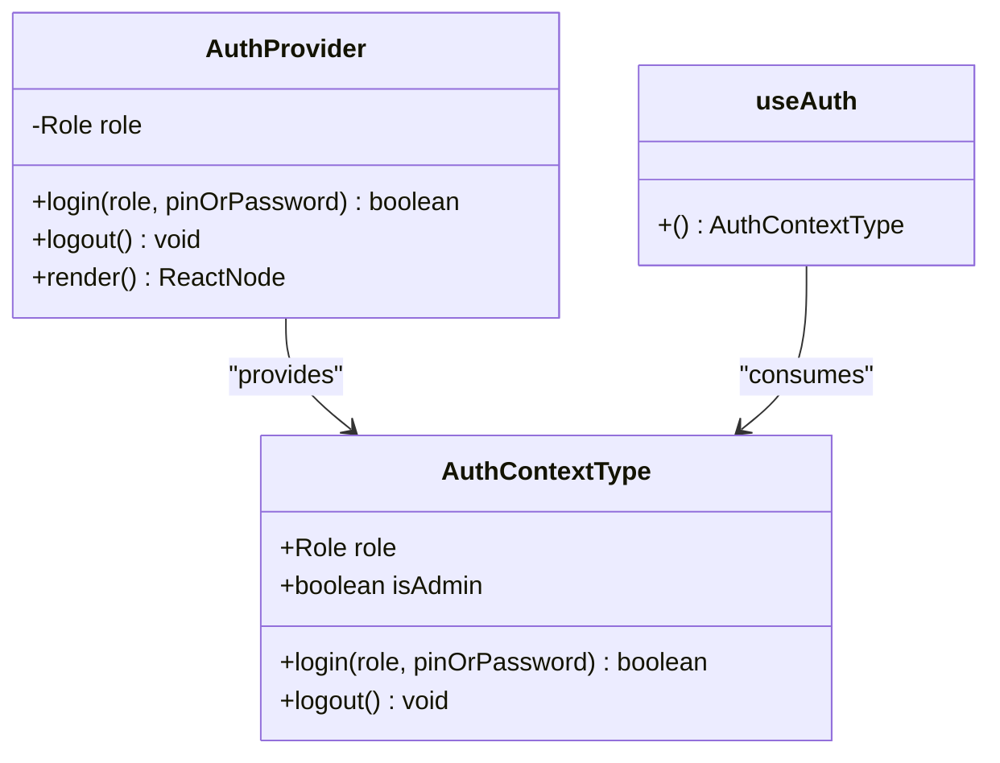
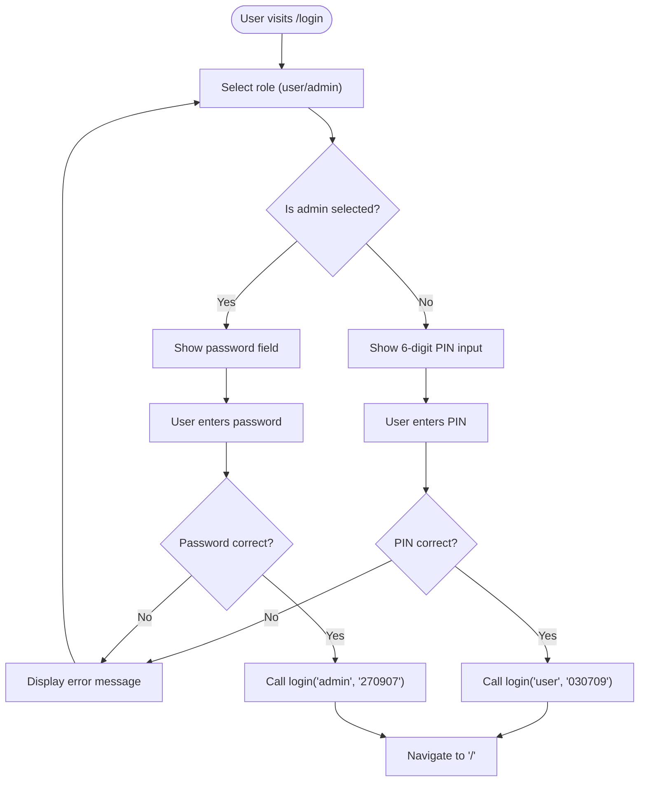
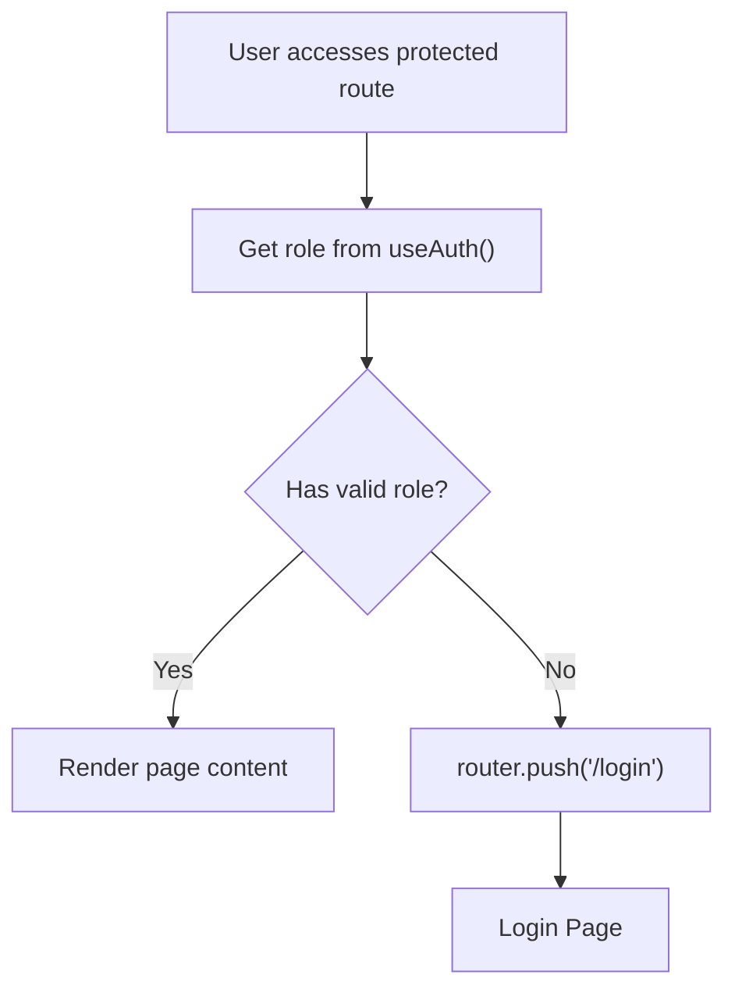
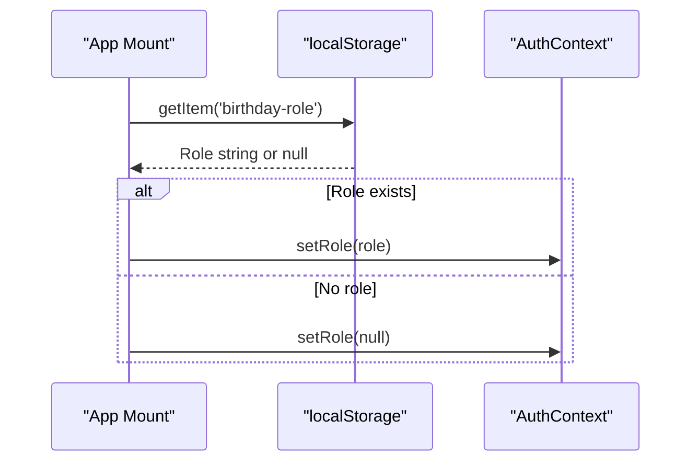
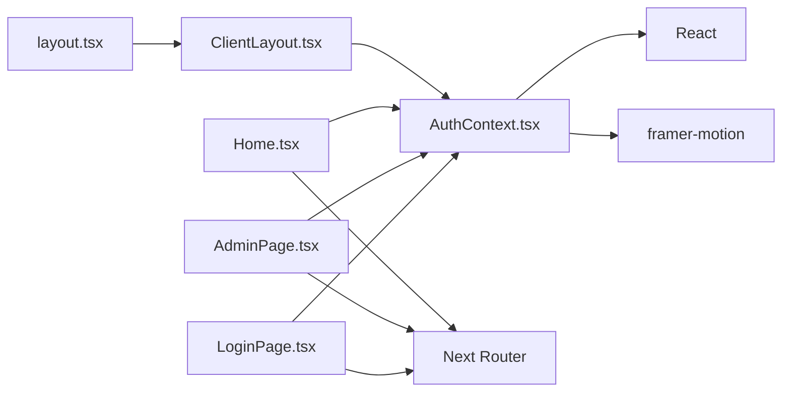

# Authentication System

<cite>
**Referenced Files in This Document**
- [AuthContext.tsx](file://app/context/AuthContext.tsx)
- [ClientLayout.tsx](file://app/ClientLayout.tsx)
- [LoginPage.tsx](file://app/login/page.tsx)
- [AdminPage.tsx](file://app/admin/page.tsx)
- [Home.tsx](file://app/page.tsx)
- [BirthdayMessage.tsx](file://app/components/BirthdayMessage.tsx)
- [PhotoGallery.tsx](file://app/components/PhotoGallery.tsx)
- [QRCodePage.tsx](file://app/qrcode/page.tsx)
- [layout.tsx](file://app/layout.tsx)
- [package.json](file://package.json)
</cite>

## Update Summary
**Changes Made**
- Updated authentication implementation details to reflect PIN-based user authentication and password-based admin authentication
- Added comprehensive documentation for the complete authentication flow including login page features
- Enhanced security considerations section with current implementation limitations
- Updated troubleshooting guide with specific PIN/password issues
- Added new QR code page integration documentation

## Table of Contents
1. [Introduction](#introduction)
2. [Project Structure](#project-structure)
3. [Core Components](#core-components)
4. [Architecture Overview](#architecture-overview)
5. [Detailed Component Analysis](#detailed-component-analysis)
6. [Authentication Flow](#authentication-flow)
7. [Security Implementation](#security-implementation)
8. [Dependency Analysis](#dependency-analysis)
9. [Performance Considerations](#performance-considerations)
10. [Security Considerations](#security-considerations)
11. [Troubleshooting Guide](#troubleshooting-guide)
12. [Best Practices and Extensions](#best-practices-and-extensions)
13. [Conclusion](#conclusion)

## Introduction
This document provides comprehensive documentation for the authentication system implemented using React Context API. The system manages user roles (admin/user), handles PIN-based authentication for users and password-based authentication for administrators, persists sessions using localStorage, and protects routes through role-based access control. It includes a custom hook for consuming authentication state, integrates with Next.js App Router navigation, and synchronizes authentication state across components.

## Project Structure
The authentication system is organized around a central context provider and several pages that consume it. The provider is mounted at the application root via a client-side layout wrapper, ensuring all pages have access to authentication state.

**Diagram sources**
- [layout.tsx:25-47](file://app/layout.tsx#L25-L47)
- [ClientLayout.tsx:5-7](file://app/ClientLayout.tsx#L5-L7)
- [AuthContext.tsx:19-51](file://app/context/AuthContext.tsx#L19-L51)

**Section sources**
- [layout.tsx:25-47](file://app/layout.tsx#L25-L47)
- [ClientLayout.tsx:5-7](file://app/ClientLayout.tsx#L5-L7)

## Core Components
- **AuthContext provider**: Manages authentication state, exposes login/logout functions, and determines admin status
- **useAuth hook**: Provides convenient access to authentication state and actions
- **LoginPage**: Handles role selection and authentication with PIN/password verification
- **Protected pages**: Home and Admin pages enforce role-based access control
- **ClientLayout wrapper**: Ensures authentication provider is available throughout the application

Key implementation patterns:
- Context-based state management with React hooks
- localStorage for session persistence across browser sessions
- Role-based access control using a simple string enum
- Client-side routing with Next.js App Router
- Voice recognition integration for user authentication

**Section sources**
- [AuthContext.tsx:5-12](file://app/context/AuthContext.tsx#L5-L12)
- [AuthContext.tsx:19-51](file://app/context/AuthContext.tsx#L19-L51)
- [LoginPage.tsx:185-339](file://app/login/page.tsx#L185-L339)
- [AdminPage.tsx:121-172](file://app/admin/page.tsx#L121-L172)
- [Home.tsx:46-118](file://app/page.tsx#L46-L118)

## Architecture Overview
The authentication architecture follows a unidirectional data flow: components consume state via the useAuth hook, and actions update the shared context state, which automatically re-renders dependent components.

**Diagram sources**
- [LoginPage.tsx:321-339](file://app/login/page.tsx#L321-L339)
- [AuthContext.tsx:29-44](file://app/context/AuthContext.tsx#L29-L44)
- [AdminPage.tsx:165-172](file://app/admin/page.tsx#L165-L172)
- [Home.tsx:76-118](file://app/page.tsx#L76-L118)

## Detailed Component Analysis

### AuthContext Provider
The provider encapsulates authentication state and exposes:
- **role**: Current user role (admin/user/null)
- **login**: Authenticates user with PIN/password and persists session
- **logout**: Clears authentication state and session
- **isAdmin**: Boolean derived from role

Implementation highlights:
- Uses useState for local state management
- Persists role to localStorage on login/logout
- Validates admin credentials against hardcoded password (270907)
- Validates user credentials against hardcoded PIN (030709)
- Exposes a custom hook for consumption

**Diagram sources**
- [AuthContext.tsx:7-12](file://app/context/AuthContext.tsx#L7-L12)
- [AuthContext.tsx:19-51](file://app/context/AuthContext.tsx#L19-L51)
- [AuthContext.tsx:53-59](file://app/context/AuthContext.tsx#L53-L59)

**Section sources**
- [AuthContext.tsx:19-51](file://app/context/AuthContext.tsx#L19-L51)
- [AuthContext.tsx:53-59](file://app/context/AuthContext.tsx#L53-L59)

### Login Page Implementation
The login page provides a comprehensive authentication interface with:
- **Role selection**: User/admin selection with visual feedback
- **PIN input**: 6-digit PIN entry for user authentication (030709)
- **Password input**: Hidden password field for admin authentication (270907)
- **Voice recognition**: Speech-to-text functionality for user authentication
- **Admin mode toggle**: Triple-tap gesture to enable admin mode
- **Form validation**: Real-time validation and error handling
- **Navigation**: Automatic redirection to appropriate route after successful login

**Diagram sources**
- [LoginPage.tsx:321-339](file://app/login/page.tsx#L321-L339)
- [LoginPage.tsx:285-311](file://app/login/page.tsx#L285-L311)

**Section sources**
- [LoginPage.tsx:185-339](file://app/login/page.tsx#L185-L339)
- [LoginPage.tsx:285-311](file://app/login/page.tsx#L285-L311)

### Protected Route Mechanisms
Protected routes are enforced through two approaches:
1. **Client-side checks in page components**
2. **Redirects to login when unauthorized**

**Diagram sources**
- [AdminPage.tsx:165-172](file://app/admin/page.tsx#L165-L172)
- [Home.tsx:76-118](file://app/page.tsx#L76-L118)

**Section sources**
- [AdminPage.tsx:165-172](file://app/admin/page.tsx#L165-L172)
- [Home.tsx:76-118](file://app/page.tsx#L76-L118)

### Session Persistence with localStorage
The system persists authentication state using localStorage:
- **On login**: stores role under 'birthday-role'
- **On logout**: removes 'birthday-role'
- **On app mount**: restores role from localStorage

**Diagram sources**
- [AuthContext.tsx:22-27](file://app/context/AuthContext.tsx#L22-L27)
- [AuthContext.tsx:41-44](file://app/context/AuthContext.tsx#L41-L44)

**Section sources**
- [AuthContext.tsx:22-27](file://app/context/AuthContext.tsx#L22-L27)
- [AuthContext.tsx:41-44](file://app/context/AuthContext.tsx#L41-L44)

### Integration with Shared Components
Components like BirthdayMessage and PhotoGallery read persisted data from localStorage, demonstrating cross-component state sharing without direct authentication dependencies.

**Section sources**
- [BirthdayMessage.tsx:22-31](file://app/components/BirthdayMessage.tsx#L22-L31)
- [PhotoGallery.tsx:28-35](file://app/components/PhotoGallery.tsx#L28-L35)

## Authentication Flow
The authentication system implements a comprehensive flow with multiple authentication methods:

### User Authentication Flow
1. **PIN Entry**: Users enter 6-digit PIN (030709)
2. **Voice Recognition**: Alternative speech-based authentication
3. **Validation**: PIN verification against hardcoded value
4. **Session Creation**: Successful authentication creates session

### Administrator Authentication Flow
1. **Admin Mode Toggle**: Triple-tap gesture enables admin mode
2. **Password Entry**: Admins enter password (270907)
3. **Validation**: Password verification against hardcoded value
4. **Admin Access**: Successful authentication grants admin privileges

### Session Management
- **Automatic Logout**: Users can log out from any page
- **Session Persistence**: Roles persist across browser sessions
- **Route Protection**: Unauthorized access redirects to login

**Section sources**
- [LoginPage.tsx:321-339](file://app/login/page.tsx#L321-L339)
- [LoginPage.tsx:285-311](file://app/login/page.tsx#L285-L311)
- [AdminPage.tsx:263](file://app/admin/page.tsx#L263)

## Security Implementation
The authentication system implements several security measures:

### Credential Storage
- **Hardcoded Credentials**: PIN (030709) and password (270907) stored in source code
- **Local Storage**: Session persistence using browser localStorage
- **No Encryption**: Credentials are stored in plaintext (development only)

### Access Control
- **Role-Based Permissions**: Different access levels for admin and user
- **Route Protection**: Client-side route guards prevent unauthorized access
- **Real-Time Validation**: Immediate feedback for authentication attempts

### Additional Security Features
- **Voice Recognition**: Speech-to-text authentication for user convenience
- **Admin Mode Toggle**: Triple-tap gesture prevents accidental admin access
- **Visual Feedback**: Clear error messaging and success indicators

**Section sources**
- [AuthContext.tsx:16-17](file://app/context/AuthContext.tsx#L16-L17)
- [LoginPage.tsx:343-352](file://app/login/page.tsx#L343-L352)

## Dependency Analysis
The authentication system relies on minimal external dependencies and Next.js App Router for navigation.

**Diagram sources**
- [AuthContext.tsx:3](file://app/context/AuthContext.tsx#L3)
- [LoginPage.tsx:3-6](file://app/login/page.tsx#L3-L6)
- [AdminPage.tsx:3-6](file://app/admin/page.tsx#L3-L6)
- [Home.tsx:3-7](file://app/page.tsx#L3-L7)
- [ClientLayout.tsx](file://app/ClientLayout.tsx#L3)
- [layout.tsx](file://app/layout.tsx#L4)

**Section sources**
- [package.json:11-16](file://package.json#L11-L16)
- [AuthContext.tsx](file://app/context/AuthContext.tsx#L3)
- [LoginPage.tsx:3-6](file://app/login/page.tsx#L3-L6)
- [AdminPage.tsx:3-6](file://app/admin/page.tsx#L3-L6)
- [Home.tsx:3-7](file://app/page.tsx#L3-L7)

## Performance Considerations
- **Context updates**: Trigger re-renders for all consumers; keep the provider near the root to minimize unnecessary re-renders
- **localStorage operations**: Synchronous operations; batch writes when possible
- **Voice recognition**: Resource-intensive feature; disable when not needed
- **Animation performance**: Complex animations may impact performance on low-end devices
- **Avoid heavy computations**: In the provider; derive computed values like isAdmin efficiently

## Security Considerations
Current implementation limitations:
- **Hardcoded credentials**: PIN and password stored in source code
- **Client-side storage**: Authentication state stored in localStorage
- **No CSRF protection**: No protection against cross-site request forgery
- **No secure cookies**: No secure cookie-based session management
- **No rate limiting**: No protection against brute force attacks
- **No encryption**: Credentials stored in plaintext

Recommended improvements:
- **Environment variables**: Store secrets in environment variables
- **Backend authentication**: Implement server-side authentication APIs
- **Secure cookies**: Use secure, HTTP-only cookies for production
- **CSRF tokens**: Implement CSRF protection for forms
- **Rate limiting**: Add rate limiting and account lockout mechanisms
- **JWT tokens**: Implement token-based authentication for production
- **HTTPS enforcement**: Enforce HTTPS for all communications

**Section sources**
- [AuthContext.tsx:16-17](file://app/context/AuthContext.tsx#L16-L17)
- [AuthContext.tsx:41-44](file://app/context/AuthContext.tsx#L41-L44)

## Troubleshooting Guide
Common issues and resolutions:

### Login fails immediately
- **Verify PIN/password**: Ensure user PIN is 030709 and admin password is 270907
- **Check console errors**: Look for authentication errors in browser console
- **Verify useAuth hook**: Ensure useAuth is used within AuthProvider context

### Role not persisting across reloads
- **Confirm localStorage**: Verify browser allows localStorage usage
- **Check 'birthday-role' key**: Ensure key exists and contains valid role
- **Clear browser cache**: Try clearing browser cache and cookies

### Protected route redirects incorrectly
- **Ensure useAuth**: Verify useAuth hook is called in protected components
- **Check router navigation**: Ensure router.push uses correct paths
- **Verify role state**: Check that role updates before navigation

### Hook used outside provider
- **Wrap application**: Ensure ClientLayout wraps the application
- **Provider placement**: Verify AuthProvider is mounted at root level

### Voice recognition issues
- **Browser support**: Ensure browser supports Web Speech API (Chrome recommended)
- **Microphone access**: Verify microphone permissions are granted
- **Audio quality**: Check for background noise interference

### Admin mode toggle not working
- **Triple-tap gesture**: Ensure triple-tap within 1.5 seconds
- **Gesture timing**: Check that taps are properly timed
- **Mobile compatibility**: Test on different devices and browsers

**Section sources**
- [LoginPage.tsx:332-336](file://app/login/page.tsx#L332-L336)
- [AuthContext.tsx:53-59](file://app/context/AuthContext.tsx#L53-L59)
- [AdminPage.tsx:165-172](file://app/admin/page.tsx#L165-L172)
- [ClientLayout.tsx:5-7](file://app/ClientLayout.tsx#L5-L7)

## Best Practices and Extensions
### Extending the Authentication System
- **Backend integration**: Replace hardcoded credentials with backend authentication APIs
- **Multi-factor authentication**: Add SMS codes or biometric authentication
- **Role-based permissions**: Implement granular access control beyond admin/user
- **Token refresh**: Add automatic token refresh and expiration handling
- **Audit logging**: Implement authentication event logging

### Code Organization Improvements
- **Separate files**: Split AuthContext into separate files for state, actions, and selectors
- **TypeScript interfaces**: Add comprehensive TypeScript interfaces for authentication state
- **Middleware**: Implement Next.js middleware for route protection
- **Loading states**: Add loading states during authentication transitions

### Security Hardening
- **Environment variables**: Move secrets to environment variables or backend APIs
- **Secure cookies**: Implement secure cookie-based sessions for production
- **CSRF protection**: Add CSRF tokens and CORS policies
- **Rate limiting**: Implement rate limiting and account lockout policies
- **Audit trails**: Add comprehensive authentication event logging

### Feature Enhancements
- **Social login**: Add Google, Facebook, or other social authentication providers
- **Password reset**: Implement password reset functionality
- **Two-factor authentication**: Add SMS or authenticator app support
- **Remember me**: Implement "remember me" functionality with secure tokens
- **Account recovery**: Add account recovery and password reset workflows

## Conclusion
The authentication system provides a comprehensive, context-based solution for managing user roles and protecting routes in a Next.js application. The system successfully implements PIN-based authentication for users and password-based authentication for administrators, with role-based access control and localStorage persistence. While functional for development and demonstration, production deployments require significant security enhancements including server-side session management, secure credential storage, and robust access control mechanisms. The system demonstrates modern React patterns with Context API, custom hooks, and comprehensive error handling, providing a solid foundation for future security improvements and feature extensions.