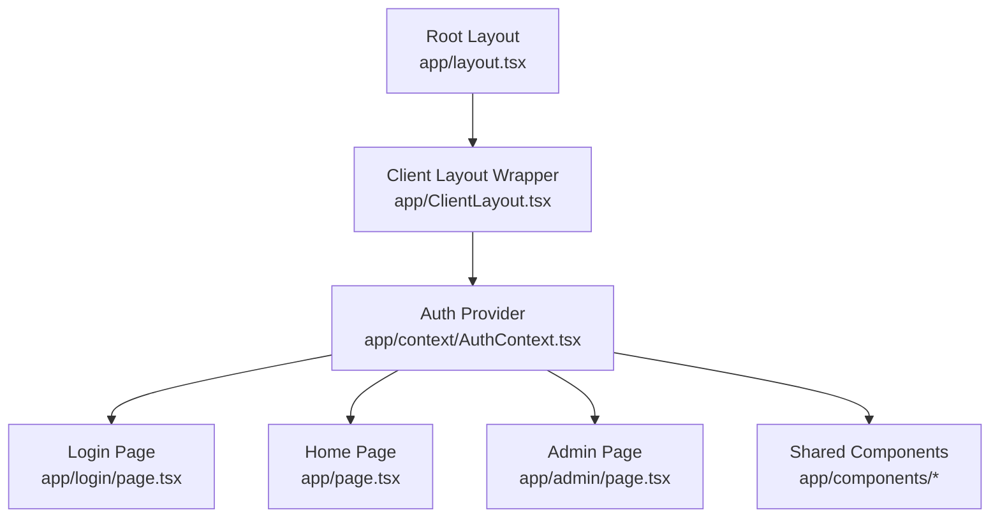
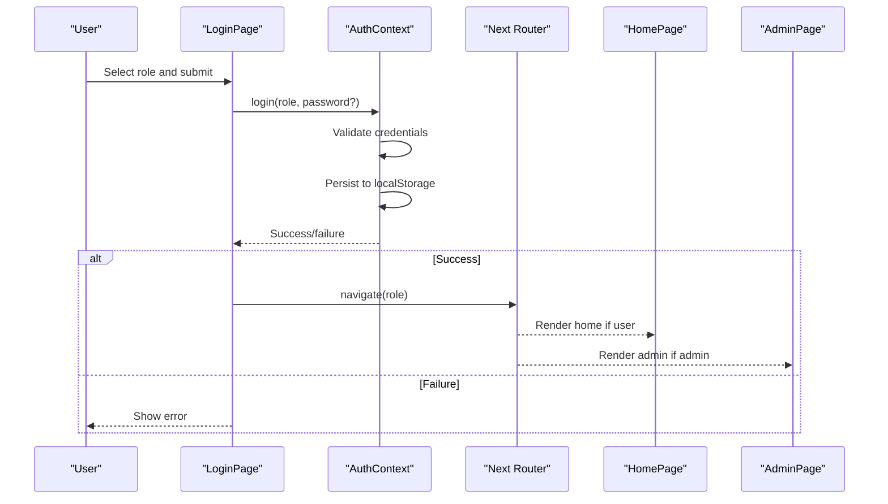
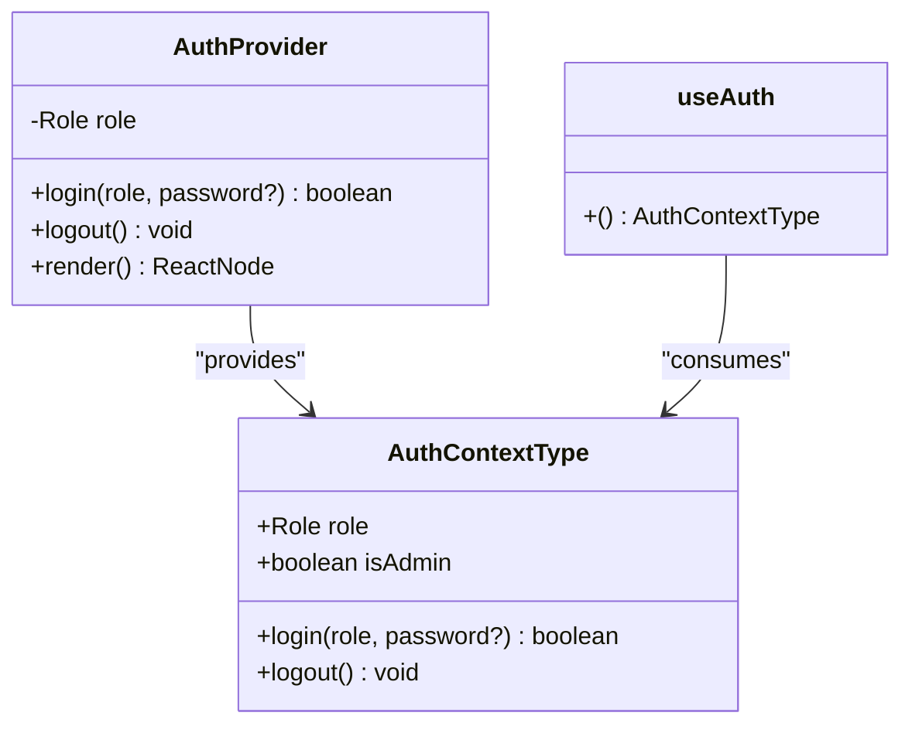
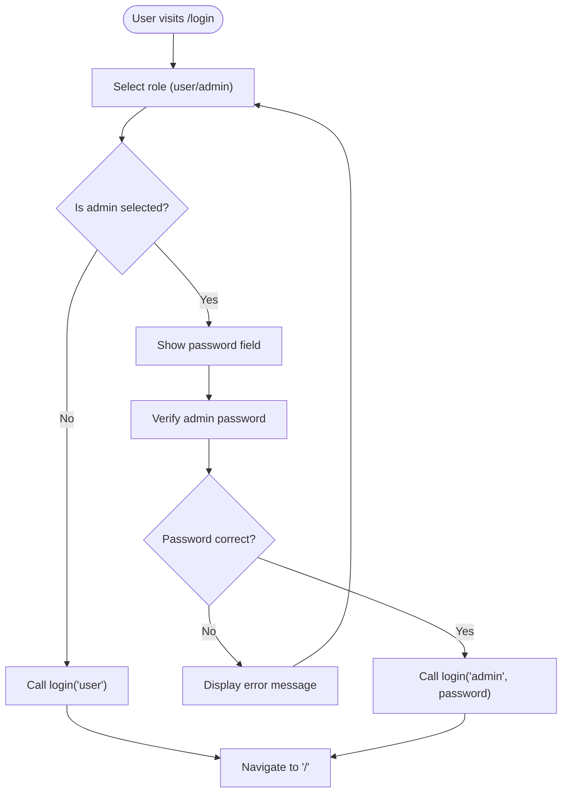
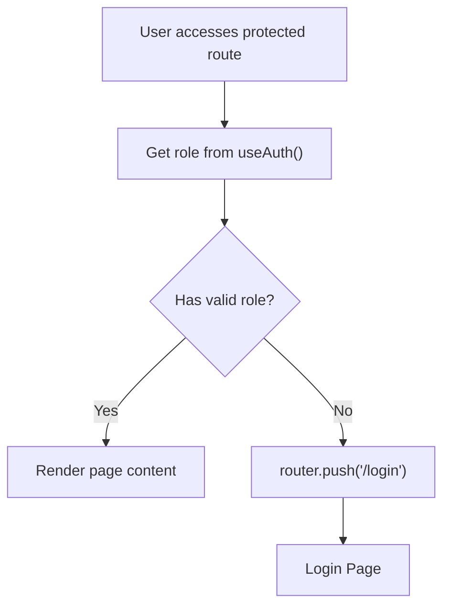
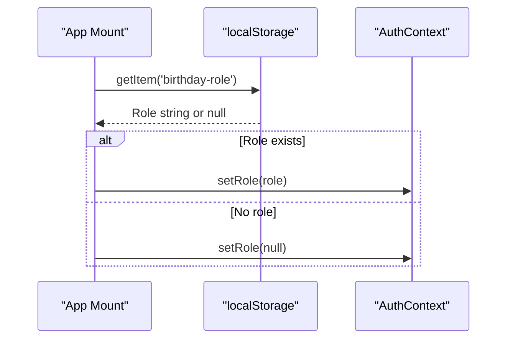
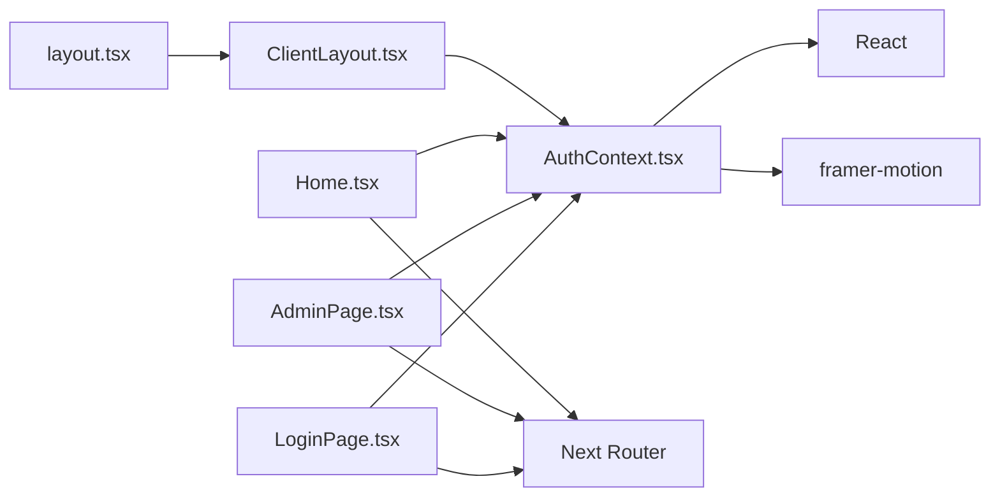

# Authentication System

<cite>
**Referenced Files in This Document**
- [AuthContext.tsx](file://app/context/AuthContext.tsx)
- [ClientLayout.tsx](file://app/ClientLayout.tsx)
- [LoginPage.tsx](file://app/login/page.tsx)
- [AdminPage.tsx](file://app/admin/page.tsx)
- [Home.tsx](file://app/page.tsx)
- [BirthdayMessage.tsx](file://app/components/BirthdayMessage.tsx)
- [PhotoGallery.tsx](file://app/components/PhotoGallery.tsx)
- [MusicPlayer.tsx](file://app/components/MusicPlayer.tsx)
- [layout.tsx](file://app/layout.tsx)
- [package.json](file://package.json)
</cite>

## Table of Contents
1. [Introduction](#introduction)
2. [Project Structure](#project-structure)
3. [Core Components](#core-components)
4. [Architecture Overview](#architecture-overview)
5. [Detailed Component Analysis](#detailed-component-analysis)
6. [Dependency Analysis](#dependency-analysis)
7. [Performance Considerations](#performance-considerations)
8. [Security Considerations](#security-considerations)
9. [Troubleshooting Guide](#troubleshooting-guide)
10. [Best Practices and Extensions](#best-practices-and-extensions)
11. [Conclusion](#conclusion)

## Introduction
This document provides comprehensive documentation for the authentication system implemented using React Context API. The system manages user roles (admin/user), handles login/logout flows, persists sessions using localStorage, and protects routes through role-based access control. It includes a custom hook for consuming authentication state, integrates with Next.js App Router navigation, and synchronizes authentication state across components.

## Project Structure
The authentication system is organized around a central context provider and several pages that consume it. The provider is mounted at the application root via a client-side layout wrapper, ensuring all pages have access to authentication state.

**Diagram sources**
- [layout.tsx:21-36](file://app/layout.tsx#L21-L36)
- [ClientLayout.tsx:5-7](file://app/ClientLayout.tsx#L5-L7)
- [AuthContext.tsx:18-49](file://app/context/AuthContext.tsx#L18-L49)

**Section sources**
- [layout.tsx:21-36](file://app/layout.tsx#L21-L36)
- [ClientLayout.tsx:5-7](file://app/ClientLayout.tsx#L5-L7)

## Core Components
- AuthContext provider: Manages authentication state, exposes login/logout functions, and determines admin status.
- useAuth hook: Provides convenient access to authentication state and actions.
- LoginPage: Handles role selection and admin password verification.
- Protected pages: Home and Admin pages enforce role-based access control.

Key implementation patterns:
- Context-based state management with React hooks
- localStorage for session persistence across browser sessions
- Role-based access control using a simple string enum
- Client-side routing with Next.js App Router

**Section sources**
- [AuthContext.tsx:5-12](file://app/context/AuthContext.tsx#L5-L12)
- [AuthContext.tsx:18-49](file://app/context/AuthContext.tsx#L18-L49)
- [LoginPage.tsx:9-26](file://app/login/page.tsx#L9-L26)
- [AdminPage.tsx:19-61](file://app/admin/page.tsx#L19-L61)
- [Home.tsx:13-44](file://app/page.tsx#L13-L44)

## Architecture Overview
The authentication architecture follows a unidirectional data flow: components consume state via the useAuth hook, and actions update the shared context state, which automatically re-renders dependent components.

**Diagram sources**
- [LoginPage.tsx:16-26](file://app/login/page.tsx#L16-L26)
- [AuthContext.tsx:28-42](file://app/context/AuthContext.tsx#L28-L42)
- [AdminPage.tsx:32-36](file://app/admin/page.tsx#L32-L36)
- [Home.tsx:22-26](file://app/page.tsx#L22-L26)

## Detailed Component Analysis

### AuthContext Provider
The provider encapsulates authentication state and exposes:
- role: Current user role (admin/user/null)
- login: Authenticates user and persists session
- logout: Clears authentication state and session
- isAdmin: Boolean derived from role

Implementation highlights:
- Uses useState for local state management
- Persists role to localStorage on login/logout
- Validates admin credentials against a hardcoded secret
- Exposes a custom hook for consumption

**Diagram sources**
- [AuthContext.tsx:7-12](file://app/context/AuthContext.tsx#L7-L12)
- [AuthContext.tsx:18-49](file://app/context/AuthContext.tsx#L18-L49)
- [AuthContext.tsx:51-57](file://app/context/AuthContext.tsx#L51-L57)

**Section sources**
- [AuthContext.tsx:18-49](file://app/context/AuthContext.tsx#L18-L49)
- [AuthContext.tsx:51-57](file://app/context/AuthContext.tsx#L51-L57)

### Login Page Implementation
The login page provides a role selection interface with:
- Role cards for user/admin selection
- Conditional password input for admin
- Form validation and error handling
- Navigation to appropriate route after successful login

**Diagram sources**
- [LoginPage.tsx:16-26](file://app/login/page.tsx#L16-L26)
- [LoginPage.tsx:120-161](file://app/login/page.tsx#L120-L161)

**Section sources**
- [LoginPage.tsx:9-26](file://app/login/page.tsx#L9-L26)
- [LoginPage.tsx:120-161](file://app/login/page.tsx#L120-L161)

### Protected Route Mechanisms
Protected routes are enforced through two approaches:
1. Client-side checks in page components
2. Redirects to login when unauthorized

**Diagram sources**
- [AdminPage.tsx:32-36](file://app/admin/page.tsx#L32-L36)
- [Home.tsx:22-26](file://app/page.tsx#L22-L26)

**Section sources**
- [AdminPage.tsx:32-36](file://app/admin/page.tsx#L32-L36)
- [Home.tsx:22-26](file://app/page.tsx#L22-L26)

### Session Persistence with localStorage
The system persists authentication state using localStorage:
- On login: stores role under 'birthday-role'
- On logout: removes 'birthday-role'
- On app mount: restores role from localStorage

**Diagram sources**
- [AuthContext.tsx:21-26](file://app/context/AuthContext.tsx#L21-L26)
- [AuthContext.tsx:39-42](file://app/context/AuthContext.tsx#L39-L42)

**Section sources**
- [AuthContext.tsx:21-26](file://app/context/AuthContext.tsx#L21-L26)
- [AuthContext.tsx:39-42](file://app/context/AuthContext.tsx#L39-L42)

### Integration with Shared Components
Components like BirthdayMessage and PhotoGallery read persisted data from localStorage, demonstrating cross-component state sharing without direct authentication dependencies.

**Section sources**
- [BirthdayMessage.tsx:18-26](file://app/components/BirthdayMessage.tsx#L18-L26)
- [PhotoGallery.tsx:31-37](file://app/components/PhotoGallery.tsx#L31-L37)

## Dependency Analysis
The authentication system relies on minimal external dependencies and Next.js App Router for navigation.

**Diagram sources**
- [AuthContext.tsx](file://app/context/AuthContext.tsx#L3)
- [LoginPage.tsx:3-6](file://app/login/page.tsx#L3-L6)
- [AdminPage.tsx:3-6](file://app/admin/page.tsx#L3-L6)
- [Home.tsx:3-7](file://app/page.tsx#L3-L7)
- [ClientLayout.tsx](file://app/ClientLayout.tsx#L3)
- [layout.tsx](file://app/layout.tsx#L4)

**Section sources**
- [package.json:11-16](file://package.json#L11-L16)
- [AuthContext.tsx](file://app/context/AuthContext.tsx#L3)
- [LoginPage.tsx:3-6](file://app/login/page.tsx#L3-L6)
- [AdminPage.tsx:3-6](file://app/admin/page.tsx#L3-L6)
- [Home.tsx:3-7](file://app/page.tsx#L3-L7)

## Performance Considerations
- Context updates trigger re-renders for all consumers; keep the provider near the root to minimize unnecessary re-renders
- localStorage operations are synchronous; batch writes when possible
- Avoid heavy computations in the provider; derive computed values like isAdmin efficiently
- Consider memoizing expensive derived values if performance becomes a concern

## Security Considerations
Current implementation limitations:
- Admin password is hardcoded in source code
- Authentication state stored in localStorage (client-side storage)
- No CSRF protection or secure cookie handling
- No rate limiting or account lockout mechanisms

Recommended improvements:
- Move secrets to environment variables or backend APIs
- Implement server-side session management with secure cookies
- Add CSRF tokens and HTTPS enforcement
- Implement rate limiting and account lockout policies
- Add token refresh mechanisms and expiration handling
- Consider OAuth or JWT for production deployments

**Section sources**
- [AuthContext.tsx](file://app/context/AuthContext.tsx#L16)
- [AuthContext.tsx:39-42](file://app/context/AuthContext.tsx#L39-L42)

## Troubleshooting Guide
Common issues and resolutions:

### Login fails immediately
- Verify admin password matches the hardcoded value
- Check console for error messages
- Ensure useAuth hook is used within AuthProvider

### Role not persisting across reloads
- Confirm localStorage is enabled in the browser
- Verify 'birthday-role' key exists and contains valid role
- Check for localStorage quota exceeded errors

### Protected route redirects incorrectly
- Ensure useAuth is called in protected components
- Verify router.push is called with correct paths
- Check that role state updates before navigation

### Hook used outside provider
- Wrap application with ClientLayout containing AuthProvider
- Ensure provider is mounted at root level

**Section sources**
- [LoginPage.tsx:18-21](file://app/login/page.tsx#L18-L21)
- [AuthContext.tsx:53-55](file://app/context/AuthContext.tsx#L53-L55)
- [AdminPage.tsx:32-36](file://app/admin/page.tsx#L32-L36)
- [ClientLayout.tsx:5-7](file://app/ClientLayout.tsx#L5-L7)

## Best Practices and Extensions
### Extending the Authentication System
- Add user registration and password hashing
- Implement multi-factor authentication
- Add role-based permissions for granular access control
- Integrate with backend authentication APIs
- Add token refresh and automatic logout on inactivity

### Code Organization Improvements
- Split AuthContext into separate files for state, actions, and selectors
- Add TypeScript interfaces for authentication state
- Implement middleware for route protection
- Add loading states during authentication transitions

### Security Hardening
- Move secrets to environment variables
- Implement secure cookie-based sessions
- Add CSRF protection and CORS policies
- Implement audit logging for authentication events

## Conclusion
The authentication system provides a clean, context-based solution for managing user roles and protecting routes in a Next.js application. While functional for development and demonstration, production deployments require significant security enhancements including server-side session management, secure credential storage, and robust access control mechanisms.