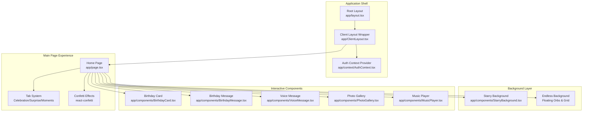
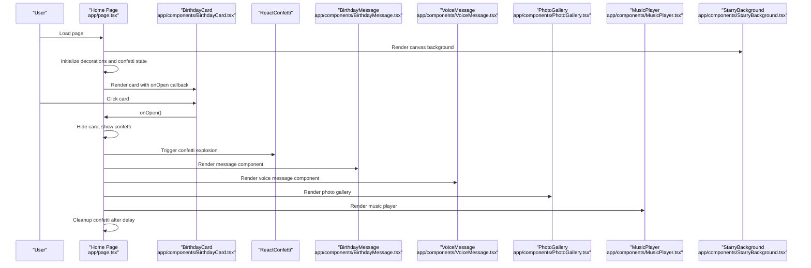
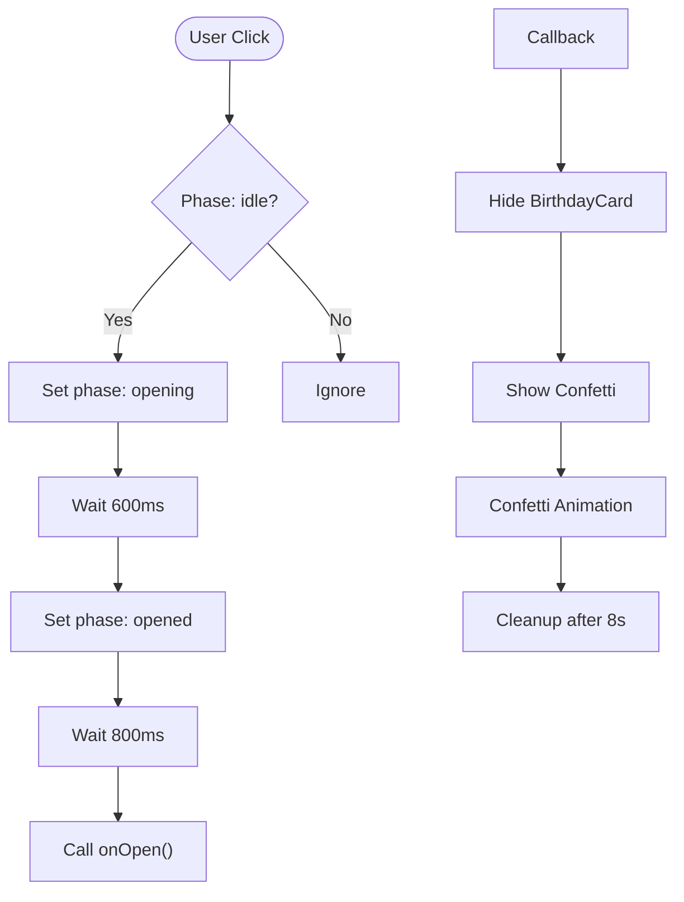
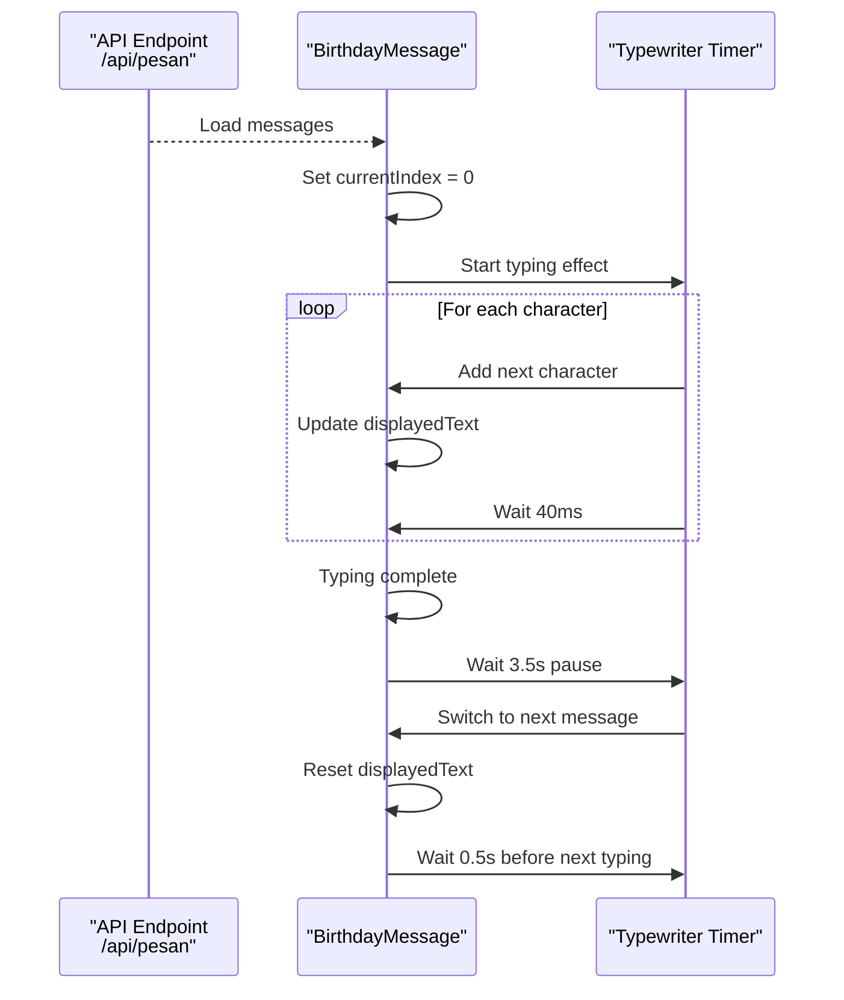
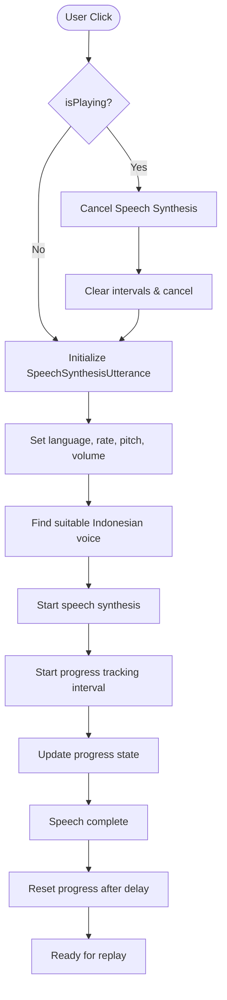
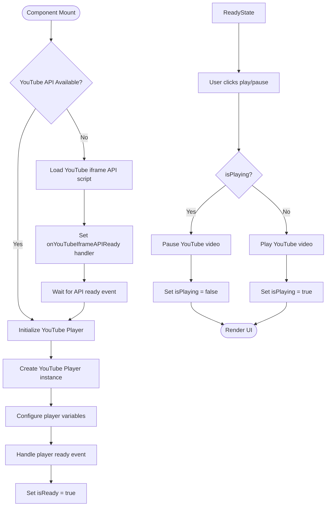
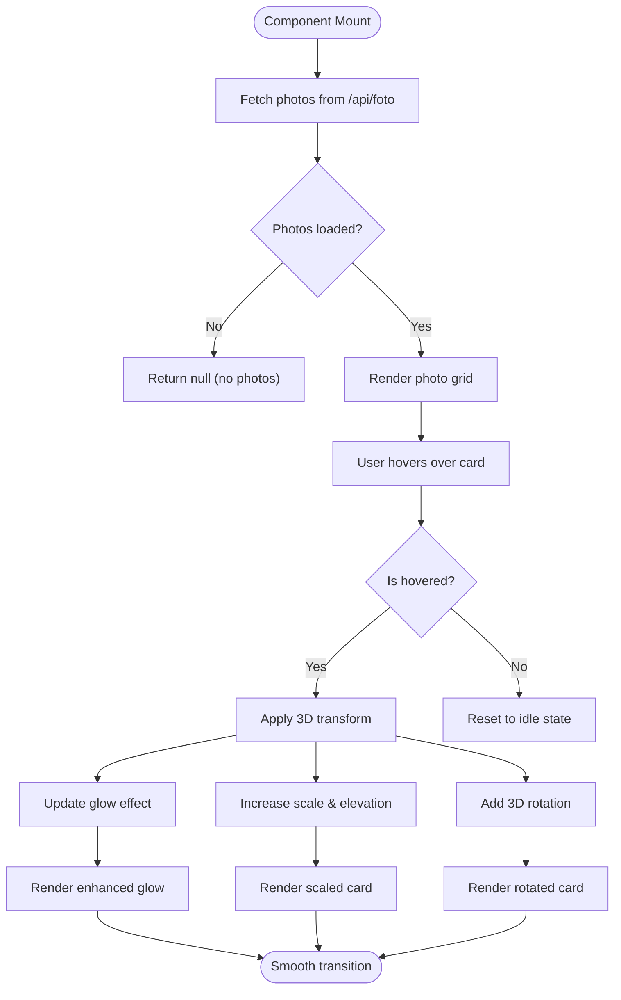
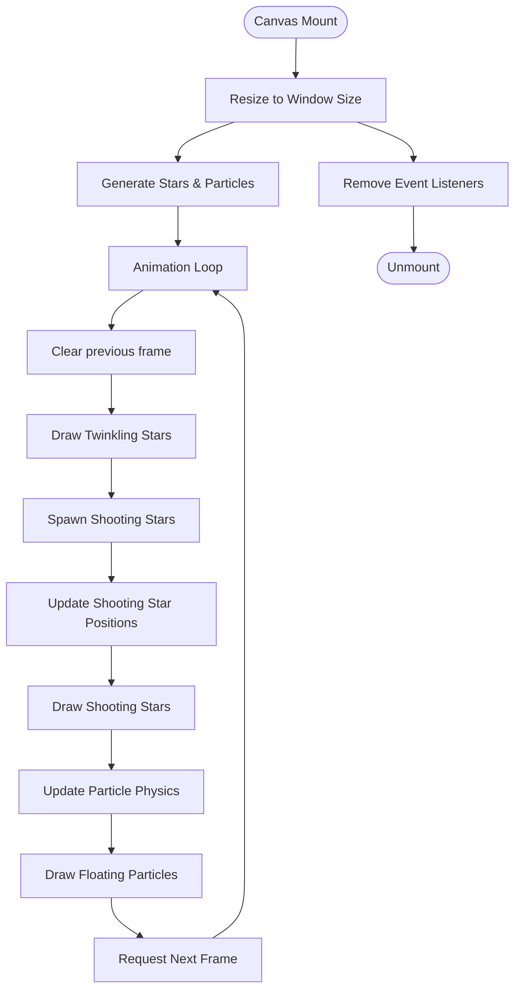
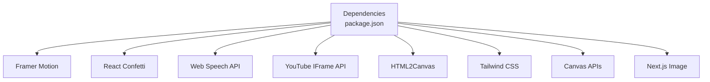

# Birthday Experience Components

<cite>
**Referenced Files in This Document**
- [BirthdayCard.tsx](file://app/components/BirthdayCard.tsx)
- [BirthdayMessage.tsx](file://app/components/BirthdayMessage.tsx)
- [MusicPlayer.tsx](file://app/components/MusicPlayer.tsx)
- [PhotoGallery.tsx](file://app/components/PhotoGallery.tsx)
- [StarryBackground.tsx](file://app/components/StarryBackground.tsx)
- [VoiceMessage.tsx](file://app/components/VoiceMessage.tsx)
- [page.tsx](file://app/page.tsx)
- [layout.tsx](file://app/layout.tsx)
- [ClientLayout.tsx](file://app/ClientLayout.tsx)
- [AuthContext.tsx](file://app/context/AuthContext.tsx)
- [globals.css](file://app/globals.css)
- [package.json](file://package.json)
</cite>

## Update Summary
**Changes Made**
- Added comprehensive documentation for the new VoiceMessage component
- Updated BirthdayCard component with enhanced 3D envelope animation and floating particle effects
- Enhanced MusicPlayer component with YouTube integration and advanced visual effects
- Improved PhotoGallery component with sophisticated 3D card animations and hover effects
- Updated StarryBackground component with enhanced canvas rendering and particle systems
- Added new gift selection functionality and surprise reveal system
- Enhanced main page integration with tabbed interface and interactive elements

## Table of Contents
1. [Introduction](#introduction)
2. [Project Structure](#project-structure)
3. [Core Components](#core-components)
4. [Architecture Overview](#architecture-overview)
5. [Detailed Component Analysis](#detailed-component-analysis)
6. [Enhanced Interactive Features](#enhanced-interactive-features)
7. [Dependency Analysis](#dependency-analysis)
8. [Performance Considerations](#performance-considerations)
9. [Accessibility and Responsive Design](#accessibility-and-responsive-design)
10. [Troubleshooting Guide](#troubleshooting-guide)
11. [Conclusion](#conclusion)

## Introduction
This document provides comprehensive documentation for the enhanced interactive birthday experience components. The system now features six key components that together create an immersive, animated, and personalized birthday celebration with advanced interactive elements:

- **BirthdayCard**: An interactive 3D animated card with celebratory effects, floating particle backgrounds, and envelope reveal mechanics
- **BirthdayMessage**: A dynamic message display system with typewriter effect, emoji animations, and progress indicators
- **VoiceMessage**: A speech synthesis component with waveform visualization, progress tracking, and 3D button effects
- **MusicPlayer**: An advanced audio playback controller with YouTube integration, visual waveform effects, and expandable controls
- **PhotoGallery**: A sophisticated responsive image gallery with 3D polaroid cards, hover animations, and decorative elements
- **StarryBackground**: A rich canvas-based background featuring twinkling stars, shooting stars, and floating cosmic particles

The documentation includes component purposes, implementation details, usage patterns, props, customization options, animation implementations, integration patterns, responsive design considerations, accessibility features, and performance optimizations. It also explains how these components work together to deliver a cohesive, multi-layered birthday experience.

## Project Structure
The enhanced birthday experience is built as a Next.js application with client-side components and animations powered by Framer Motion. The main page orchestrates a complex multi-tab experience, integrating the background, confetti effects, interactive components, and gift selection system.

**Diagram sources**
- [layout.tsx:1-37](file://app/layout.tsx#L1-L37)
- [ClientLayout.tsx:1-8](file://app/ClientLayout.tsx#L1-L8)
- [AuthContext.tsx:1-58](file://app/context/AuthContext.tsx#L1-L58)
- [page.tsx:1-1064](file://app/page.tsx#L1-L1064)
- [StarryBackground.tsx:1-204](file://app/components/StarryBackground.tsx#L1-L204)
- [BirthdayCard.tsx:1-317](file://app/components/BirthdayCard.tsx#L1-L317)
- [BirthdayMessage.tsx:1-181](file://app/components/BirthdayMessage.tsx#L1-L181)
- [VoiceMessage.tsx:1-279](file://app/components/VoiceMessage.tsx#L1-L279)
- [PhotoGallery.tsx:1-214](file://app/components/PhotoGallery.tsx#L1-L214)
- [MusicPlayer.tsx:1-221](file://app/components/MusicPlayer.tsx#L1-L221)

**Section sources**
- [layout.tsx:1-37](file://app/layout.tsx#L1-L37)
- [ClientLayout.tsx:1-8](file://app/ClientLayout.tsx#L1-L8)
- [AuthContext.tsx:1-58](file://app/context/AuthContext.tsx#L1-L58)
- [page.tsx:1-1064](file://app/page.tsx#L1-L1064)

## Core Components
This section introduces each component's enhanced purpose and primary responsibilities within the comprehensive birthday experience.

- **BirthdayCard**: Provides an interactive 3D envelope card with floating particle backgrounds, ambient orb effects, and a sophisticated reveal mechanism that triggers confetti and opens the main content with layered animations.
- **BirthdayMessage**: Displays a rotating collection of personalized messages with typewriter effect, emoji animations, progress indicators, and smooth cross-fade transitions.
- **VoiceMessage**: Offers a speech synthesis component with waveform visualization, progress tracking, animated 3D buttons, and visual feedback during audio playback.
- **MusicPlayer**: Provides an advanced animated music player with YouTube integration, visual waveform-like progress indicator, expandable panel, and sophisticated visual effects.
- **PhotoGallery**: Renders a responsive grid of 3D polaroid-style photo cards with gradient backgrounds, hover animations, decorative elements, and interactive elements.
- **StarryBackground**: Creates a dynamic canvas background with twinkling stars, occasional shooting stars, floating cosmic particles, and support for color variants.

**Section sources**
- [BirthdayCard.tsx:1-317](file://app/components/BirthdayCard.tsx#L1-L317)
- [BirthdayMessage.tsx:1-181](file://app/components/BirthdayMessage.tsx#L1-L181)
- [VoiceMessage.tsx:1-279](file://app/components/VoiceMessage.tsx#L1-L279)
- [MusicPlayer.tsx:1-221](file://app/components/MusicPlayer.tsx#L1-L221)
- [PhotoGallery.tsx:1-214](file://app/components/PhotoGallery.tsx#L1-L214)
- [StarryBackground.tsx:1-204](file://app/components/StarryBackground.tsx#L1-L204)

## Architecture Overview
The enhanced birthday experience follows a sophisticated layered architecture with multiple interactive layers:
- **Authentication layer** ensures only authorized users can access the experience.
- **Tab-based navigation** manages different sections: Celebration, Surprise, and Moments.
- **Gift selection system** with interactive card flipping and download functionality.
- **Background layer** provides visual ambiance via canvas rendering and floating decorations.
- **Interactive components** encapsulate their own state and animations, communicating through props and callbacks.
- **Real-time data integration** through API endpoints for messages, photos, and surprises.

**Diagram sources**
- [page.tsx:120-124](file://app/page.tsx#L120-L124)
- [page.tsx:237-239](file://app/page.tsx#L237-L239)
- [BirthdayCard.tsx:21-26](file://app/components/BirthdayCard.tsx#L21-L26)
- [BirthdayMessage.tsx:16-31](file://app/components/BirthdayMessage.tsx#L16-L31)
- [VoiceMessage.tsx:6-20](file://app/components/VoiceMessage.tsx#L6-L20)
- [PhotoGallery.tsx:24-35](file://app/components/PhotoGallery.tsx#L24-L35)
- [MusicPlayer.tsx:13-66](file://app/components/MusicPlayer.tsx#L13-L66)
- [StarryBackground.tsx:40-195](file://app/components/StarryBackground.tsx#L40-L195)

## Detailed Component Analysis

### Enhanced BirthdayCard
**Purpose:**
- Serves as the sophisticated entry point to the birthday experience with advanced 3D animations, floating particle effects, and envelope reveal mechanics.

**Key Implementation Details:**
- Uses Framer Motion for complex entrance, exit, and hover animations with precise timing.
- Implements advanced 3D envelope animation using CSS transforms with preserve-3d and backface-visibility.
- Generates dynamic floating particle backgrounds with randomized sizes, positions, and continuous animations.
- Features ambient orb effects with radial gradients and infinite scaling animations.
- Includes grid overlay and starfield background for enhanced visual depth.
- Triggers confetti explosion and invokes parent callback on successful reveal.

**Props:**
- `onOpen`: Callback invoked after the card begins opening, allowing the parent to hide the card and trigger confetti.

**State Management:**
- `phase`: Tracks card state - 'idle' | 'opening' | 'opened'
- `isMobile`: Detects mobile viewport for responsive particle counts

**Enhanced Animations:**
- **Entrance**: Fade-in with scale-up and noise overlay
- **Exit**: Fade-out with scale-down and rotation
- **Envelope**: 3D flip animation with precise timing (0.7 seconds)
- **Letter**: Smooth reveal with rotation and elevation
- **Ambient Orbs**: Infinite scaling with staggered delays
- **Floating Emojis**: Continuous y-axis movement with opacity and rotation
- **Starfield**: Twinkling animation with randomized delays

**Customization Options:**
- Gradient background color variations
- Particle count adjustment based on device type
- Timing and easing customization for all animations
- Mobile-responsive particle density

**Integration Patterns:**
- Conditionally rendered via AnimatePresence in the home page
- Parent handles confetti explosion and content visibility
- Coordinates with gift selection system for seamless experience

**Section sources**
- [BirthdayCard.tsx:10-317](file://app/components/BirthdayCard.tsx#L10-L317)
- [page.tsx:120-124](file://app/page.tsx#L120-L124)

#### Enhanced BirthdayCard Animation Flowchart

**Diagram sources**
- [BirthdayCard.tsx:21-26](file://app/components/BirthdayCard.tsx#L21-L26)
- [page.tsx:120-124](file://app/page.tsx#L120-L124)

### Enhanced BirthdayMessage
**Purpose:**
- Displays a rotating collection of personalized birthday messages with sophisticated typewriter effect, emoji animations, and progress indicators.

**Key Implementation Details:**
- Loads customizable messages from `/api/pesan` endpoint with fallback to default messages.
- Implements typewriter effect with configurable typing speed and pause intervals.
- Uses AnimatePresence for smooth cross-fade transitions between messages.
- Features animated emoji display with staggered entrance animations.
- Shows interactive progress dots with active state highlighting.
- Includes decorative top and bottom accent bars.

**Props:**
- None (uses internal state and API integration)

**State Management:**
- `currentIndex`: Index of currently displayed message
- `messages`: Array of message strings loaded from API or defaults
- `displayedText`: Current text being typed
- `isTyping`: Controls typing animation state

**Enhanced Animations:**
- **Message transitions**: Crossfade with scale-up/down effects
- **Emoji animations**: Spring-based entrance with shadow effects
- **Progress dots**: Scale-up with layoutId animation for active state
- **Decorative elements**: Pulsing dots with gradient coloring
- **Typewriter cursor**: Blinking animation with shadow effects

**Customization Options:**
- Editable via `/api/pesan` endpoint for admin messages
- Responsive typography sizing and spacing
- Configurable typing speed and pause intervals
- Customizable emoji collection

**Integration Patterns:**
- Integrated into the main page under the Celebration tab
- Works independently with API data fetching
- Responsive design adapts to different screen sizes

**Section sources**
- [BirthdayMessage.tsx:16-181](file://app/components/BirthdayMessage.tsx#L16-L181)
- [page.tsx:502-535](file://app/page.tsx#L502-L535)

#### Enhanced BirthdayMessage Typewriter Sequence

**Diagram sources**
- [BirthdayMessage.tsx:33-55](file://app/components/BirthdayMessage.tsx#L33-L55)
- [page.tsx:502-535](file://app/page.tsx#L502-L535)

### Enhanced VoiceMessage
**Purpose:**
- Provides a speech synthesis component with waveform visualization, progress tracking, and sophisticated 3D button effects.

**Key Implementation Details:**
- Uses Web Speech API for text-to-speech synthesis with Indonesian voice selection.
- Implements custom waveform visualization with 24 animated bars and realistic audio simulation.
- Features animated 3D play button with pulse rings and hover effects.
- Includes progress tracking with gradient progress bar and completion state.
- Provides visual feedback with different states: idle, playing, replayable.
- Implements sophisticated cleanup and resource management.

**Props:**
- None (fully self-contained component)

**State Management:**
- `isPlaying`: Tracks audio playback state
- `hasPlayed`: Indicates if audio has been played at least once
- `progress`: Numeric progress percentage (0-100)
- `isHovered`: Controls hover effects on interactive elements

**Enhanced Animations:**
- **Waveform bars**: Individual bar animations with randomized heights and timing
- **Pulse rings**: Three concentric rings expanding outward during playback
- **3D button**: Spring-based hover and tap animations with depth effects
- **Progress bar**: Smooth width animation with gradient coloring
- **Text states**: Animated transitions between idle, playing, and replay states

**Customization Options:**
- Speech synthesis parameters (rate, pitch, volume)
- Waveform visualization customization
- Button styling and effects
- Animation timing and easing

**Integration Patterns:**
- Positioned within the main page content area
- Self-contained with no external dependencies
- Responsive design adapts to different screen sizes

**Section sources**
- [VoiceMessage.tsx:6-279](file://app/components/VoiceMessage.tsx#L6-L279)

#### Enhanced VoiceMessage Speech Flowchart

**Diagram sources**
- [VoiceMessage.tsx:22-75](file://app/components/VoiceMessage.tsx#L22-L75)

### Enhanced MusicPlayer
**Purpose:**
- Provides an advanced animated music player with YouTube integration, visual waveform effects, and sophisticated control panel.

**Key Implementation Details:**
- Integrates with YouTube IFrame API for seamless video playback control.
- Uses HTMLAudioElement with YouTube video integration for synchronized audio.
- Features sophisticated pulse ring animations during playback with staggered timing.
- Implements expandable control panel with hover effects and tooltip display.
- Includes advanced visual effects with glow rings and radial gradients.
- Provides comprehensive initialization and cleanup handling for YouTube API.

**Props:**
- None (fully self-contained component)

**State Management:**
- `isPlaying`: Tracks YouTube video playback state
- `isReady`: Indicates YouTube player initialization status
- `isHovered`: Controls hover effects and tooltip visibility

**Enhanced Animations:**
- **Pulse rings**: Three rings with staggered delays and fading effects
- **Glow effects**: Radial gradient with blur for visual enhancement
- **Button animations**: 3D hover and tap effects with spring physics
- **Tooltip transitions**: Smooth appear/disappear with directional animation
- **Waveform bars**: Infinite animation during playback with gradient coloring

**Customization Options:**
- YouTube video ID configuration
- Player variables and customization
- Visual styling and effects
- Animation timing and easing

**Integration Patterns:**
- Positioned as a floating control in the bottom-right corner
- Self-contained with YouTube API integration
- Responsive design and mobile optimization

**Section sources**
- [MusicPlayer.tsx:13-221](file://app/components/MusicPlayer.tsx#L13-L221)

#### Enhanced MusicPlayer YouTube Integration Flowchart

**Diagram sources**
- [MusicPlayer.tsx:20-66](file://app/components/MusicPlayer.tsx#L20-L66)

### Enhanced PhotoGallery
**Purpose:**
- Presents a sophisticated responsive grid of 3D polaroid-style photo cards with advanced hover animations, gradient backgrounds, and decorative elements.

**Key Implementation Details:**
- Loads customizable photos from `/api/foto` endpoint with comprehensive error handling.
- Renders responsive grid with staggered entrance animations and spring physics.
- Implements advanced 3D card effects with hover transformations and depth perception.
- Features gradient backgrounds, noise textures, and light leak effects.
- Includes animated polaroid-style cards with caption areas and accent decorations.
- Provides interactive hover states with glow effects and elevation.

**Props:**
- None (uses API integration and internal state)

**State Management:**
- `photos`: Array of Photo objects loaded from API or empty state
- `hoveredIndex`: Tracks currently hovered card index

**Enhanced Animations:**
- **Grid items**: Staggered entrance with spring physics and 3D rotations
- **Hover effects**: Scale-up, lift, and 3D rotation with depth changes
- **Gradient overlays**: Smooth color transitions during hover
- **Light leak effects**: Radial gradient animations
- **Accent elements**: Pulsing and scaling animations

**Customization Options:**
- Gradient color schemes and glow effects
- Photo loading from API endpoint
- Hover animation timing and easing
- Decorative element styling

**Integration Patterns:**
- Integrated into the Moments tab under the main page
- Responsive grid adapts to different screen sizes
- Self-contained with API data fetching

**Section sources**
- [PhotoGallery.tsx:24-214](file://app/components/PhotoGallery.tsx#L24-L214)
- [page.tsx:1031](file://app/page.tsx#L1031)

#### Enhanced PhotoGallery 3D Card Animation Flowchart

**Diagram sources**
- [PhotoGallery.tsx:45-209](file://app/components/PhotoGallery.tsx#L45-L209)

### Enhanced StarryBackground
**Purpose:**
- Creates a rich canvas-based background with twinkling stars, shooting stars, floating cosmic particles, and sophisticated visual effects.

**Key Implementation Details:**
- Manages three distinct animation systems: static stars, animated shooting stars, and floating particles.
- Handles window resizing with dynamic canvas adjustment and cleanup.
- Supports two color variants: 'night' (blue/purple) and 'warm' (pink/orange).
- Uses requestAnimationFrame for efficient rendering with animation frame cleanup.
- Implements advanced particle physics with boundary wrapping and velocity-based movement.
- Features shooting star generation with gradient tails and head glow effects.

**Props:**
- `variant`: 'night' | 'warm' (default 'night')

**State Management:**
- Internal canvas state and animation loops managed via refs and effects
- Dynamic star generation with randomized properties
- Real-time particle system with collision detection

**Enhanced Animations:**
- **Stars**: Twinkling with phase-based opacity modulation and radial glow effects
- **Shooting stars**: Random spawning with linear motion and gradient tails
- **Particles**: Floating upwards with boundary wrapping and velocity-based movement
- **Color variants**: Sophisticated hue-based coloring for different visual themes

**Customization Options:**
- Adjustable star count and particle density
- Configurable animation speeds and timing
- Customizable color variants and glow intensities
- Dynamic canvas sizing and responsive behavior

**Integration Patterns:**
- Fixed overlay positioned behind other content with z-index management
- Continuous background animation with efficient resource usage
- Responsive design that adapts to viewport changes

**Section sources**
- [StarryBackground.tsx:37-204](file://app/components/StarryBackground.tsx#L37-L204)

#### Enhanced StarryBackground Canvas Animation Flowchart

**Diagram sources**
- [StarryBackground.tsx:40-195](file://app/components/StarryBackground.tsx#L40-L195)

## Enhanced Interactive Features
The birthday experience now includes several sophisticated interactive features beyond the core components:

### Gift Selection System
- **Mystery Cards**: Interactive 3D cards that flip to reveal surprises
- **Selection Logic**: Two-card selection with validation and confetti celebration
- **Download Functionality**: HTML2Canvas integration for creating downloadable gift cards
- **Multi-phase Interface**: Intro, pick, and done phases with smooth transitions

### Advanced Tab Navigation
- **Celebration Tab**: Hero cards, message display, and interactive elements
- **Surprise Tab**: Gift selection with 3D card animations and download system
- **Moments Tab**: Photo gallery with sophisticated 3D card effects
- **Responsive Design**: Adaptive layouts for different screen sizes

### Real-time Data Integration
- **API Endpoints**: `/api/pesan`, `/api/foto`, `/api/kejutan`, `/api/pengaturan`
- **Dynamic Content**: Messages, photos, and surprises loaded from backend
- **Configuration Management**: Title and subtitle customization via settings API

**Section sources**
- [page.tsx:157-161](file://app/page.tsx#L157-L161)
- [page.tsx:834-998](file://app/page.tsx#L834-L998)
- [page.tsx:1031](file://app/page.tsx#L1031)

## Dependency Analysis
The enhanced birthday experience relies on several key dependencies and frameworks:

- **Framer Motion**: Provides sophisticated motion primitives for all animations across components
- **React Confetti**: Delivers confetti explosion effects triggered by card interactions
- **Web Speech API**: Enables voice synthesis for the VoiceMessage component
- **YouTube IFrame API**: Powers the advanced MusicPlayer with video integration
- **HTML2Canvas**: Handles screenshot functionality for gift card downloads
- **Canvas APIs**: Used by StarryBackground for efficient 2D rendering
- **Next.js Image**: Optimized image loading for PhotoGallery component

**Diagram sources**
- [package.json:11-37](file://package.json#L11-L37)

**Section sources**
- [package.json:11-37](file://package.json#L11-L37)

## Performance Considerations
- **Canvas Rendering**: StarryBackground uses requestAnimationFrame and comprehensive cleanup to prevent memory leaks
- **Animation Optimization**: Components leverage Framer Motion's optimized animations with staggered entrances and spring physics
- **API Integration**: Components implement proper error handling and loading states for external data
- **Conditional Rendering**: Components are conditionally rendered and cleaned up to reduce overhead
- **Responsive Design**: Components adapt to screen size using Tailwind's responsive utilities and dynamic calculations
- **Resource Management**: Proper cleanup of event listeners, intervals, and external API connections
- **Lazy Loading**: Images use Next.js optimized loading with proper sizing attributes

## Accessibility and Responsive Design
- **Responsive Design**:
  - Comprehensive mobile-first approach with adaptive component behaviors
  - Grid layouts adapt to small, medium, and large screens using Tailwind's responsive prefixes
  - Typography scales appropriately across breakpoints with fluid sizing
  - Animations remain performant on lower-powered devices with reduced complexity
- **Accessibility**:
  - Focus management and keyboard navigation support for interactive elements
  - Color contrast maintained through gradient backgrounds and careful color choices
  - Alternative text provided for all images and decorative elements
  - Screen reader friendly announcements for interactive states
- **Performance**:
  - Minimize heavy computations in render paths with proper state management
  - Use lazy loading for images and external resources
  - Implement proper cleanup of animations and event listeners
  - Optimize canvas rendering with efficient animation frame usage

## Troubleshooting Guide
Common Issues and Resolutions:

### Component Issues
- **BirthdayCard not responding**: Ensure proper click handlers and phase state management
- **BirthdayMessage not loading**: Verify `/api/pesan` endpoint and CORS configuration
- **VoiceMessage not playing**: Check browser speech synthesis permissions and Indonesian voice availability
- **MusicPlayer not loading**: Ensure YouTube IFrame API loads successfully and player initializes
- **PhotoGallery not displaying**: Verify `/api/foto` endpoint and image URLs are accessible

### Animation Issues
- **Confetti not appearing**: Confirm ReactConfetti is installed and component renders with correct dimensions
- **Canvas not rendering**: Check for canvas context availability and component mount timing
- **Animations stuttering**: Verify requestAnimationFrame usage and proper cleanup of animation frames
- **3D effects not working**: Ensure CSS transform properties and preserve-3d are properly configured

### Integration Issues
- **API endpoints failing**: Check network connectivity and server-side API implementations
- **YouTube integration errors**: Verify API key configuration and video ID validity
- **Download functionality failing**: Ensure HTML2Canvas is properly imported and canvas rendering succeeds
- **Responsive layout issues**: Check Tailwind CSS configuration and viewport meta tags

**Section sources**
- [page.tsx:120-124](file://app/page.tsx#L120-L124)
- [MusicPlayer.tsx:44-66](file://app/components/MusicPlayer.tsx#L44-L66)
- [VoiceMessage.tsx:15-20](file://app/components/VoiceMessage.tsx#L15-L20)
- [PhotoGallery.tsx:28-35](file://app/components/PhotoGallery.tsx#L28-L35)
- [StarryBackground.tsx:40-55](file://app/components/StarryBackground.tsx#L40-L55)

## Conclusion
The enhanced birthday experience components collectively deliver a sophisticated, immersive, and interactive celebration with advanced animations and real-time interactivity. Each component is designed with clear responsibilities, robust animations, and thoughtful integration patterns. By leveraging Framer Motion for smooth transitions, Web Speech API for audio synthesis, YouTube integration for music playback, and Canvas for dynamic backgrounds, the system achieves both aesthetic appeal and exceptional performance.

The modular architecture allows for easy customization and extension, enabling administrators to personalize messages, photos, surprises, and audio to create a truly special, multi-layered experience. The addition of gift selection functionality, voice messaging, and sophisticated 3D animations creates a comprehensive birthday celebration that engages users through multiple interactive touchpoints while maintaining excellent performance across all devices and screen sizes.