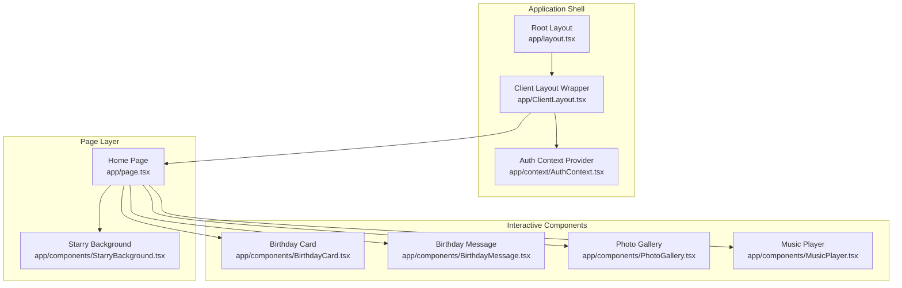
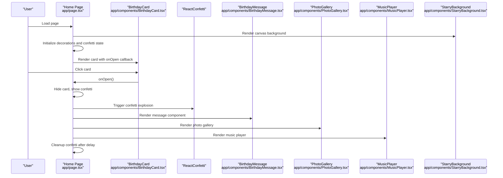
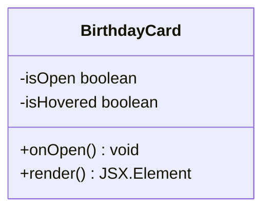
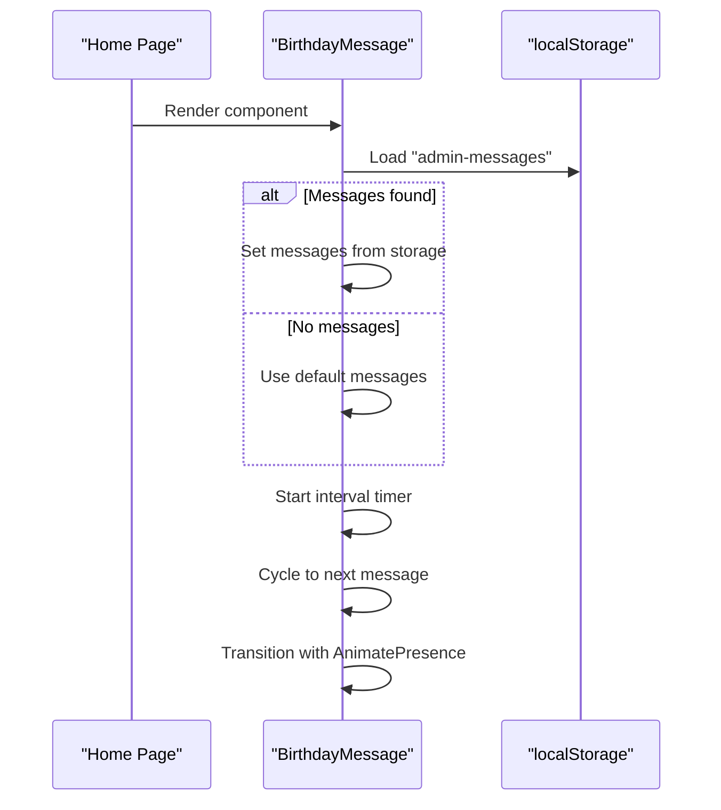
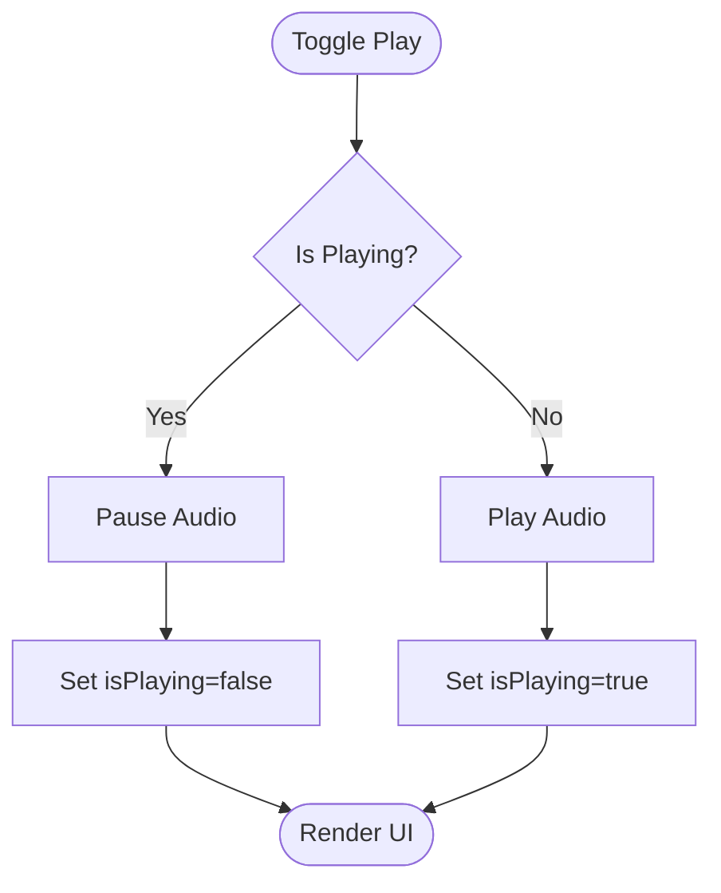
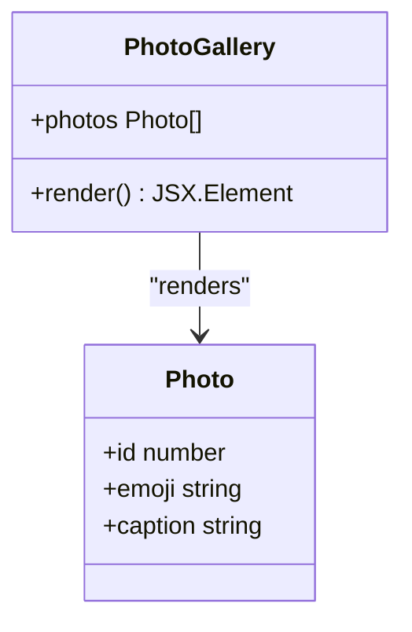
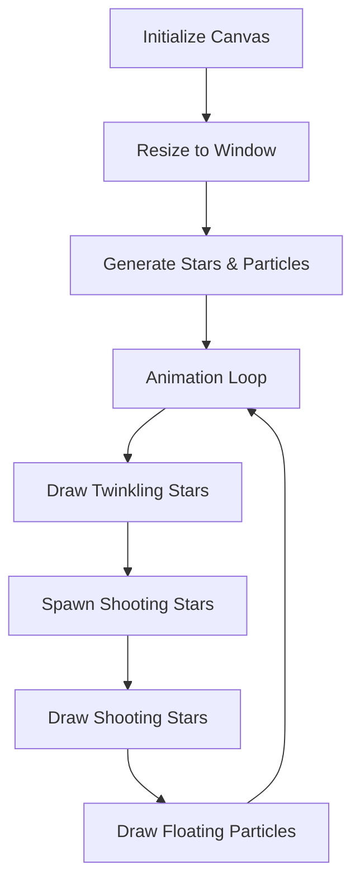
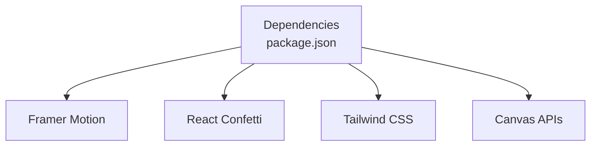

# Birthday Experience Components

<cite>
**Referenced Files in This Document**
- [BirthdayCard.tsx](file://app/components/BirthdayCard.tsx)
- [BirthdayMessage.tsx](file://app/components/BirthdayMessage.tsx)
- [MusicPlayer.tsx](file://app/components/MusicPlayer.tsx)
- [PhotoGallery.tsx](file://app/components/PhotoGallery.tsx)
- [StarryBackground.tsx](file://app/components/StarryBackground.tsx)
- [page.tsx](file://app/page.tsx)
- [layout.tsx](file://app/layout.tsx)
- [ClientLayout.tsx](file://app/ClientLayout.tsx)
- [AuthContext.tsx](file://app/context/AuthContext.tsx)
- [globals.css](file://app/globals.css)
- [package.json](file://package.json)
</cite>

## Table of Contents
1. [Introduction](#introduction)
2. [Project Structure](#project-structure)
3. [Core Components](#core-components)
4. [Architecture Overview](#architecture-overview)
5. [Detailed Component Analysis](#detailed-component-analysis)
6. [Dependency Analysis](#dependency-analysis)
7. [Performance Considerations](#performance-considerations)
8. [Accessibility and Responsive Design](#accessibility-and-responsive-design)
9. [Troubleshooting Guide](#troubleshooting-guide)
10. [Conclusion](#conclusion)

## Introduction
This document provides comprehensive documentation for the interactive birthday experience components. It covers five key components that together create an immersive, animated, and personalized birthday celebration:
- BirthdayCard: An interactive animated card with celebratory effects that reveals a surprise message upon interaction.
- BirthdayMessage: A dynamic message display system that cycles through personalized messages with smooth transitions.
- MusicPlayer: An audio playback controller with visual feedback and expandable controls.
- PhotoGallery: A responsive image gallery component showcasing themed photo cards with hover effects.
- StarryBackground: A visually rich canvas-based background featuring twinkling stars, shooting stars, and floating particles.

The documentation includes component purposes, implementation details, usage patterns, props, customization options, animation implementations, integration patterns, responsive design considerations, accessibility features, and performance optimizations. It also explains how these components work together to deliver a cohesive birthday experience.

## Project Structure
The birthday experience is built as a Next.js application with client-side components and animations powered by Framer Motion. The main page orchestrates the experience, integrating the background, confetti effects, and all interactive components.

**Diagram sources**
- [layout.tsx:1-37](file://app/layout.tsx#L1-L37)
- [ClientLayout.tsx:1-8](file://app/ClientLayout.tsx#L1-L8)
- [AuthContext.tsx:1-58](file://app/context/AuthContext.tsx#L1-L58)
- [page.tsx:1-239](file://app/page.tsx#L1-L239)
- [StarryBackground.tsx:1-195](file://app/components/StarryBackground.tsx#L1-L195)
- [BirthdayCard.tsx:1-159](file://app/components/BirthdayCard.tsx#L1-L159)
- [BirthdayMessage.tsx:1-98](file://app/components/BirthdayMessage.tsx#L1-L98)
- [PhotoGallery.tsx:1-100](file://app/components/PhotoGallery.tsx#L1-L100)
- [MusicPlayer.tsx:1-102](file://app/components/MusicPlayer.tsx#L1-L102)

**Section sources**
- [layout.tsx:1-37](file://app/layout.tsx#L1-L37)
- [ClientLayout.tsx:1-8](file://app/ClientLayout.tsx#L1-L8)
- [AuthContext.tsx:1-58](file://app/context/AuthContext.tsx#L1-L58)
- [page.tsx:1-239](file://app/page.tsx#L1-L239)

## Core Components
This section introduces each component’s purpose and primary responsibilities within the birthday experience.

- BirthdayCard: Provides an interactive 3D flip card with floating particle effects, hover animations, and a reveal mechanism that triggers confetti and opens the main content.
- BirthdayMessage: Displays a rotating collection of personalized messages with smooth transitions, progress indicators, and glow effects.
- MusicPlayer: Offers a compact, animated music player with play/pause toggling, visual waveform-like progress indicator, and an expandable panel for additional controls.
- PhotoGallery: Renders a responsive grid of themed photo cards with decorative elements, hover animations, and captions.
- StarryBackground: Creates a dynamic canvas background with twinkling stars, occasional shooting stars, and floating particles, with support for color variants.

**Section sources**
- [BirthdayCard.tsx:1-159](file://app/components/BirthdayCard.tsx#L1-L159)
- [BirthdayMessage.tsx:1-98](file://app/components/BirthdayMessage.tsx#L1-L98)
- [MusicPlayer.tsx:1-102](file://app/components/MusicPlayer.tsx#L1-L102)
- [PhotoGallery.tsx:1-100](file://app/components/PhotoGallery.tsx#L1-L100)
- [StarryBackground.tsx:1-195](file://app/components/StarryBackground.tsx#L1-L195)

## Architecture Overview
The birthday experience follows a layered architecture:
- Authentication layer ensures only authorized users can access the experience.
- Page orchestration manages lifecycle events, animations, and component visibility.
- Background layer provides visual ambiance via canvas rendering and floating decorations.
- Interactive components encapsulate their own state and animations, communicating through props and callbacks.

**Diagram sources**
- [page.tsx:38-42](file://app/page.tsx#L38-L42)
- [page.tsx:77-85](file://app/page.tsx#L77-L85)
- [BirthdayCard.tsx:14-17](file://app/components/BirthdayCard.tsx#L14-L17)
- [BirthdayMessage.tsx:14-33](file://app/components/BirthdayMessage.tsx#L14-L33)
- [PhotoGallery.tsx:28-37](file://app/components/PhotoGallery.tsx#L28-L37)
- [MusicPlayer.tsx:6-20](file://app/components/MusicPlayer.tsx#L6-L20)
- [StarryBackground.tsx:36-186](file://app/components/StarryBackground.tsx#L36-L186)

## Detailed Component Analysis

### BirthdayCard
Purpose:
- Serves as the entry point to the birthday experience with celebratory animations and a 3D flip reveal.

Key Implementation Details:
- Uses Framer Motion for entrance, exit, and hover animations.
- Implements a 3D flip effect using CSS transforms and preserve-3d.
- Generates floating particle backgrounds dynamically with randomized sizes, positions, and animations.
- Triggers confetti and invokes a parent callback on open.

Props:
- onOpen: Callback invoked after the card begins opening, allowing the parent to hide the card and trigger confetti.

State Management:
- isOpen: Tracks whether the card is flipped to reveal the inside content.
- isHovered: Controls hover effects on the front cover.

Animations:
- Entrance: Fade-in and scale.
- Exit: Fade-out with scale-down.
- Front cover: Hover scaling and rotation.
- Inside: Pulsing emoji animation.
- Floating particles: Continuous y/x/scale animations with random durations and delays.

Customization Options:
- Gradient background colors.
- Particle count and randomness.
- Flip timing and easing.

Integration Patterns:
- Called conditionally via AnimatePresence in the home page.
- Parent handles confetti and content visibility.

Usage Example (conceptual):
- Render the card and pass a callback to handle the reveal sequence.

**Section sources**
- [BirthdayCard.tsx:6-8](file://app/components/BirthdayCard.tsx#L6-L8)
- [BirthdayCard.tsx:10-17](file://app/components/BirthdayCard.tsx#L10-L17)
- [BirthdayCard.tsx:58-145](file://app/components/BirthdayCard.tsx#L58-L145)
- [page.tsx:87-89](file://app/page.tsx#L87-L89)

#### BirthdayCard Class Diagram

**Diagram sources**
- [BirthdayCard.tsx:10-17](file://app/components/BirthdayCard.tsx#L10-L17)

### BirthdayMessage
Purpose:
- Displays a rotating collection of personalized birthday messages with smooth transitions and visual progress indicators.

Key Implementation Details:
- Loads customizable messages from local storage; falls back to default messages if none are stored.
- Cycles through messages at a fixed interval.
- Uses AnimatePresence for cross-fade transitions between messages.
- Shows a counter of message dots indicating current position.
- Displays a progress bar that fills over time.

Props:
- None (uses internal state and localStorage).

State Management:
- currentMessage: Index of the currently displayed message.
- messages: Array of message strings loaded from localStorage or defaults.

Animations:
- Message transitions: Crossfade with upward movement.
- Counter dots: Scale and color change for the active dot.
- Progress bar: Linear fill over time.

Customization Options:
- Editable via localStorage entries for admin messages.
- Responsive typography sizing.

Integration Patterns:
- Integrated into the main page under the header section.
- Works independently with no external dependencies.

Usage Example (conceptual):
- Render the component to display rotating messages with automatic cycling.

**Section sources**
- [BirthdayMessage.tsx:6-12](file://app/components/BirthdayMessage.tsx#L6-L12)
- [BirthdayMessage.tsx:14-33](file://app/components/BirthdayMessage.tsx#L14-L33)
- [BirthdayMessage.tsx:35-96](file://app/components/BirthdayMessage.tsx#L35-L96)

#### BirthdayMessage Sequence Diagram

**Diagram sources**
- [BirthdayMessage.tsx:18-33](file://app/components/BirthdayMessage.tsx#L18-L33)
- [page.tsx:139-142](file://app/page.tsx#L139-L142)

### MusicPlayer
Purpose:
- Provides an animated music player with play/pause control, visual feedback, and an expandable panel.

Key Implementation Details:
- Uses HTMLAudioElement with a looping MP3 source.
- Toggles play/pause state and updates UI accordingly.
- Shows animated pulse rings during playback.
- Supports double-click to expand the control panel.

Props:
- None.

State Management:
- isPlaying: Tracks playback state.
- isExpanded: Controls visibility of the expanded panel.

Animations:
- Main button: Hover and tap scaling with spring physics.
- Pulse rings: Expanding rings with opacity fade.
- Expanded panel: Spring-based entrance/exit.
- Progress bar: Infinite linear animation when playing.

Customization Options:
- Change audio source by updating the audio element source.
- Adjust button styling and colors.

Integration Patterns:
- Positioned as a floating control in the bottom-right corner.
- Can be placed anywhere in the page layout.

Usage Example (conceptual):
- Render the component to provide audio playback with visual feedback.

**Section sources**
- [MusicPlayer.tsx:6-20](file://app/components/MusicPlayer.tsx#L6-L20)
- [MusicPlayer.tsx:22-100](file://app/components/MusicPlayer.tsx#L22-L100)

#### MusicPlayer Flowchart

**Diagram sources**
- [MusicPlayer.tsx:11-20](file://app/components/MusicPlayer.tsx#L11-L20)

### PhotoGallery
Purpose:
- Presents a responsive grid of themed photo cards with decorative elements and hover animations.

Key Implementation Details:
- Loads customizable photos from local storage; falls back to default photos if none are stored.
- Renders a responsive grid with staggered entrance animations.
- Applies group hover effects and subtle shadows for depth.
- Uses gradient backgrounds and decorative circles for visual appeal.

Props:
- None.

State Management:
- photos: Array of Photo objects loaded from localStorage or defaults.

Animations:
- Grid items: Staggered entrance with spring physics.
- Hover: Scale up and lift effect.
- Emoji: Continuous rotation and scaling animation.

Customization Options:
- Add/remove photos via localStorage entries.
- Modify gradient palette and decorative elements.

Integration Patterns:
- Integrated into the main page under a dedicated section.
- Responsive grid adapts to screen size.

Usage Example (conceptual):
- Render the component to showcase themed photo cards with captions.

**Section sources**
- [PhotoGallery.tsx:28-37](file://app/components/PhotoGallery.tsx#L28-L37)
- [PhotoGallery.tsx:39-98](file://app/components/PhotoGallery.tsx#L39-L98)

#### PhotoGallery Class Diagram

**Diagram sources**
- [PhotoGallery.tsx:6-17](file://app/components/PhotoGallery.tsx#L6-L17)
- [PhotoGallery.tsx:28-98](file://app/components/PhotoGallery.tsx#L28-L98)

### StarryBackground
Purpose:
- Creates a dynamic canvas-based background with twinkling stars, occasional shooting stars, and floating particles.

Key Implementation Details:
- Manages three animation systems: static stars, animated shooting stars, and floating particles.
- Handles window resizing to adjust canvas dimensions.
- Supports two variants: night (blueish) and warm (pinkish).
- Uses requestAnimationFrame for efficient rendering.

Props:
- variant: 'night' | 'warm' (default 'night').

State Management:
- Internal canvas state and animation loops managed via refs and effects.

Animations:
- Stars: Twinkling with phase-based opacity modulation and radial glow.
- Shooting stars: Randomly spawned with linear motion and gradient tails.
- Particles: Floating upwards with boundary wrapping.

Customization Options:
- Adjust star count, particle count, and animation speeds.
- Modify color variants and glow intensities.

Integration Patterns:
- Fixed overlay positioned behind other content.
- Runs continuously in the background.

Usage Example (conceptual):
- Render the component to provide a visually rich background.

**Section sources**
- [StarryBackground.tsx:36-186](file://app/components/StarryBackground.tsx#L36-L186)

#### StarryBackground Canvas Flowchart

**Diagram sources**
- [StarryBackground.tsx:50-176](file://app/components/StarryBackground.tsx#L50-L176)

## Dependency Analysis
The birthday experience relies on several key dependencies and frameworks:

- Framer Motion: Provides motion primitives for animations across all components.
- React Confetti: Delivers confetti explosion effects triggered by the card interaction.
- Tailwind CSS: Supplies utility classes for styling and responsive layouts.
- Canvas APIs: Used by StarryBackground for efficient 2D rendering.

**Diagram sources**
- [package.json:11-27](file://package.json#L11-L27)

**Section sources**
- [package.json:11-27](file://package.json#L11-L27)

## Performance Considerations
- Canvas Rendering: StarryBackground uses requestAnimationFrame and cleans up listeners on unmount to prevent memory leaks.
- Animation Optimization: Components leverage Framer Motion’s optimized animations and staggered entrances to reduce layout thrashing.
- Local Storage: BirthdayMessage and PhotoGallery load data once on mount to minimize repeated parsing.
- Conditional Rendering: BirthdayCard is conditionally rendered and removed from DOM after opening to reduce overhead.
- Responsive Design: Components adapt to screen size using Tailwind’s responsive utilities and dynamic calculations (e.g., canvas resizing).

[No sources needed since this section provides general guidance]

## Accessibility and Responsive Design
- Responsive Design:
  - Grid layouts adapt to small, medium, and large screens using Tailwind’s responsive prefixes.
  - Typography scales appropriately across breakpoints.
  - Animations remain performant on lower-powered devices by avoiding excessive DOM manipulation.
- Accessibility:
  - Focus management and keyboard navigation are not explicitly implemented; consider adding focus traps and ARIA attributes for complex interactive elements.
  - Color contrast is maintained through gradient backgrounds and careful color choices.
  - Alternative text is not applicable for decorative emojis; ensure meaningful content remains accessible.
- Performance:
  - Minimize heavy computations in render paths.
  - Use lazy loading for images if additional assets are introduced later.

[No sources needed since this section provides general guidance]

## Troubleshooting Guide
Common Issues and Resolutions:
- Audio does not play:
  - Ensure the audio source path exists and is accessible.
  - Verify browser autoplay policies and user gesture requirements.
- Confetti not appearing:
  - Confirm ReactConfetti is installed and the component is rendered with correct window dimensions.
- Canvas not rendering:
  - Check for canvas context availability and ensure the component mounts before drawing.
- Messages not updating:
  - Verify localStorage keys and JSON format for admin messages.
- Photos not loading:
  - Confirm localStorage keys and JSON format for admin photos.

**Section sources**
- [MusicPlayer.tsx:29-31](file://app/components/MusicPlayer.tsx#L29-L31)
- [page.tsx:77-85](file://app/page.tsx#L77-L85)
- [StarryBackground.tsx:40-43](file://app/components/StarryBackground.tsx#L40-L43)
- [BirthdayMessage.tsx:18-26](file://app/components/BirthdayMessage.tsx#L18-L26)
- [PhotoGallery.tsx:31-37](file://app/components/PhotoGallery.tsx#L31-L37)

## Conclusion
The birthday experience components collectively deliver an immersive, visually rich, and interactive celebration. Each component is designed with clear responsibilities, robust animations, and thoughtful integration patterns. By leveraging Framer Motion for smooth transitions, Tailwind for responsive styling, and Canvas for dynamic backgrounds, the system achieves both aesthetic appeal and performance. The modular architecture allows for easy customization and extension, enabling administrators to personalize messages, photos, and audio to create a truly special experience.