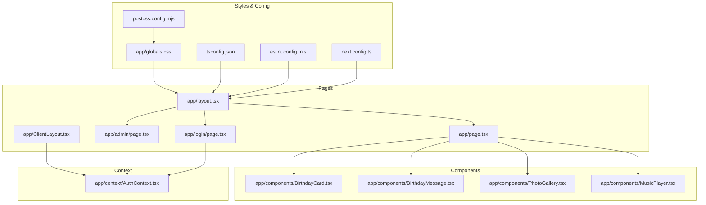
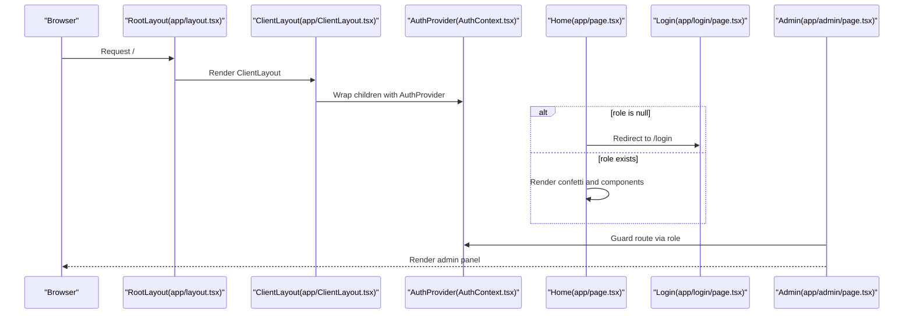
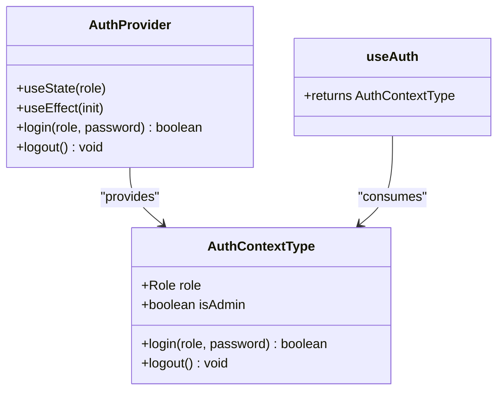
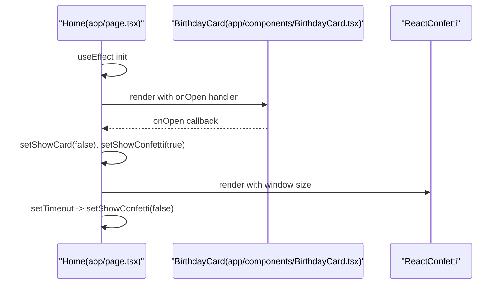
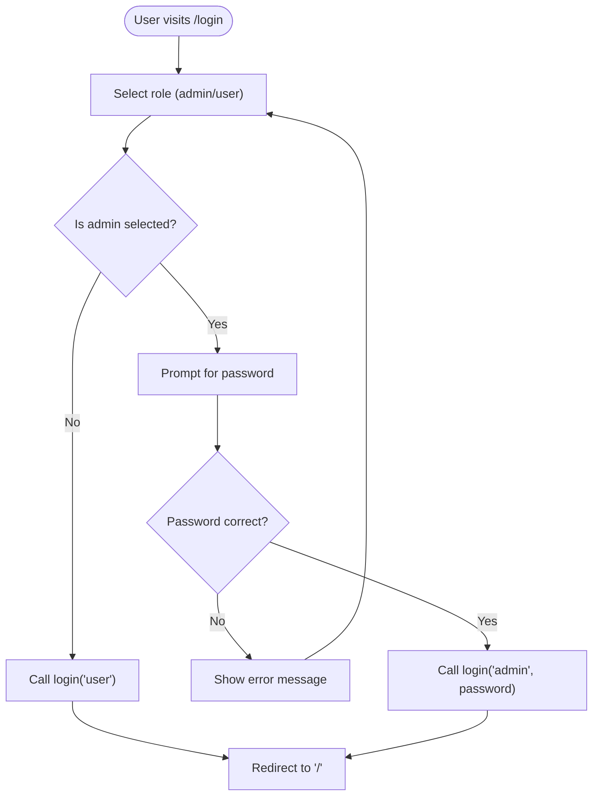
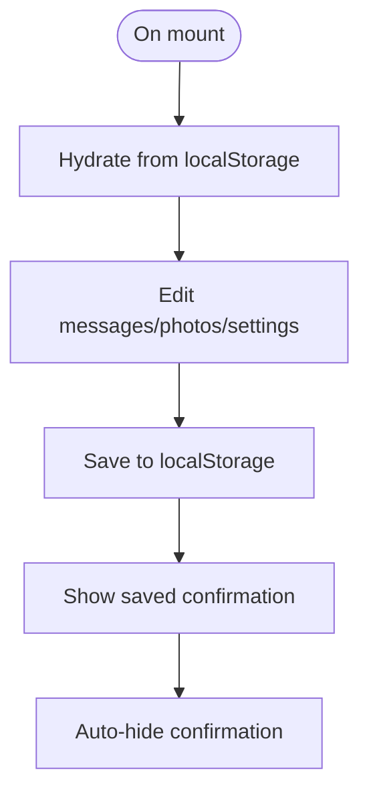
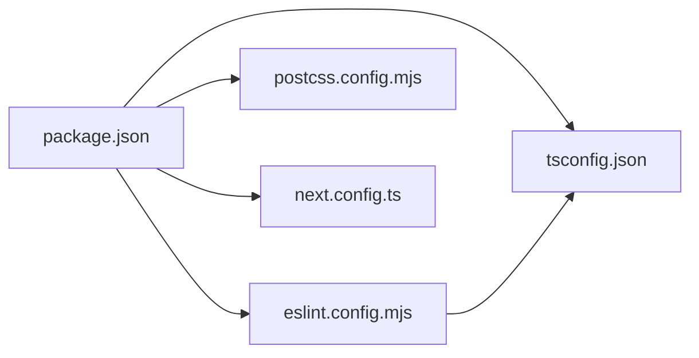

# Development Guidelines

<cite>
**Referenced Files in This Document**
- [package.json](file://package.json)
- [tsconfig.json](file://tsconfig.json)
- [eslint.config.mjs](file://eslint.config.mjs)
- [next.config.ts](file://next.config.ts)
- [postcss.config.mjs](file://postcss.config.mjs)
- [README.md](file://README.md)
- [app/layout.tsx](file://app/layout.tsx)
- [app/globals.css](file://app/globals.css)
- [app/page.tsx](file://app/page.tsx)
- [app/admin/page.tsx](file://app/admin/page.tsx)
- [app/login/page.tsx](file://app/login/page.tsx)
- [app/ClientLayout.tsx](file://app/ClientLayout.tsx)
- [app/context/AuthContext.tsx](file://app/context/AuthContext.tsx)
- [app/components/BirthdayCard.tsx](file://app/components/BirthdayCard.tsx)
- [app/components/BirthdayMessage.tsx](file://app/components/BirthdayMessage.tsx)
- [app/components/MusicPlayer.tsx](file://app/components/MusicPlayer.tsx)
- [app/components/PhotoGallery.tsx](file://app/components/PhotoGallery.tsx)
</cite>

## Table of Contents
1. [Introduction](#introduction)
2. [Project Structure](#project-structure)
3. [Core Components](#core-components)
4. [Architecture Overview](#architecture-overview)
5. [Detailed Component Analysis](#detailed-component-analysis)
6. [Dependency Analysis](#dependency-analysis)
7. [Performance Considerations](#performance-considerations)
8. [Troubleshooting Guide](#troubleshooting-guide)
9. [Conclusion](#conclusion)
10. [Appendices](#appendices)

## Introduction
This document provides comprehensive development guidelines for contributing to the Ulang Tahun Gebetan project. It covers code style conventions, TypeScript usage patterns, component development standards, linting and compilation configurations, development workflow, commit conventions, code review processes, state management patterns, performance optimization, testing and debugging strategies, and extension guidelines. The goal is to ensure consistent, maintainable, and high-quality development across the project.

## Project Structure
The project follows a Next.js App Router structure with a clear separation of pages, components, and shared assets. Key areas:
- Pages under app/: route handlers for home, login, admin, and client layout wrapper
- Shared UI components under app/components/
- Global styles and Tailwind integration under app/globals.css
- Application-wide context under app/context/
- Build-time configuration files for TypeScript, ESLint, PostCSS, and Next.js

**Diagram sources**
- [app/layout.tsx:1-37](file://app/layout.tsx#L1-L37)
- [app/page.tsx:1-239](file://app/page.tsx#L1-L239)
- [app/login/page.tsx:1-192](file://app/login/page.tsx#L1-L192)
- [app/admin/page.tsx:1-313](file://app/admin/page.tsx#L1-L313)
- [app/ClientLayout.tsx:1-8](file://app/ClientLayout.tsx#L1-L8)
- [app/context/AuthContext.tsx:1-58](file://app/context/AuthContext.tsx#L1-L58)
- [app/components/BirthdayCard.tsx:1-148](file://app/components/BirthdayCard.tsx#L1-L148)
- [app/components/BirthdayMessage.tsx:1-138](file://app/components/BirthdayMessage.tsx#L1-L138)
- [app/components/PhotoGallery.tsx:1-123](file://app/components/PhotoGallery.tsx#L1-L123)
- [app/components/MusicPlayer.tsx:1-102](file://app/components/MusicPlayer.tsx#L1-L102)
- [app/globals.css:1-175](file://app/globals.css#L1-L175)
- [tsconfig.json:1-35](file://tsconfig.json#L1-L35)
- [eslint.config.mjs:1-19](file://eslint.config.mjs#L1-L19)
- [postcss.config.mjs:1-8](file://postcss.config.mjs#L1-L8)
- [next.config.ts:1-8](file://next.config.ts#L1-L8)

**Section sources**
- [README.md:1-37](file://README.md#L1-L37)
- [app/layout.tsx:1-37](file://app/layout.tsx#L1-L37)
- [app/globals.css:1-175](file://app/globals.css#L1-L175)
- [tsconfig.json:1-35](file://tsconfig.json#L1-L35)
- [eslint.config.mjs:1-19](file://eslint.config.mjs#L1-L19)
- [postcss.config.mjs:1-8](file://postcss.config.mjs#L1-L8)
- [next.config.ts:1-8](file://next.config.ts#L1-L8)

## Core Components
- Authentication Context: Provides role-based access control and persists role in local storage. Used across pages to gate routes and expose isAdmin flag.
- Page Components:
  - Home page orchestrates confetti, animations, and child components.
  - Login page handles role selection and admin password verification.
  - Admin page manages dynamic content (messages, photos, page settings) and saves to local storage.
- Shared Components:
  - BirthdayCard: Interactive animated envelope with state-driven phases.
  - BirthdayMessage: Typewriter-style message carousel with persistence.
  - PhotoGallery: Responsive polaroid-style gallery with hover effects.
  - MusicPlayer: Minimal floating player with expanded panel and visualizer.

Best practices observed:
- Use 'use client' consistently for components using hooks or browser APIs.
- Persist user-facing content in localStorage for quick iteration during development.
- Prefer Framer Motion for micro-interactions and entrance/exit transitions.
- Keep component props minimal and strongly typed.

**Section sources**
- [app/context/AuthContext.tsx:1-58](file://app/context/AuthContext.tsx#L1-L58)
- [app/page.tsx:1-239](file://app/page.tsx#L1-L239)
- [app/login/page.tsx:1-192](file://app/login/page.tsx#L1-L192)
- [app/admin/page.tsx:1-313](file://app/admin/page.tsx#L1-L313)
- [app/components/BirthdayCard.tsx:1-148](file://app/components/BirthdayCard.tsx#L1-L148)
- [app/components/BirthdayMessage.tsx:1-138](file://app/components/BirthdayMessage.tsx#L1-L138)
- [app/components/PhotoGallery.tsx:1-123](file://app/components/PhotoGallery.tsx#L1-L123)
- [app/components/MusicPlayer.tsx:1-102](file://app/components/MusicPlayer.tsx#L1-L102)

## Architecture Overview
The application uses Next.js App Router with a client-side AuthProvider wrapping the app tree. Pages coordinate state and render shared components. Local storage stores admin-managed content and user roles.

**Diagram sources**
- [app/layout.tsx:1-37](file://app/layout.tsx#L1-L37)
- [app/ClientLayout.tsx:1-8](file://app/ClientLayout.tsx#L1-L8)
- [app/context/AuthContext.tsx:1-58](file://app/context/AuthContext.tsx#L1-L58)
- [app/page.tsx:1-239](file://app/page.tsx#L1-L239)
- [app/login/page.tsx:1-192](file://app/login/page.tsx#L1-L192)
- [app/admin/page.tsx:1-313](file://app/admin/page.tsx#L1-L313)

## Detailed Component Analysis

### Authentication Context
- Responsibilities: Manage role state, persist to localStorage, expose login/logout, and isAdmin flag.
- Patterns:
  - Context with provider pattern for global state.
  - Client directive for client-only behavior.
  - Effect to hydrate persisted role on mount.
- Recommendations:
  - Validate role prop types and enforce non-empty strings.
  - Centralize error messaging for invalid credentials.
  - Consider secure storage alternatives for production.

**Diagram sources**
- [app/context/AuthContext.tsx:1-58](file://app/context/AuthContext.tsx#L1-L58)

**Section sources**
- [app/context/AuthContext.tsx:1-58](file://app/context/AuthContext.tsx#L1-L58)

### Home Page
- Responsibilities: Gate access via AuthContext, orchestrate confetti, render BirthdayCard, and compose child components.
- Patterns:
  - Client directive for client-side state and effects.
  - AnimatePresence for smooth transitions.
  - Local storage hydration for title/subtitle.
- Recommendations:
  - Debounce window resize updates for performance.
  - Extract confetti logic into a reusable hook if extended.

**Diagram sources**
- [app/page.tsx:1-239](file://app/page.tsx#L1-L239)
- [app/components/BirthdayCard.tsx:1-148](file://app/components/BirthdayCard.tsx#L1-L148)

**Section sources**
- [app/page.tsx:1-239](file://app/page.tsx#L1-L239)

### Login Page
- Responsibilities: Role selection, optional admin password prompt, and redirection after successful login.
- Patterns:
  - Conditional rendering of password input.
  - Animated feedback and error messaging.
- Recommendations:
  - Add input validation and accessibility attributes.
  - Consider multi-factor options for admin login.

**Diagram sources**
- [app/login/page.tsx:1-192](file://app/login/page.tsx#L1-L192)
- [app/context/AuthContext.tsx:1-58](file://app/context/AuthContext.tsx#L1-L58)

**Section sources**
- [app/login/page.tsx:1-192](file://app/login/page.tsx#L1-L192)

### Admin Page
- Responsibilities: Manage messages, photos, and page settings; persist to localStorage; provide logout.
- Patterns:
  - Tabbed interface with AnimatePresence transitions.
  - Controlled inputs with local state and batch save.
- Recommendations:
  - Add optimistic UI updates and rollback on errors.
  - Implement export/import of settings for backup.

**Diagram sources**
- [app/admin/page.tsx:1-313](file://app/admin/page.tsx#L1-L313)

**Section sources**
- [app/admin/page.tsx:1-313](file://app/admin/page.tsx#L1-L313)

### Shared Components
- BirthdayCard: Uses Framer Motion for envelope opening animation and letter reveal; triggers parent callback after delay.
- BirthdayMessage: Implements typewriter effect with controlled state and localStorage persistence.
- PhotoGallery: Renders responsive cards with hover effects and randomized gradients.
- MusicPlayer: Floating player with expanded panel and animated progress indicator.

Recommendations:
- Extract animation variants into constants for reuse.
- Add lazy loading for images if content grows.
- Consider memoization for expensive computations.

**Section sources**
- [app/components/BirthdayCard.tsx:1-148](file://app/components/BirthdayCard.tsx#L1-L148)
- [app/components/BirthdayMessage.tsx:1-138](file://app/components/BirthdayMessage.tsx#L1-L138)
- [app/components/PhotoGallery.tsx:1-123](file://app/components/PhotoGallery.tsx#L1-L123)
- [app/components/MusicPlayer.tsx:1-102](file://app/components/MusicPlayer.tsx#L1-L102)

## Dependency Analysis
- Runtime dependencies: Next.js, React, Framer Motion, react-confetti, react-dom.
- Dev dependencies: TypeScript, ESLint, Tailwind CSS, @types packages.
- Toolchain: TypeScript compiler, ESLint, PostCSS/Tailwind, Next.js build/runtime.

**Diagram sources**
- [package.json:1-29](file://package.json#L1-L29)
- [tsconfig.json:1-35](file://tsconfig.json#L1-L35)
- [eslint.config.mjs:1-19](file://eslint.config.mjs#L1-L19)
- [postcss.config.mjs:1-8](file://postcss.config.mjs#L1-L8)
- [next.config.ts:1-8](file://next.config.ts#L1-L8)

**Section sources**
- [package.json:1-29](file://package.json#L1-L29)
- [tsconfig.json:1-35](file://tsconfig.json#L1-L35)
- [eslint.config.mjs:1-19](file://eslint.config.mjs#L1-L19)
- [postcss.config.mjs:1-8](file://postcss.config.mjs#L1-L8)
- [next.config.ts:1-8](file://next.config.ts#L1-L8)

## Performance Considerations
- Animations: Prefer hardware-accelerated properties (transform/opacity) and avoid layout thrashing.
- Rendering:
  - Use AnimatePresence judiciously; unmount offscreen content when appropriate.
  - Memoize derived data and avoid unnecessary re-renders.
- Assets:
  - Lazy-load heavy assets; keep confetti pieces count reasonable.
  - Use CSS filters and gradients instead of large images where possible.
- State:
  - Keep localStorage reads/writes minimal and batched.
  - Debounce window-related events.
- Tooling:
  - Enable strict TypeScript checks and incremental builds.
  - Run linting and type checks in CI to prevent regressions.

[No sources needed since this section provides general guidance]

## Troubleshooting Guide
Common issues and resolutions:
- ESLint fails locally but passes in CI:
  - Ensure local Node.js and package versions match CI.
  - Reinstall dependencies and clear caches.
- TypeScript errors after adding a new component:
  - Verify path aliases and module resolution in tsconfig.json.
  - Add missing types or declare module for external assets.
- Tailwind/CSS not applying:
  - Confirm PostCSS plugin is enabled and Tailwind directives are present.
  - Check for conflicting CSS specificity and order of imports.
- Confetti not appearing:
  - Verify window size state is initialized and passed to ReactConfetti.
  - Ensure audio element paths are correct for MusicPlayer.
- Authentication loops:
  - Check AuthContext provider wrapping and localStorage availability.
  - Validate redirect logic in pages gated by role.

**Section sources**
- [eslint.config.mjs:1-19](file://eslint.config.mjs#L1-L19)
- [tsconfig.json:1-35](file://tsconfig.json#L1-L35)
- [postcss.config.mjs:1-8](file://postcss.config.mjs#L1-L8)
- [app/page.tsx:1-239](file://app/page.tsx#L1-L239)
- [app/components/MusicPlayer.tsx:1-102](file://app/components/MusicPlayer.tsx#L1-L102)
- [app/context/AuthContext.tsx:1-58](file://app/context/AuthContext.tsx#L1-L58)

## Conclusion
By adhering to the established patterns—strict TypeScript usage, centralized authentication, modular components with animations, and robust tooling—you can extend the Ulang Tahun Gebetan project reliably. Focus on maintainability, performance, and user experience as you introduce new features and components.

[No sources needed since this section summarizes without analyzing specific files]

## Appendices

### Code Style Conventions
- File naming: PascalCase for components, kebab-case for pages and static assets.
- Imports: Group external, internal, and asset imports; use absolute paths via tsconfig paths.
- Components: Stateless functional components with explicit props interfaces; use 'use client' only when hooks/browser APIs are used.
- Hooks: Place custom hooks in app/hooks/ if created; otherwise keep close to usage.
- CSS: Favor Tailwind utilities; define reusable variants in globals.css; avoid inline styles.

**Section sources**
- [tsconfig.json:21-23](file://tsconfig.json#L21-L23)
- [app/globals.css:1-175](file://app/globals.css#L1-L175)

### TypeScript Usage Patterns
- Strict mode: Enabled; leverage exhaustive checks and non-null assertions carefully.
- No emit: Ensures build-time type safety without emitting JS.
- JSX: Use react-jsx with React 18+ runtime.
- Path aliases: '@/*' mapped to repository root for clean imports.

**Section sources**
- [tsconfig.json:7-14](file://tsconfig.json#L7-L14)
- [tsconfig.json:21-23](file://tsconfig.json#L21-L23)

### ESLint Configuration
- Extends Next.js recommended configs for web vitals and TypeScript.
- Ignores Next.js build artifacts and next-env.d.ts by default; override as needed.
- Run lint via npm script 'lint'.

**Section sources**
- [eslint.config.mjs:1-19](file://eslint.config.mjs#L1-L19)
- [package.json:9-9](file://package.json#L9-L9)

### Commit Message Conventions
- Scope: Feature area (e.g., components/BirthdayCard, pages/Home, context/AuthContext).
- Type: feat, fix, refactor, docs, chore, perf, test.
- Example: feat(components): add new animation variant to BirthdayCard

[No sources needed since this section provides general guidance]

### Code Review Checklist
- Does the change align with component architecture and state management patterns?
- Are TypeScript types accurate and used consistently?
- Are animations and effects optimized for performance?
- Is localStorage usage safe and scoped appropriately?
- Are error boundaries and guards in place for route protection?
- Are tests added for new logic?

[No sources needed since this section provides general guidance]

### Testing Strategies
- Unit tests: Jest/React Testing Library for pure functions and small components.
- Integration tests: Playwright/Cypress for page flows (login → home → admin).
- Visual regression: Compare screenshots of animated components across browsers.
- Accessibility: Lint with axe-core rules and manual checks.

[No sources needed since this section provides general guidance]

### Debugging Techniques
- Use React DevTools Profiler to identify heavy renders.
- Monitor performance with Lighthouse and Web Vitals.
- Inspect Tailwind-generated CSS in Elements panel.
- Validate ESLint and TypeScript errors before committing.

[No sources needed since this section provides general guidance]

### Extending Functionality
- Adding a new page:
  - Create a new file under app/<route>/page.tsx.
  - Wrap with ClientLayout and AuthProvider if needed.
  - Import and render in RootLayout.
- Adding a new component:
  - Place under app/components/.
  - Export default component with typed props.
  - Use 'use client' only when necessary.
  - Add animations via Framer Motion and Tailwind utilities.
- State management:
  - Prefer local component state for ephemeral UI.
  - Use context for cross-component shared state (already implemented).
  - Persist user-facing content in localStorage for quick iteration.

**Section sources**
- [app/ClientLayout.tsx:1-8](file://app/ClientLayout.tsx#L1-L8)
- [app/context/AuthContext.tsx:1-58](file://app/context/AuthContext.tsx#L1-L58)
- [app/components/BirthdayCard.tsx:1-148](file://app/components/BirthdayCard.tsx#L1-L148)