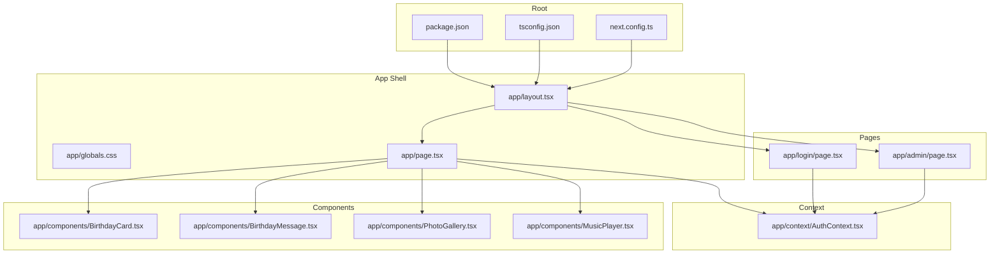
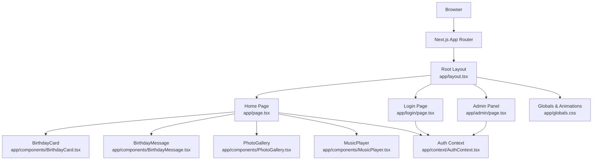
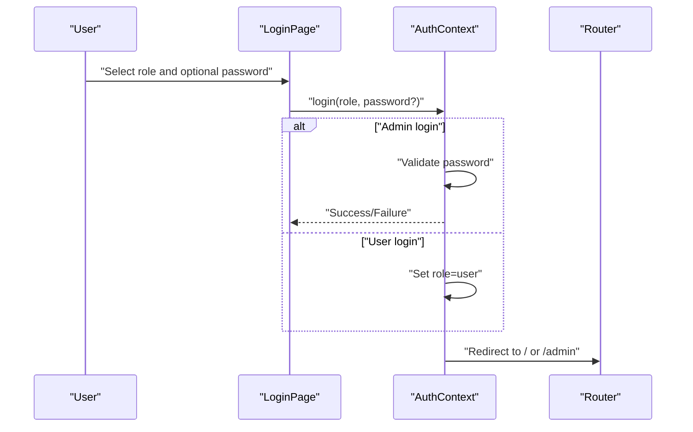
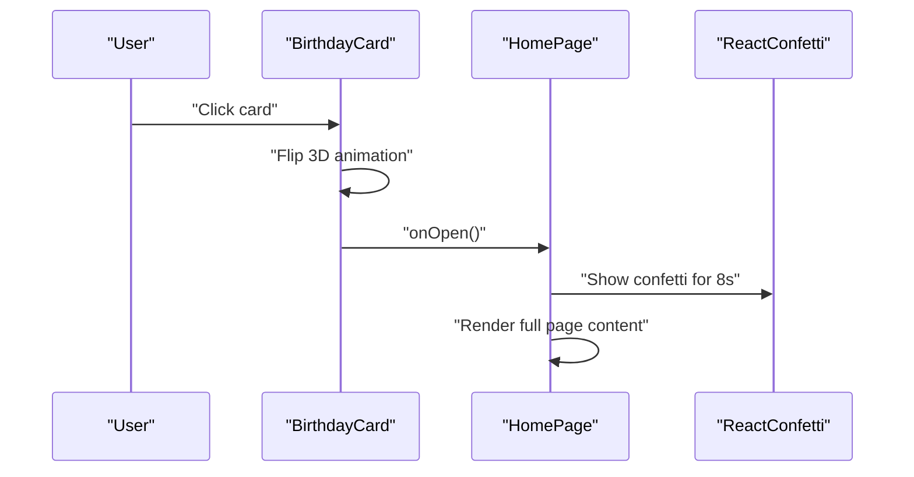
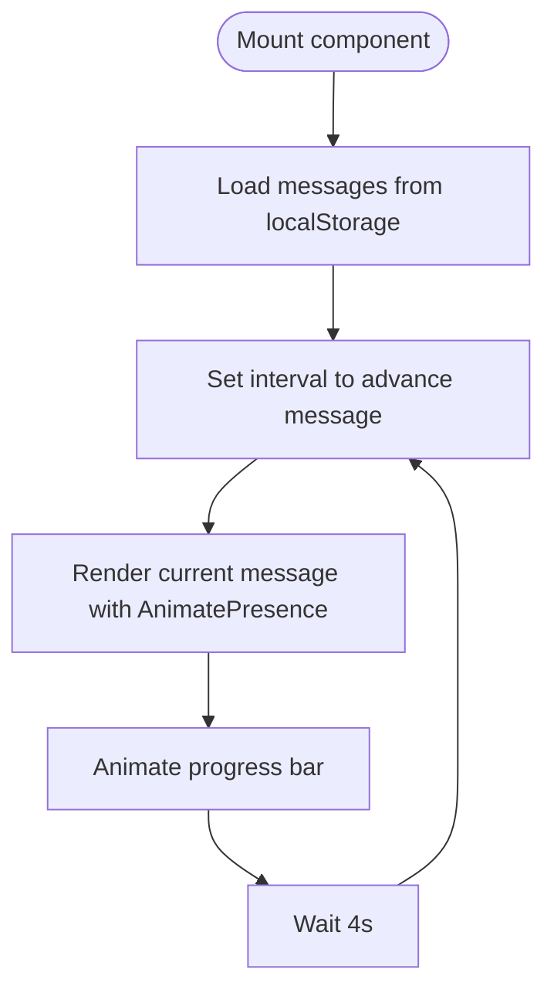
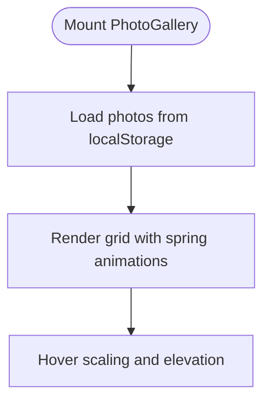
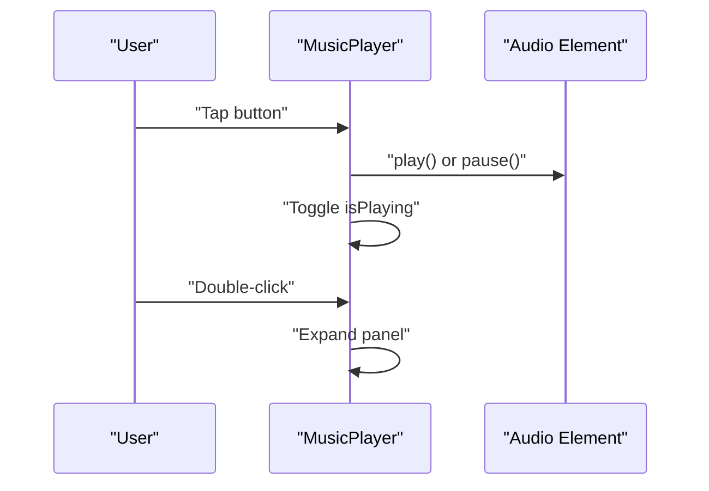
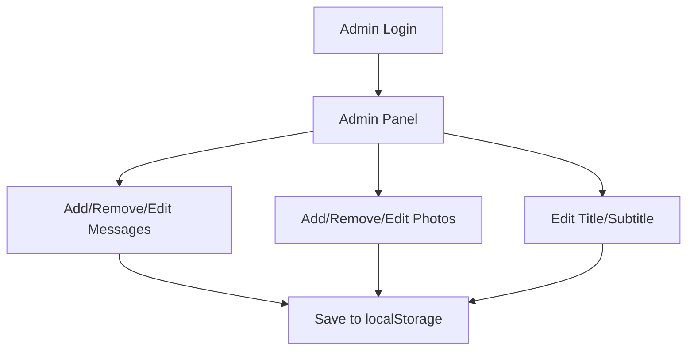
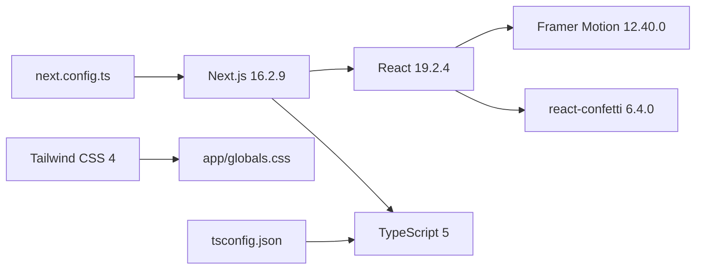

# Project Overview

<cite>
**Referenced Files in This Document**
- [README.md](file://README.md)
- [package.json](file://package.json)
- [tsconfig.json](file://tsconfig.json)
- [next.config.ts](file://next.config.ts)
- [app/layout.tsx](file://app/layout.tsx)
- [app/globals.css](file://app/globals.css)
- [app/page.tsx](file://app/page.tsx)
- [app/components/BirthdayCard.tsx](file://app/components/BirthdayCard.tsx)
- [app/components/BirthdayMessage.tsx](file://app/components/BirthdayMessage.tsx)
- [app/components/PhotoGallery.tsx](file://app/components/PhotoGallery.tsx)
- [app/components/MusicPlayer.tsx](file://app/components/MusicPlayer.tsx)
- [app/context/AuthContext.tsx](file://app/context/AuthContext.tsx)
- [app/admin/page.tsx](file://app/admin/page.tsx)
- [app/login/page.tsx](file://app/login/page.tsx)
</cite>

## Table of Contents
1. [Introduction](#introduction)
2. [Project Structure](#project-structure)
3. [Core Components](#core-components)
4. [Architecture Overview](#architecture-overview)
5. [Detailed Component Analysis](#detailed-component-analysis)
6. [Dependency Analysis](#dependency-analysis)
7. [Performance Considerations](#performance-considerations)
8. [Troubleshooting Guide](#troubleshooting-guide)
9. [Conclusion](#conclusion)
10. [Appendices](#appendices)

## Introduction
Ulang Tahun Gebetan is a personalized birthday celebration web application designed to deliver an immersive, interactive, and emotionally resonant digital birthday experience. The name "Ulang Tahun Gebetan" translates to "Birthday Celebration" in Indonesian, reflecting the project’s cultural roots and intent to honor a special person on their birthday with thoughtful, curated content.

Target audience:
- Birthday celebrants who want a meaningful, visually rich digital gift
- Creators who want to personalize and curate messages, photos, and music
- Administrators who manage content and branding for the celebration page

Core value proposition:
- A delightful, story-driven birthday page with layered interactions
- Fully customizable content (messages, photos, page title/subtitle)
- Integrated audio experience with a persistent player
- Responsive, modern UI powered by contemporary web technologies

Scope:
- Personalized birthday landing page with animated transitions
- Interactive birthday card with a reveal sequence
- Rotating personalized birthday messages
- Photo gallery with decorative themes
- Background music player with visual feedback
- Admin panel for managing content and page settings
- Role-based access (admin and user) with local storage persistence

Limitations:
- Content is stored locally in the browser (localStorage) and not persisted server-side
- No external authentication provider integration
- Audio asset must be present at a specific path (/birthday-song.mp3)
- Designed primarily for single-user birthday experiences

Potential use cases:
- Personal birthday surprises for friends or family
- Corporate or team birthday pages with shared messages
- Anniversary or milestone celebrations with customizable themes
- Educational demonstrations of modern frontend stacks (Next.js, React, TypeScript, Tailwind CSS)

## Project Structure
The project follows a Next.js App Router structure with a clear separation of concerns:
- app/: Application shell, pages, components, and global styles
- app/context/: Authentication context for role-based access
- app/admin/: Admin panel for content management
- app/login/: Login page with role selection and admin password verification
- app/components/: Reusable UI components for birthday card, messages, photo gallery, and music player
- app/layout.tsx and app/globals.css: Root layout and global styling with animations and glassmorphism effects
- Root configuration files: package.json, tsconfig.json, next.config.ts

**Diagram sources**
- [app/layout.tsx:1-37](file://app/layout.tsx#L1-L37)
- [app/globals.css:1-175](file://app/globals.css#L1-L175)
- [app/page.tsx:1-239](file://app/page.tsx#L1-L239)
- [app/context/AuthContext.tsx:1-58](file://app/context/AuthContext.tsx#L1-L58)
- [app/login/page.tsx:1-171](file://app/login/page.tsx#L1-L171)
- [app/admin/page.tsx:1-313](file://app/admin/page.tsx#L1-L313)
- [app/components/BirthdayCard.tsx:1-159](file://app/components/BirthdayCard.tsx#L1-L159)
- [app/components/BirthdayMessage.tsx:1-98](file://app/components/BirthdayMessage.tsx#L1-L98)
- [app/components/PhotoGallery.tsx:1-100](file://app/components/PhotoGallery.tsx#L1-L100)
- [app/components/MusicPlayer.tsx:1-102](file://app/components/MusicPlayer.tsx#L1-L102)

**Section sources**
- [README.md:1-37](file://README.md#L1-L37)
- [package.json:1-29](file://package.json#L1-L29)
- [tsconfig.json:1-35](file://tsconfig.json#L1-L35)
- [next.config.ts:1-8](file://next.config.ts#L1-L8)

## Core Components
- Interactive Birthday Card: A 3D-flip card that reveals a celebratory message upon interaction, with floating particle backgrounds and hover effects.
- Personalized Messages: A rotating carousel of messages with smooth transitions and progress indicators, configurable via the admin panel.
- Photo Gallery: A responsive grid of themed photo cards with decorative gradients, hover animations, and captions.
- Audio Experience: A persistent music player with play/pause controls, visual waveform feedback, and a compact/expansive interface.
- Authentication and Access Control: Role-based login (admin/user) with password protection for admin and seamless redirection logic.
- Admin Panel: A content management interface allowing administrators to add/remove/edit messages, photos, and page settings.

**Section sources**
- [app/components/BirthdayCard.tsx:1-159](file://app/components/BirthdayCard.tsx#L1-L159)
- [app/components/BirthdayMessage.tsx:1-98](file://app/components/BirthdayMessage.tsx#L1-L98)
- [app/components/PhotoGallery.tsx:1-100](file://app/components/PhotoGallery.tsx#L1-L100)
- [app/components/MusicPlayer.tsx:1-102](file://app/components/MusicPlayer.tsx#L1-L102)
- [app/context/AuthContext.tsx:1-58](file://app/context/AuthContext.tsx#L1-L58)
- [app/admin/page.tsx:1-313](file://app/admin/page.tsx#L1-L313)

## Architecture Overview
The application uses a client-side-first architecture built on Next.js App Router. It leverages React hooks for state management, Framer Motion for animations, and Tailwind CSS for styling. Authentication is handled via a custom context with role-based routing.

**Diagram sources**
- [app/layout.tsx:1-37](file://app/layout.tsx#L1-L37)
- [app/page.tsx:1-239](file://app/page.tsx#L1-L239)
- [app/context/AuthContext.tsx:1-58](file://app/context/AuthContext.tsx#L1-L58)
- [app/login/page.tsx:1-171](file://app/login/page.tsx#L1-L171)
- [app/admin/page.tsx:1-313](file://app/admin/page.tsx#L1-L313)
- [app/components/BirthdayCard.tsx:1-159](file://app/components/BirthdayCard.tsx#L1-L159)
- [app/components/BirthdayMessage.tsx:1-98](file://app/components/BirthdayMessage.tsx#L1-L98)
- [app/components/PhotoGallery.tsx:1-100](file://app/components/PhotoGallery.tsx#L1-L100)
- [app/components/MusicPlayer.tsx:1-102](file://app/components/MusicPlayer.tsx#L1-L102)
- [app/globals.css:1-175](file://app/globals.css#L1-L175)

## Detailed Component Analysis

### Authentication and Access Control
The authentication system manages roles (admin, user) and persists them in localStorage. It enforces route protection so unauthorized access is redirected appropriately.

**Diagram sources**
- [app/login/page.tsx:16-30](file://app/login/page.tsx#L16-L30)
- [app/context/AuthContext.tsx:28-42](file://app/context/AuthContext.tsx#L28-L42)

**Section sources**
- [app/context/AuthContext.tsx:1-58](file://app/context/AuthContext.tsx#L1-L58)
- [app/login/page.tsx:1-171](file://app/login/page.tsx#L1-L171)

### Birthday Card Interaction Flow
The birthday card component orchestrates the opening sequence, triggers confetti, and coordinates with the home page to reveal the full celebration experience.

**Diagram sources**
- [app/components/BirthdayCard.tsx:14-17](file://app/components/BirthdayCard.tsx#L14-L17)
- [app/page.tsx:38-42](file://app/page.tsx#L38-L42)

**Section sources**
- [app/components/BirthdayCard.tsx:1-159](file://app/components/BirthdayCard.tsx#L1-L159)
- [app/page.tsx:13-44](file://app/page.tsx#L13-L44)

### Personalized Messages Carousel
The message component cycles through a list of predefined and admin-specified messages with smooth transitions and progress visualization.

**Diagram sources**
- [app/components/BirthdayMessage.tsx:18-33](file://app/components/BirthdayMessage.tsx#L18-L33)

**Section sources**
- [app/components/BirthdayMessage.tsx:1-98](file://app/components/BirthdayMessage.tsx#L1-L98)

### Photo Gallery Grid
The photo gallery renders a responsive grid of themed cards with decorative gradients, hover effects, and captions. It loads initial defaults or admin-specified photos from localStorage.

**Diagram sources**
- [app/components/PhotoGallery.tsx:28-37](file://app/components/PhotoGallery.tsx#L28-L37)

**Section sources**
- [app/components/PhotoGallery.tsx:1-100](file://app/components/PhotoGallery.tsx#L1-L100)

### Music Player Controls
The music player exposes a compact button with expanded panel controls, visual waveform feedback, and dual tap/click interactions for play/pause and expand.

**Diagram sources**
- [app/components/MusicPlayer.tsx:11-20](file://app/components/MusicPlayer.tsx#L11-L20)

**Section sources**
- [app/components/MusicPlayer.tsx:1-102](file://app/components/MusicPlayer.tsx#L1-L102)

### Admin Panel Management
The admin panel allows authorized users to manage messages, photos, and page settings, persisting changes to localStorage and providing immediate previews.

**Diagram sources**
- [app/admin/page.tsx:63-70](file://app/admin/page.tsx#L63-L70)

**Section sources**
- [app/admin/page.tsx:1-313](file://app/admin/page.tsx#L1-L313)

## Dependency Analysis
Technology stack and configuration:
- Next.js 16.2.9 (App Router)
- React 19.2.4 and React DOM 19.2.4
- TypeScript 5 with strict compiler options
- Tailwind CSS 4 for utility-first styling
- Framer Motion 12.40.0 for animations
- react-confetti 6.4.0 for celebratory effects

**Diagram sources**
- [package.json:11-27](file://package.json#L11-L27)
- [tsconfig.json:2-24](file://tsconfig.json#L2-L24)
- [next.config.ts:3-5](file://next.config.ts#L3-L5)

**Section sources**
- [package.json:1-29](file://package.json#L1-L29)
- [tsconfig.json:1-35](file://tsconfig.json#L1-L35)
- [next.config.ts:1-8](file://next.config.ts#L1-L8)

## Performance Considerations
- Animations: Framer Motion and Tailwind utilities are used extensively; keep the number of concurrent animations reasonable to avoid layout thrashing.
- Local Storage: Frequent reads/writes are lightweight but avoid excessive updates during rapid user interactions.
- Fonts: Next/font is configured to optimize loading; ensure minimal font variations to reduce render-blocking.
- Audio: The music player loops an audio asset; ensure the asset is optimized and cached by the browser.
- Images: Placeholder gradients are used; if adding real images, implement lazy loading and appropriate sizing.

## Troubleshooting Guide
Common issues and resolutions:
- Redirect loop on home page: Ensure the authentication context sets a role before rendering the home page. Verify localStorage contains a valid role.
- Admin password errors: Confirm the password matches the hardcoded admin credential; otherwise, the login flow will shake and show an error.
- Confetti not appearing: Check that the confetti effect is triggered after the card opens and that window dimensions are available.
- Music not playing: Verify the audio file exists at the expected path and that the audio element is accessible via ref.
- Messages/photos not updating: Ensure the admin panel saves to localStorage and that the home page reads from localStorage on mount.

**Section sources**
- [app/page.tsx:22-36](file://app/page.tsx#L22-L36)
- [app/login/page.tsx:19-24](file://app/login/page.tsx#L19-L24)
- [app/components/MusicPlayer.tsx:29-31](file://app/components/MusicPlayer.tsx#L29-L31)
- [app/admin/page.tsx:63-70](file://app/admin/page.tsx#L63-L70)

## Conclusion
Ulang Tahun Gebetan delivers a charming, interactive birthday experience with a clean, modern tech stack and thoughtful UX. Its modular components, role-based access, and admin customization capabilities make it adaptable for personal and small-group celebrations. While content is currently browser-local, the architecture supports easy extension toward server-side persistence and broader sharing.

## Appendices
- Cultural note: The application’s name “Ulang Tahun Gebetan” emphasizes celebration and gratitude, aligning with the warm, personalized tone of the interface and content.
- Accessibility: Consider adding ARIA labels for interactive elements and ensuring keyboard navigation for the music player and admin controls.