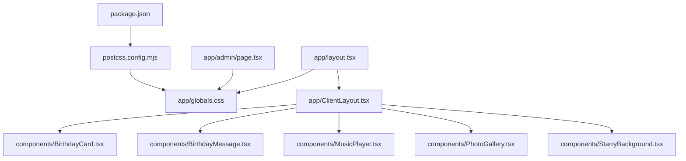
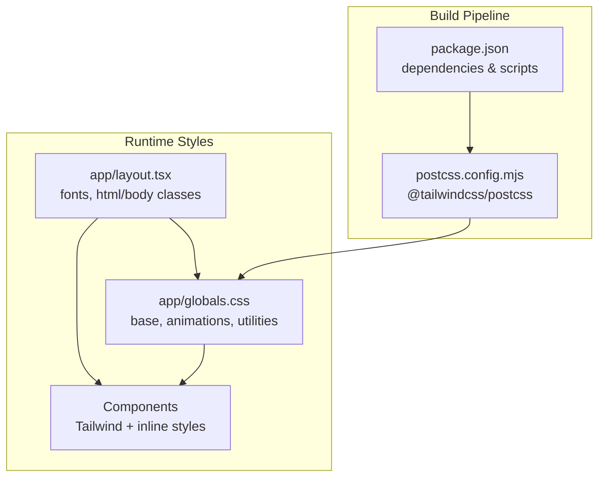
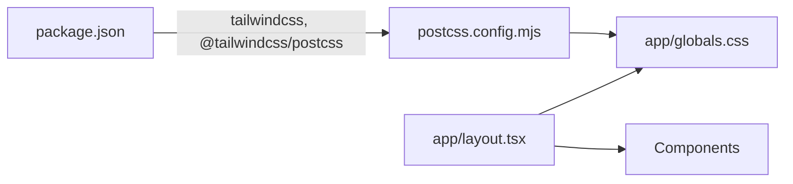

# Styling & Theming

<cite>
**Referenced Files in This Document**
- [app/globals.css](file://app/globals.css)
- [app/layout.tsx](file://app/layout.tsx)
- [app/ClientLayout.tsx](file://app/ClientLayout.tsx)
- [app/components/BirthdayCard.tsx](file://app/components/BirthdayCard.tsx)
- [app/components/BirthdayMessage.tsx](file://app/components/BirthdayMessage.tsx)
- [app/components/MusicPlayer.tsx](file://app/components/MusicPlayer.tsx)
- [app/components/PhotoGallery.tsx](file://app/components/PhotoGallery.tsx)
- [app/components/StarryBackground.tsx](file://app/components/StarryBackground.tsx)
- [app/admin/page.tsx](file://app/admin/page.tsx)
- [postcss.config.mjs](file://postcss.config.mjs)
- [package.json](file://package.json)
</cite>

## Table of Contents
1. [Introduction](#introduction)
2. [Project Structure](#project-structure)
3. [Core Components](#core-components)
4. [Architecture Overview](#architecture-overview)
5. [Detailed Component Analysis](#detailed-component-analysis)
6. [Dependency Analysis](#dependency-analysis)
7. [Performance Considerations](#performance-considerations)
8. [Troubleshooting Guide](#troubleshooting-guide)
9. [Conclusion](#conclusion)
10. [Appendices](#appendices)

## Introduction
This document explains the styling and theming system powering the birthday celebration website. It covers the global CSS architecture, Tailwind CSS integration, responsive design patterns, color schemes, typography, and visual design principles that create a vibrant, celebratory atmosphere. It also provides guidance on customizing themes, adding new styles, maintaining design consistency, and extending the system while preserving a cohesive aesthetic.

## Project Structure
The styling system is organized around:
- Global base styles and animations in a single stylesheet
- Tailwind CSS configured via PostCSS
- Utility-first Tailwind classes applied across components
- Motion-enhanced UI built with Framer Motion
- Canvas-based animated backgrounds for immersive visuals

**Diagram sources**
- [app/layout.tsx:1-37](file://app/layout.tsx#L1-L37)
- [app/globals.css:1-175](file://app/globals.css#L1-L175)
- [app/ClientLayout.tsx:1-8](file://app/ClientLayout.tsx#L1-L8)
- [app/components/BirthdayCard.tsx:1-148](file://app/components/BirthdayCard.tsx#L1-L148)
- [app/components/BirthdayMessage.tsx:1-98](file://app/components/BirthdayMessage.tsx#L1-L98)
- [app/components/MusicPlayer.tsx:1-102](file://app/components/MusicPlayer.tsx#L1-L102)
- [app/components/PhotoGallery.tsx:1-100](file://app/components/PhotoGallery.tsx#L1-L100)
- [app/components/StarryBackground.tsx:1-195](file://app/components/StarryBackground.tsx#L1-L195)
- [app/admin/page.tsx:1-200](file://app/admin/page.tsx#L1-L200)
- [postcss.config.mjs:1-8](file://postcss.config.mjs#L1-L8)
- [package.json:1-29](file://package.json#L1-L29)

**Section sources**
- [app/layout.tsx:1-37](file://app/layout.tsx#L1-L37)
- [postcss.config.mjs:1-8](file://postcss.config.mjs#L1-L8)
- [package.json:1-29](file://package.json#L1-L29)

## Core Components
- Global CSS and animations define reusable effects and glass morphism utilities.
- Layout integrates fonts and applies base Tailwind utilities.
- Components use Tailwind utilities alongside motion primitives for interactive, responsive UI.
- Admin page demonstrates theming in a control panel with backdrop blur and gradient accents.

Key styling pillars:
- Utility-first Tailwind classes for layout, spacing, colors, and effects
- Custom animations and text gradients for celebratory effects
- Glass morphism for modern overlays
- Responsive breakpoints and mobile-first approach
- Canvas-based animated backgrounds for immersive scenes

**Section sources**
- [app/globals.css:1-175](file://app/globals.css#L1-L175)
- [app/layout.tsx:1-37](file://app/layout.tsx#L1-L37)
- [app/components/BirthdayCard.tsx:1-148](file://app/components/BirthdayCard.tsx#L1-L148)
- [app/components/BirthdayMessage.tsx:1-98](file://app/components/BirthdayMessage.tsx#L1-L98)
- [app/components/MusicPlayer.tsx:1-102](file://app/components/MusicPlayer.tsx#L1-L102)
- [app/components/PhotoGallery.tsx:1-100](file://app/components/PhotoGallery.tsx#L1-L100)
- [app/admin/page.tsx:1-200](file://app/admin/page.tsx#L1-L200)

## Architecture Overview
The styling pipeline combines:
- Tailwind CSS via PostCSS plugin
- Global CSS for base styles, animations, and custom utilities
- Component-level Tailwind classes and inline styles for dynamic effects
- Motion-driven transitions and hover states

**Diagram sources**
- [package.json:1-29](file://package.json#L1-L29)
- [postcss.config.mjs:1-8](file://postcss.config.mjs#L1-L8)
- [app/globals.css:1-175](file://app/globals.css#L1-L175)
- [app/layout.tsx:1-37](file://app/layout.tsx#L1-L37)

## Detailed Component Analysis

### Global CSS and Animations
- Base layer sets body smoothing and overflow behavior.
- Extensive custom keyframe animations for floating, glowing, shimmering, gradient shifts, aurora, candle flicker, typewriter cursor, fade-in, scaling, rotation, and pulse rings.
- Glass morphism utilities (.glass, .glass-light, .glass-dark) for frosted overlays.
- Scrollbar customization with gradient thumb.
- Text gradient utilities for pink, gold, and aurora effects.
- Noise texture overlay for subtle surface detail.

Guidance:
- Reuse animation utilities to maintain consistent motion language.
- Prefer glass utilities for modals and panels to keep depth cues uniform.
- Keep text gradients scoped to headings and emphasized text for readability.

**Section sources**
- [app/globals.css:1-175](file://app/globals.css#L1-L175)

### Typography and Fonts
- Google Fonts via Next/font (Geist Sans and Geist Mono) are loaded and injected as CSS variables for consistent typography tokens.
- The HTML element receives font variables and anti-aliasing classes.

Responsive considerations:
- Typography scales naturally with container widths; use responsive modifiers (e.g., md:, lg:) for headings and text sizes.

**Section sources**
- [app/layout.tsx:1-37](file://app/layout.tsx#L1-L37)

### BirthdayCard Component
- Uses motion primitives for entrance, opening, and letter reveal.
- Implements layered envelope with 3D flip using inline transforms and clip-path.
- Background gradients and aurora radial blur create a magical ambiance.
- Inline styles for dynamic borders and glows; Tailwind classes for layout and shadows.

Design principles:
- Layered composition with depth cues (shadows, borders, gradients).
- Subtle pulsing and floating effects for interactivity.

**Section sources**
- [app/components/BirthdayCard.tsx:1-148](file://app/components/BirthdayCard.tsx#L1-L148)

### BirthdayMessage Component
- Animated message carousel with fade transitions and progress indicator.
- Glowing outer container with animated gradient blur.
- Corner accents and counter dots reinforce playful design.

Responsive behavior:
- Text sizing increases at medium breakpoint for readability.

**Section sources**
- [app/components/BirthdayMessage.tsx:1-98](file://app/components/BirthdayMessage.tsx#L1-L98)

### MusicPlayer Component
- Floating player with gradient accents and optional expanded panel.
- Animated playback bars and pulsing rings when playing.
- Backdrop blur and borders for elevated appearance.

Accessibility note:
- Ensure sufficient contrast for text overlays on animated backgrounds.

**Section sources**
- [app/components/MusicPlayer.tsx:1-102](file://app/components/MusicPlayer.tsx#L1-L102)

### PhotoGallery Component
- Responsive grid using Tailwind’s responsive prefixes.
- Gradient backgrounds per item with decorative blurred circles.
- Hover animations and subtle shadows for depth.

Consistency:
- Use consistent rounded corners, shadows, and border opacity across cards.

**Section sources**
- [app/components/PhotoGallery.tsx:1-100](file://app/components/PhotoGallery.tsx#L1-L100)

### StarryBackground Component
- Canvas-based animated starfield with twinkling, glow, shooting stars, and floating particles.
- Variant switching affects star colors and particle hues.
- Efficient animation loop with resize handling.

Performance:
- Keep particle counts reasonable; adjust for device capabilities.

**Section sources**
- [app/components/StarryBackground.tsx:1-195](file://app/components/StarryBackground.tsx#L1-L195)

### Admin Page
- Dark gradient backdrop with glass-like controls.
- Tabbed interface with animated transitions.
- Form controls use consistent border, background, and focus styles.

**Section sources**
- [app/admin/page.tsx:1-200](file://app/admin/page.tsx#L1-L200)

## Dependency Analysis
- Tailwind CSS is enabled via the PostCSS plugin declared in configuration.
- Dependencies include Tailwind v4 and the PostCSS plugin package.
- Global CSS is imported in the root layout, ensuring styles are available application-wide.

**Diagram sources**
- [package.json:1-29](file://package.json#L1-L29)
- [postcss.config.mjs:1-8](file://postcss.config.mjs#L1-L8)
- [app/globals.css:1-175](file://app/globals.css#L1-L175)
- [app/layout.tsx:1-37](file://app/layout.tsx#L1-L37)

**Section sources**
- [package.json:1-29](file://package.json#L1-L29)
- [postcss.config.mjs:1-8](file://postcss.config.mjs#L1-L8)

## Performance Considerations
- Prefer CSS animations and transforms over JavaScript where possible (already used extensively).
- Limit heavy canvas operations; monitor frame rates on lower-end devices.
- Use responsive breakpoints judiciously to avoid excessive reflows.
- Keep glass morphism blur moderate to prevent rendering overhead.
- Minimize DOM nesting in animated components to reduce layout thrashing.

## Troubleshooting Guide
Common issues and resolutions:
- Animations not playing: Verify Tailwind is properly compiled and global CSS is imported in the root layout.
- Glass effects missing: Confirm backdrop-filter support and that the glass utilities are applied.
- Scrollbar styles ignored: Ensure browser supports custom scrollbar styling; test across browsers.
- Font rendering inconsistencies: Check that font variables are applied to the HTML element.

**Section sources**
- [app/layout.tsx:1-37](file://app/layout.tsx#L1-L37)
- [app/globals.css:1-175](file://app/globals.css#L1-L175)

## Conclusion
The styling and theming system blends Tailwind’s utility-first approach with custom animations, glass morphism, and canvas-based effects to deliver a rich, birthday-themed experience. By adhering to shared animation utilities, color tokens, and responsive patterns, developers can extend the system while maintaining visual coherence.

## Appendices

### Color Schemes and Tokens
- Primary gradients: pink-to-purple and gold-to-pink
- Background gradients: dark purples and indigos for night scenes
- Glass morphism: light, dark, and neutral variants
- Text gradients: pink, gold, aurora

Usage tips:
- Use gradient utilities for emphasis and hero elements.
- Apply glass utilities for modals and floating panels.
- Maintain readable text by pairing text gradients with appropriate background contrasts.

**Section sources**
- [app/globals.css:107-162](file://app/globals.css#L107-L162)
- [app/components/BirthdayCard.tsx:28-132](file://app/components/BirthdayCard.tsx#L28-L132)
- [app/components/MusicPlayer.tsx:39-88](file://app/components/MusicPlayer.tsx#L39-L88)

### Responsive Design Patterns
- Mobile-first approach with Tailwind’s responsive prefixes (e.g., sm:, md:, lg:).
- Grid layouts adapt from single column to multi-column galleries.
- Typography scales with container widths; use responsive text utilities.

**Section sources**
- [app/components/PhotoGallery.tsx:40-97](file://app/components/PhotoGallery.tsx#L40-L97)
- [app/components/BirthdayMessage.tsx:77-82](file://app/components/BirthdayMessage.tsx#L77-L82)

### Extending the Styling System
- Add new animation utilities to the global stylesheet and reuse across components.
- Introduce new glass variants or text gradients thoughtfully to preserve brand consistency.
- When adding new components, prefer Tailwind utilities and motion primitives for maintainability.
- Centralize theme tokens (colors, radii, shadows) in the global CSS for easy updates.

**Section sources**
- [app/globals.css:1-175](file://app/globals.css#L1-L175)
- [app/layout.tsx:1-37](file://app/layout.tsx#L1-L37)